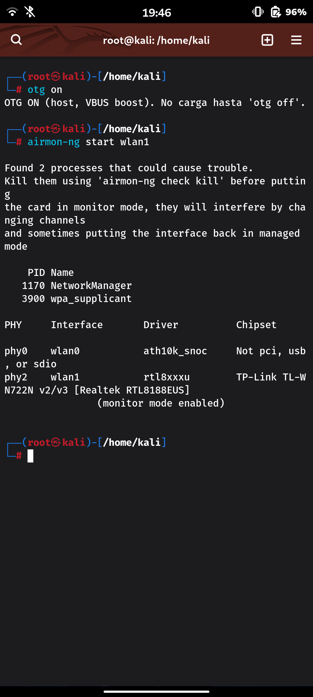

# Kali NetHunter Pro for the Motorola Moto G82 5G (motorola-rhodep)

Port of **Kali Linux (NetHunter Pro / Phosh)** on a **mainline Linux kernel
(7.2-rc5)** to the Motorola Moto G82 5G — codename **rhodep**, SoC **Qualcomm
SM6375** (Snapdragon 695). This device is **not** on Kali's official supported
list; everything here is a from-scratch community port.

> Built on top of a postmarketOS mainline kernel port. The kernel is shared with
> the pmOS port; Kali only changes the kernel `.config` and the userspace.

> **Current image: `kali-boot-v94-STABLE.img`.** Everything below that works,
> works on it: speaker, earpiece, headphones with jack detection, and the
> microphone. It is `v92-STABLE-audio` plus one device tree node reserving 8 MB
> for the modem's memshare region, and nothing else: kernel, ramdisk and cmdline
> are byte for byte identical to v92, so falling back is just reflashing the
> older file.
>
> The image only carries the kernel, the device tree and the initramfs. Audio,
> SSH over USB and the memshare responder live in the rootfs and are installed
> by the scripts under `userspace/`; see [`docs/BUILD.md`](docs/BUILD.md).

> **The modem is functional but shipped off, so mobile data is not usable
> day to day.** It registers on LTE, mobile data reached ~24 Mbit/s, calls
> connect (there is no in-call *audio* yet, see below) and SMS arrives — the
> radio itself is done. The cause of two sessions of "the modem never leaves
> offline" turned out to be files, not silicon: the modem fetches run-time
> images from the AP over TFTP and every request was being answered "file not
> found". Install with `userspace/modem/install.sh` and read
> [`userspace/modem/README.md`](userspace/modem/README.md).
>
> **But it is shipped switched off**, because of a separate bug that only
> became reachable once the modem worked: with `ipa.ko` loaded *and the modem
> attached to LTE*, the SoC watchdog-resets every 3 to 10 minutes, silently.
> With the radio on but not attached it runs for 22 minutes; with `ipa.ko` out,
> the same. So `install.sh` drops `/etc/modprobe.d/rhodep-ipa-hold.conf` (and
> `rhodep-icc-hold.conf` for the interconnect provider), which costs mobile data
> and ModemManager but keeps the phone stable. Delete them and reboot to get the
> whole modem back, resets included.
>
> **Three hypotheses have been tested on the device and buried**: the unvoted
> NoC path to IMEM, that vote being demand-driven instead of a floor, and the
> IPA SRAM layout inherited from qcm2290. Patches 0044-0048 are all kept, every
> one of them a correction checked against the vendor tree, and none of them is
> the cause. Do not re-test them; §5 session 15 of HANDOFF-SESSION4.md says what
> was measured. **The experiment that would settle it has never run**: attach to
> LTE with `ipa.ko` never loaded. It needs the LTE attach APN set by hand over
> `qmicli`, because ModemManager is what normally configures it and MM will not
> touch a QMI modem with no net port.
>
> None of the modem work needs a new boot image — the IPA patches live in
> `ipa.ko`, a module — so **`kali-boot-v94-STABLE.img` is still the image to
> flash**. `kali-boot-v97-ipa-interconnect.img` exists for working on the reset:
> it adds the interconnect provider nodes and the IPA's three NoC paths to the
> device tree, boots identically to v94 because both drivers are held out, and
> has `README-v97.txt` next to it.

> **Bluetooth** was found with its service masked and a random controller
> address; `userspace/bluetooth/install.sh` fixes both. See that directory.

> **NFC reads cards.** The Samsung S3NRN4V runs on the in-tree `s3fwrn5` with
> patches 0101-0105. One thing is not optional and is easy to miss: the module
> needs `rfreg_dual=1`, without which it comes up on the older register
> transfer, answers on the I2C bus, and reads *nothing* because its antenna is
> never configured — a "polls but sees no card" ghost that cost real time to
> find. `userspace/nfc/install.sh` drops
> `/etc/modprobe.d/s3fwrn5-rhodep.conf` (which sets it), installs the
> `rhodep-nfc` terminal reader, and protects both. The RF register blobs
> (`sec_s3fwrn5_rfreg.bin`, `sec_s3fwrn5_swreg.bin`) ship and are protected with
> the vendor NFC blobs. Verified reading a MIFARE Classic 1K and an EMV card.
> Card emulation is started (`rhodep-nfc listen`): the chip enters NFC-A listen
> and accepts a fixed UID; presenting a specific tag to a reader is the open
> point — see [`docs/nfc.md`](docs/nfc.md).

> In-call audio does not exist yet, and is not a modem problem: Qualcomm voice
> audio goes modem <-> ADSP <-> codec and mainline has no q6voice (MVM/CVS/CVP)
> at all. Scoped in HANDOFF-SESSION4.md session 14.

> **Building from a clean clone?** Read
> **[`docs/BUILD.md`](docs/BUILD.md)** first: it is the end-to-end checklist,
> including the external material (firmware, `ipa_fws`, the audio blob, the pmOS
> initramfs, the debos recipe) that a clone does not and cannot contain.

> **Picking this up, or handing it to someone else?** Start at
> **[`docs/interconnect-sm6375-wip/HANDOFF-SESSION4.md`](docs/interconnect-sm6375-wip/HANDOFF-SESSION4.md)**:
> §0 is the current state of the port (which image to flash, what works, what
> does not), §5 is the one thing still blocking mobile data, and §6 is how to
> build, flash and debug, including where every file lives and which of them are
> in `/tmp` and therefore disposable. Audio has its own document,
> [`AUDIO-SM6375.md`](docs/interconnect-sm6375-wip/AUDIO-SM6375.md).

## Index

- [What works](#what-works)
- [What does not work](#what-does-not-work)
- [Bugs](#bugs)
- [Where to pick this up](#where-to-pick-this-up)
- [Screenshots](#screenshots)
- [Extra tools (`extra-tools/`)](#extra-tools-extra-tools)
- [Known limitations](#known-limitations)
- [Repository layout](#repository-layout)
- [The kernel (shared with the pmOS port)](#the-kernel-shared-with-the-pmos-port)
  - [Build & install a clean kernel image, end to end](#build--install-a-clean-kernel-image-end-to-end)
  - [The 97 applied patches](#the-97-applied-patches-kernelpatches-applied-in-this-order)
  - [Audio](#audio)
  - [Kernel config notes (CRITICAL)](#kernel-config-notes-critical)
  - [Building the kernel (pmbootstrap)](#building-the-kernel-pmbootstrap)
  - [Turning the kernel apk into a Debian `linux-image` .deb](#turning-the-kernel-apk-into-a-debian-linux-image-deb)
  - [Kernel headers (for DKMS / external Wi-Fi drivers)](#kernel-headers-for-dkms--external-wi-fi-drivers)
  - [Building out-of-tree drivers (hardware not supported by mainline yet)](#building-out-of-tree-drivers-hardware-not-supported-by-mainline-yet)
  - [Updating the kernel: what you have to redo](#updating-the-kernel-what-you-have-to-redo)
- [Building the Kali rootfs (debos)](#building-the-kali-rootfs-debos)
- [Installing on the device](#installing-on-the-device)
- [Day-to-day use](#day-to-day-use)
  - [Update Kali + install the toolset](#update-kali--install-the-toolset-keep-the-custom-kernel-safe)
  - [Login screen (GDM)](#login-screen-gdm-instead-of-the-phoshservice-autologin)
  - [Extra sessions (Plasma Mobile, Lomiri, Xfce)](#extra-sessions-plasma-mobile-lomiri-xfce)
  - [Suspend](#suspend)
  - [SSH over the USB cable](#ssh-over-the-usb-cable)
  - [Kali menu launchers under Plasma Mobile](#kali-menu-launchers-under-plasma-mobile)
  - [Phone apps (dialer / SMS / contacts / files)](#phone-apps-dialer--sms--contacts--files)
  - [USB WiFi adapter (monitor mode / injection)](#usb-wifi-adapter-monitor-mode--injection)
- [Recovery / rollback](#recovery--rollback)
- [How to continue the port (open work)](#how-to-continue-the-port-open-work)
- [Nice to have in the future](#nice-to-have-in-the-future)
- [License](#license)
- [Credits](#credits)

Component docs (each directory has its own README with the detail):
`packages/rhodep-gpu-vulkan/` (Turnip/Vulkan) ·
`packages/rhodep-gpu-opencl/` (rusticl/OpenCL) ·
[`userspace/keyboard/README.md`](userspace/keyboard/README.md) (on-screen
keyboard + the KWin X11/Java patch) ·
[`userspace/wifi-drivers/README.md`](userspace/wifi-drivers/README.md) (external
USB Wi-Fi drivers, monitor+inject) ·
[`userspace/apt/apply-holds.sh`](userspace/apt/apply-holds.sh) (apt holds +
file protection) ·
[`userspace/modem/README.md`](userspace/modem/README.md) ·
[`docs/BUILD.md`](docs/BUILD.md) (end-to-end build checklist) ·
[`extra-tools/README.md`](extra-tools/README.md)

## What works
- Boots to **Phosh** (mobile GUI), user `kali` / password `1234`
- **Plasma Mobile**, which is what this port is actually used on day to day —
  it is more comfortable than Phosh here. Installed with `apt install
  plasma-mobile` and picked from the GDM session menu; see "Extra sessions"
  below, and `extra-tools/terminal-keyboard/` for the on-screen keyboard work
  that makes its terminal usable.
- **Smooth UI**, tuned end to end. The GPU is at its silicon ceiling already
  (Adreno 619, 840 MHz fuse limit, 120 Hz panel default, ~117 fps / 0 janks
  measured), so the wins are elsewhere: kernel patch 0114 gives the scheduler a
  real big.LITTLE topology (2x A78 + 6x A55 with capacities), so interactive
  threads run on the fast cores and EAS engages instead of a flat 8-way SMP —
  verified on device (`cpu_capacity` 329 vs 1024, Energy Model registered).
  `userspace/fluidity/` turns off the two heaviest KWin effects (Blur,
  Background Contrast), halves animation duration, enables power-profiles-daemon,
  and leans on zram (zstd, `swappiness=120`) so memory pressure no longer kills
  foreground apps.
- **Suspend and resume**, including waking with the screen intact. This needed
  kernel patch 0059 and a systemd sleep hook; before them the phone came back
  from a long screen-off with a permanently black display. See "Suspend" below.
- **Display** (Novatek NT37701 AMOLED 1080x2400, DSI + DSC command mode)
- **Internal WiFi + Bluetooth** (WCN3990)
- **Modem / ADSP / CDSP** remoteprocs
- **GPU** Adreno 619 (accelerated): OpenGL through freedreno (KWin composites
  on it), **Vulkan through Turnip** (`mesa-vulkan-drivers`, exposed as "Turnip
  Adreno (TM) 619" to `vulkaninfo`; enabled by `packages/rhodep-gpu-vulkan`),
  and OpenCL through rusticl (see `packages/rhodep-gpu-opencl`). Touchscreen
  (Goodix GT9916S), buttons
- **Battery** (CellWise CW2217 gauge) + **charging** (SGM41542) with full thermal
  protection (kernel hot-side + userspace cold-side JEITA)
- **USB host / OTG** with VBUS from the SGM41542 charger → **external USB WiFi
  adapters** with **monitor mode + packet injection**, which the internal
  WCN3990 cannot do. Two are supported:
  - **TP-Link TL-WN722N v2/v3 (RTL8188EUS)** — single-band 2.4 GHz, via the
    `rtl8188eus` (`8188eu`) DKMS driver, see `packages/rhodep-rtl8188eus-fix`.
  - **TP-Link Archer T2U Nano (RTL8811AU)** — dual-band 2.4 + 5 GHz, via the
    `rtw88` mac80211 driver (`rtw_8821au`), see `packages/rhodep-rtl8821au`.

  Either shows up as `wlan1`; the internal `wlan0` is never touched.
- **microSD**, in the tray beside the SIM. Verified with a 16 GB card: it
  enumerates at UHS-I SDR104, 202 MHz on a 4-bit bus, and its vfat partition is
  readable. It needed no work at all -- `&sdhc_2` has had its supplies and
  card-detect GPIO since patch 0001, and nobody had put a card in to find out.
- **Docker**, and all NetHunter kernel features (WiFi USB injection drivers,
  BadUSB HID gadget, CAN, SDR, NFS)
- **Phone apps** (dialer, SMS, Contacts, file manager) via `mobian-phosh-phone`
  — installed by default in the rootfs build; usable once the modem is enabled
- **Audio out through the internal speakers**: both AW88261 amplifiers on
  Secondary MI2S, the bottom loudspeaker and the earpiece together, driven by
  the ADSP. Works from the browser and anything else that goes through
  PipeWire, with no commands to run by hand. **USB audio** works too.
- **Headphones** on the 3.5 mm jack, through the WCD9370 over soundwire, with
  **jack detection**: plugging in switches to the headphones and unplugging
  switches back to the speaker, automatically.
- **Microphone** (AMIC3), exposed as a PipeWire source, so recording works from
  any application, through the PulseAudio compatibility layer as well.
- **Modem** (bring-up done, but **shipped off — not usable day to day**):
  registers on LTE, mobile data measured at ~24 Mbit/s, voice calls connect
  (no in-call audio yet) and SMS arrives. It is held out of the boot because
  the SoC watchdog-resets a few minutes after attaching to LTE — see "What does
  not work" and the note at the top, and `userspace/modem/README.md`.
- **Bluetooth audio** (A2DP). The controller's address is stable across reboots,
  so pairings survive, but it is the firmware's default rather than the
  device's own assigned address — `userspace/bluetooth/`.
- **Sensors**: accelerometer, gyroscope, magnetometer, compass, proximity and
  ambient light, through `iio-sensor-proxy`, so **screen auto-rotation works**.
  They live on the SSC inside the ADSP (the IMU on I3C) and read their registry
  off the application processor over FastRPC; `userspace/sensors/` is the half
  that was missing. Contrary to what this repo said until now, that needed **no
  kernel change at all** — Qualcomm's own libadsprpc (`quic/fastrpc`, BSD-3)
  already speaks mainline's uapi.

## What does not work

| | |
| --- | --- |
| **Mobile data, day to day** | It works, and then the SoC watchdog-resets 3 to 10 minutes after the modem attaches to LTE. `ipa.ko` is therefore held out of the boot. This is the one thing standing between this port and a finished phone. HANDOFF-SESSION4.md §5, sessions 14-15. |
| **In-call audio** | Calls connect but there is no sound. Not a modem problem: Qualcomm voice audio goes modem ↔ ADSP ↔ codec and mainline has no q6voice (MVM/CVS/CVP) at all. A new driver, not a bug. |
| **Fingerprint** | Focaltech with a proprietary HAL (`fingerprint.focaltech.default.so`). No mainline driver. |
| **NFC** | Samsung `sec-nfc` on i2c7. No mainline driver. |
| **GPS** | **A satellite fix watchdog-resets the SoC in under a second**, reproducibly, with `ipa.ko` not loaded. It was never an indoors problem. Narrowed since: the trigger is the GNSS *measurement engine* coming up, so `standalone` mode kills the phone while **`cellid` positioning works** — a live session, fifty indications, position reports and NMEA, no reset (`scripts/rhodep-gnss-test.py 60 min opmode=cellid`). The same reproducer is now the fastest way to work on the LTE reset. [`GNSS-SM6375.md`](docs/interconnect-sm6375-wip/GNSS-SM6375.md) |
| **Camera** | **Does not capture** — no photos, no video, no viewfinder. Only groundwork is done: the FAN53870 camera PMIC driver is written and running (all 7 LDOs registered, voltages verified against the chip's registers), and the rest is feasible because the ISP pipeline (`csid530` + `tfe530` + `tpg101`) is the *same silicon* mainline already drives on qcm2290, the 52 `gcc_camss_*` clocks are in mainline, and the 50 MP main sensor (Samsung S5KJN1) has a mainline driver. Still needed before any image: a `camss` entry for SM6375, the CSIPHY/CSID/TFE nodes and the sensor node. [`CAMERA-SENSORS-FEASIBILITY.md`](docs/CAMERA-SENSORS-FEASIBILITY.md) |
| **Monitor mode on the internal WiFi — passive RX** | **Partially works** — monitor vdev starts, firmware enters promiscuous mode (`entered promiscuous mode` in dmesg), 802.11 frames captured with radiotap headers. Limitation: mon0 shares phy0 with wlan0, so it is locked to wlan0's current channel; changing channel fails with `-EBUSY` while wlan0 is associated. Injection (`raw 0`) remains impossible. See nice-to-have item 13 for the next step (promisc WMI pdev param, or scan-only use: disconnect wlan0 first). |

## Bugs

Things that work but sometimes break, as opposed to the table above, which is
things that do not work at all.

**Bluetooth used to stop after a warm reset of the controller — fixed.**
Turning it off from the quick-settings shade and back on failed, took four or
five presses, and often needed a reboot. The cause was not the controller at
all: `icc_sync_state()` drops the INT_MAX floors `icc_node_add()` installs, and
on this SoC almost nothing declares interconnect paths, so every unvoted node —
including the QUP the Bluetooth UART runs on — went to zero the moment it fired.
The tell was the timing: the setups during boot always succeeded, because
`sync_state` had not run yet.

It was dormant until patch 0065 made the interconnect provider built in instead
of a blacklisted module; before that the provider never bound and the RPM's boot
vote stood. Fixed by patch 0088, which does not register `.sync_state` for this
SoC, plus 0086, which gives uart1 the `qup-core`/`qup-config` paths sm6115 has
and sm6375 never did.

Measured: 150 controller resets with zero failures, against failures within one
to six cycles before, and `qup0_core_master` holding INT_MAX instead of 0. The
bisect, the mechanism and the dead ends — link speed, transfer length, the power
pulse, the shared rails, rfkill — are in
[`docs/bluetooth-warm-reset-wip/README.md`](docs/bluetooth-warm-reset-wip/README.md).

**The WiFi is not lost during suspend — NetworkManager throws it away on
resume.** Leave the phone locked and the link is gone when you come back, so
the obvious reading is that the radio dies while the phone sleeps. Measured over
a **1586-second (26 minute) s2idle suspend**, that reading is wrong on both
counts.

At suspend entry NetworkManager unmanaged `usb0`, `qrtr0`, `wlan1` and both
`p2p-dev-*` devices and declared itself `ASLEEP` — and left **`wlan0` activated**.
The link survived the whole 26 minutes. What happened next is the bug:

	22:20:36  PM: suspend exit
	22:20:37  NetworkManager: sleep: wake requested
	22:20:37  device (wlan0): activated -> unmanaged (reason 'unmanaged-nm-disabled')
	22:20:37  wpa_supplicant: CTRL-EVENT-DISCONNECTED locally_generated=1
	22:20:37  wlan0: deauthenticating by local choice (Reason: 3=DEAUTH_LEAVING)
	22:20:45  wlan0: associated          <- eight seconds later, from scratch

Both halves are deliberate, and both are in `do_sleep_wake()` in NetworkManager's
`src/core/nm-manager.c`. On the way down:

	/* Wake-on-LAN devices will be taken down post-suspend rather than pre- */
	if (suspending && device_is_wake_on_lan(priv->platform, device))
		continue;

and on the way back up:

	/* Belatedly take down Wake-on-LAN devices; ideally we wouldn't have to do
	 * this but for now it's the only way to make sure we re-check their
	 * connectivity. */
	if (device_is_wake_on_lan(priv->platform, device))
		nm_device_set_unmanaged_by_flags(device, NM_UNMANAGED_MANAGER_DISABLED, ...);

`device_is_wake_on_lan()` asks the platform, which for a wifi link means WoWLAN,
so `etc/NetworkManager/rhodep-wowlan.conf` is what puts `wlan0` on this path.
**That file is working exactly as intended** and should be kept: it is the reason
the link stays up across the suspend at all, and therefore the reason a magic
packet can wake the phone. Without it NM tears the interface down *before*
suspending instead, which is strictly worse.

There is no setting for the resume teardown. It is unconditional, and upstream's
own comment calls it a workaround. But it does not read configuration either —
`device_is_wake_on_lan()` asks the *hardware* — so it is enough for WoWLAN to
look disarmed at the instant NM asks. **Fixed, without patching NM**, by
`userspace/power/systemd/system-sleep/rhodep-wowlan`: disarm on resume, re-arm
two seconds later.

The ordering this depends on is guaranteed rather than lucky. systemd-sleep runs
these hooks synchronously and logind only emits `PrepareForSleep(false)` once it
exits, so the hook always finishes before NM looks:

	22:55:29.919  PM: suspend exit
	22:55:29.960  rhodep-wowlan: WoWLAN desarmado en phy0
	22:55:32.011  rhodep-wowlan: WoWLAN rearmado en phy0
	(no takedown, no deauth, no re-association)

Measured across a suspend: association time went 752 s → 788 s, continuous, where
before it reset to zero. The phone was woken by a magic packet and `gpio-keys`
never moved, so WoWLAN still works with the hook in place.

Three things this cost, all worth knowing before touching it:

- **The re-arm cannot be a backgrounded child.** The first version used
  `setsid sh -c "sleep 10; ..." &`; `systemd-suspend.service` deactivated 380 ms
  later and systemd killed its cgroup with the child inside. setsid escapes the
  session and the TTY, not the cgroup. It runs under `systemd-run` now, which
  gets a transient unit of its own.
- **A `delay` inhibitor around the window is impossible from here.** logind
  refuses it — *"Failed to inhibit: The operation inhibition has been requested
  for is already running"* — because the hook runs inside the very sleep
  operation it would be inhibiting. Asking for it failed the whole unit in 38 ms
  and left WoWLAN off, which is worse than the race it was meant to close.
- Both failures ended the same way: **WoWLAN disarmed permanently**, so the phone
  could not be woken over the network at all. That is why the safety net is
  `rhodep-wowlan-check.timer`, which reconciles the state every minute instead of
  trusting a moment, skipping the resume window via `/run/rhodep-wowlan.resuming`.

The alternative, for the record, was patching NM or taking `wlan0` away from it
and driving wpa_supplicant directly — which already does the right thing here,
logging *"Do not deauthenticate as part of interface deinit since WoWLAN is
enabled"* just as NM pulls the rug out from under it.

**The USB adapter has a second, unrelated version of this.** Across the same
suspend the dongle was never de-enumerated — VBUS held, `role=host` held, and the
kernel logged `usb 1-1: reset high-speed USB device number 2`, a reset of the
same device on the same port, not a re-enumeration. But `rtw_8821au` reloads
firmware on that reset, so the phy is rebuilt: `phy1` disappears, `phy2` appears,
and NM registers a **new** `wlan1`. Anything pinned to the old interface — a
capture, monitor mode, a MAC — is gone. Checking that `wlan1` still exists after
a resume does not tell you anything; check the phy index.

The practical consequence for auditing work is that a capture must not be allowed
to suspend in the first place, which is what `rhodep-keep-awake` and its
AF_PACKET detection are for.

**Both halves have now been confirmed away from the bench.** A walk with the
screen locked and the TP-Link scanning through OTG: the WiFi stayed up, and the
capture on the dongle ran through without the adapter dropping or coming back as
a new interface. That is the scenario this whole section was written from -- it
had only ever been reproduced while plugged in and sitting on a desk, and the
one thing that could not be tested there was whether it survives being carried
around.

**Waking the phone over WiFi works, and has been demonstrated end to end.** Until
now WoWLAN was only known to be *armed* -- `iw phy0 wowlan show` reports the magic
packet -- which is not the same as it working. Forced a suspend with
`systemctl suspend`, confirmed the phone was unreachable over both ssh paths, sent
a magic packet, and it came back on its own:

	suspend count       2 -> 3     (it really suspended)
	gpio-keys wakeups   2 -> 2     (nobody touched the button)
	"Power key pressed" 0 times in the journal
	22:36:37 suspend entry -> 22:37:25 suspend exit

Two things worth keeping. The packet was **unicast, from a different subnet**
(a 172.18.0.0/16 container routed to the phone's 192.168.1.0/24) -- no broadcast
and no shared L2 segment needed, because the magic pattern is matched in the
payload. So anything with a route to the phone can wake it. And this is the same
reason ordinary traffic does *not* wake it: during the earlier 26-minute suspend
the association was alive and ssh SYNs were reaching the radio, but the firmware
drops everything that is not the magic pattern without ever waking the CPU. A
phone that ignores ssh while suspended is the feature working, not a fault.

Suspend with `systemctl suspend` when testing this. Never `rtcwake -m mem`: it
bypasses `/usr/lib/systemd/system-sleep/rhodep-adsp`, the sensors PD asserts, and
it takes the ADSP and audio down with it until a reboot.

## Where to pick this up

1. **The SoC reset, with GNSS as the trigger.** A live GNSS session kills the
   SoC in **under 100 ms**, with no SIM, no IPA, no ModemManager, no network and
   the WWAN radio switched off — `sudo scripts/rhodep-gnss-test.py 40 min` and
   the phone reboots, every time. The LTE reset needs `ipa.ko` plus an LTE
   attach plus 3 to 10 minutes of waiting, so if they share a cause the
   expensive bug now has an instant reproducer.

   **Bisected one step further, and this is where to start.** Add
   `opmode=cellid` and the identical session **survives** — twenty-five
   seconds, fifty indications, position reports and NMEA. So the trigger is the
   GNSS *measurement engine* being switched on, and not the session, the
   indications, QMI or "the session staying alive" as this file used to say.
   Put next to the LTE reset needing a *real attach* rather than merely LTE
   selected, both look like the same thing: the modem switching on a hardware
   engine, while the Q6 running software is demonstrably fine. Read
   `docs/watchdog-ipa-lte-wip/HANDOFF.md` first — the leading candidate is now
* `docs/modem-diag-wip/HANDOFF.md` — getting the modem's DIAG protocol working: what is
  established, the two patches that came out of it, and what to do next.
   QDSS/CoreSight, which is 110 device tree nodes downstream and zero in
   mainline.

   Already bisected, on the device, one reboot per row: it is not the
   indications (an empty event mask still resets), not the optional start TLVs,
   not `QMI_LOC_START` as a message (`qmicli` sends it and survives, because it
   frees the client and the session dies with it), and not the WWAN radio. **It
   is the session being allowed to stay alive**, and nothing else. Dynamic debug
   on qrtr/glink/q6v5/sysmon produces not one line before the console stops.

   Also excluded, one reboot each: `removed_mem` being 32 MB short (fixed in
   v98, still resets), clocks and power domains Linux switches off as unused
   (`clk_ignore_unused pd_ignore_unused`, v99, still resets), memshare, a
   missing VDD_MX vote, and any AP-side SMMU stream id. **Every CPU wedges at
   once**, which points at a hung bus rather than one stuck core.

   **The AP has been cleared, with evidence.** An instrumented kernel
   (`kali-boot-v100-instrumented.img`, with `HARDLOCKUP_DETECTOR_BUDDY` +
   `PSTORE_FTRACE` and the ramoops region re-split so ftrace has somewhere to
   land) shows all eight cores sitting in `do_idle` at the moment of death, the
   last real work being the modem's own glink reply to the START. No panic is
   ever reached — `kmsg_dump` is never called — and the buddy detector never
   fires, which can only happen if **every CPU stops in the same instant**.
   Loading `qnoc-sm6375` so the NoC provider is bound changes nothing either.

   So this is a hardware-level reset of the whole SoC, started somewhere the AP
   cannot observe: the mpss, TrustZone, or a bus error escalated by hardware.
   More AP-side instrumentation will not help; the next step needs modem-side
   visibility (DIAG/QXDM or a modem ramdump).
   [`GNSS-SM6375.md`](docs/interconnect-sm6375-wip/GNSS-SM6375.md)

2. **`removed_mem` is 32 MB short — tested, real, and not the cause.** Mainline
   takes the size from shima/yupik instead of blair, so Linux gets 32 MB the
   secure firmware owns. Confirmed and fixed in
   `kali-boot-v98-removed-mem.img`; the reset survived it. Keep patch 0049
   anyway and send it upstream, because handing out firmware memory is wrong on
   its own terms and would waste somebody's session later.
   [`REMOVED-MEM-SM6375.md`](docs/interconnect-sm6375-wip/REMOVED-MEM-SM6375.md)
3. **The IPA reset itself**, if items 1 and 2 come back negative. Read §5
   session 15 of HANDOFF-SESSION4.md first: three hypotheses are already buried
   with evidence and should not be retried. The experiment to run is attaching
   to LTE with `ipa.ko` never loaded, which needs the attach APN set by hand
   over `qmicli`.
4. Everything else in the table above is a project rather than a task.

> GPS used to be item 1 here, described as "five minutes, no risk". That was
> wrong, and how it was wrong is worth knowing before trusting any other "it
> almost works" line in this file: `qmicli` cannot start a GNSS session and a
> listener in the same QMI client, and when it fails it fails **quietly** —
> no NMEA, no error. That reads exactly like a GPS with no sky view, which is
> what everyone concluded. Doing it properly, from one client, resets the phone.

## Screenshots

| Phosh desktop (Kali tools) | `otg on` + monitor mode | wifite scanning |
|---|---|---|
|  |  |  |

- **Left**: Phosh app drawer running on the phone — Kali tools (NetHunter,
  Wireshark, Ophcrack, Guymager, ...), a terminal, battery/WiFi in the top bar.
- **Middle**: `otg on` powers the USB port (SGM41542 VBUS boost), then
  `airmon-ng start wlan1` puts the external TP-Link (RTL8188EUS) into
  **monitor mode** — alongside the internal `wlan0` (ath10k). With the
  `rtl8188eus`/`8188eu` DKMS driver, `aireplay-ng --test` injection works too.
- **Right**: `wifite` scanning nearby APs through the USB adapter.

## Extra tools (`extra-tools/`)

Things written after the hardware was working, when the obstacles stopped
being the device and started being software that assumes a desktop, a
keyboard, or a paid API key. None of it is needed to boot or place a
call; most of it is pentest tooling anyway.

Because that catalog runs long — helper apps, the NetHunter Pro control
panel, weekly cleanup, the pwnagotchi wrapper, the terminal keyboard and
clipboard glue, the modem AT console, the Claude Code shim — it lives
next to the code it describes, in
[`extra-tools/README.md`](extra-tools/README.md).

The README there covers, one section per directory:

- `terminal-keyboard/` — Esc, Tab, Ctrl, Alt and the arrows on Plasma's
  on-screen keyboard, in every language layout
- `terminal-clipboard/` — copy and paste in the terminal, driven from
  the shell side because the keyboard cannot reach the clipboard
- `claude-free/` — Claude Code re-pointed at the model keys opencode
  already holds
- `pwnagotchi/` — pwnagotchi on the external TP-Link (wlan1), never
  touching the internal wlan0
- `nethunter-pro-app/` — the NetHunter Pro control panel: a GTK4 /
  libadwaita app for Phosh with the port's Wi-Fi / IoT / BLE / KRACK /
  loot suite driven from a touch UI instead of a terminal
- `modem-at/` — AT console for the modem over glink, working when
  ModemManager is down and independent of the DIAG fuses
 - `cleanup/` — weekly disk-space cleanup and a permanent cap on the
   systemd journal
 - `discord-web/` — Discord's web client as a native fullscreen QtWebEngine
   (Chromium) app, on hardware GL, phone layout (the official x86_64 Discord
   will not run under box64; this runs discord.com/app instead)

## Known limitations
- **Glitched lines while the brightness moves**: a band of corrupted lines
  appears while the brightness ramps and the screen is repainting. Both halves
  are needed — scrolling alone produces nothing, and moving the brightness with
  a still screen produces nothing. Measured with
  `scripts/rhodep-glitch-capture`: twenty errors in ninety seconds of use, all
  of them within 300 ms of a backlight write.
  The cause is characterised: a DCS write lands on top of the pixel stream and
  all four DSI HS lanes underflow. `dsi_ctrl_enable()` already asks the
  controller to hold command DMAs out of a frame
  (`DSI_TRIG_CTRL_BLOCK_DMA_WITHIN_FRAME`) but never programs the window it may
  use instead, because that register is not in the map mainline generates its
  headers from. Four attempts at supplying it are written up in
  `docs/display-cmd-dma-window-wip/`, including two that left a black screen and
  one that made things worse; read that before trying a fifth.
- **Mobile data**: the modem itself is finished. It registers on LTE, data was
  measured at ~24 Mbit/s, calls connect and SMS arrives. What blocks day-to-day
  use is a separate bug reachable only now that the radio works: with `ipa.ko`
  loaded **and** the modem attached to LTE, the SoC resets, silently and within
  seconds. **It is specific to LTE.** With the modem restricted to GSM
  (`qmicli -d qrtr://0 --nas-set-system-selection-preference="gsm"`) the same
  configuration registers, attaches, is managed by ModemManager, receives SMS
  and does not reset. So the AP side -- the driver, the memory layout, the QMI
  handshake, the endpoint configuration -- is right, and so is the data path: on
  GSM a GPRS bearer comes up, real traffic flows through IPA's channels with
  zero errors and zero drops, and it survives reboots. What breaks is specific
  to an LTE attach.

  **Mobile data, voice and SMS therefore work today**, at GPRS speed, by
  installing `userspace/modem-gsm-only/`. It pins the modem to GSM before
  ModemManager can touch it and takes the IPA hold out of the way, which is
  what stopped ModemManager managing the modem at all. The cost is that there
  is no LTE and no 3G -- 3G never registered in testing. `docs/watchdog-ipa-lte-wip/` has the measurements
  and what they rule out.

  That also means voice and SMS are reachable today at the cost of data: the
  "no dialer, no SMS UI" part of this limitation came from ModemManager
  refusing a modem with no net port, and on GSM with IPA loaded there is one.
  It is not the default here because the mode preference lives in the modem's
  own NV, and anything putting it back to LTE brings the reset back. Either condition alone is stable (22 and 16.5 minutes
  observed). So `userspace/modem/install.sh` ships
  `/etc/modprobe.d/rhodep-ipa-hold.conf`, and `rhodep-icc-hold.conf` for the
  interconnect provider, which keeps both drivers out of the boot. The cost is
  that `rmnet_ipa0` never appears and ModemManager, which refuses a QMI modem
  with no net port, does not create the modem at all — so no dialer, no SMS UI
  and no `mmcli`. QMI itself still answers directly
  (`qmicli -d qrtr://0 --dms-get-ids`). Delete the file and reboot to get the
  whole modem back, resets included. HANDOFF-SESSION4.md §5, sessions 14-15.
- **The SIM was never the problem.** Older revisions of this file blamed a
  SIM/UIM fault for the modem not registering (`DeviceNotReady`, no ATR on a
  known-good card). That was wrong: the modem fetches its run-time images from
  the AP over TFTP and every request was being answered "file not found", so it
  never left `offline`. `userspace/modem/` populates the remote file system
  from the stock `modem`/`fsg`/`persist` partitions, serves
  `/readonly/vendor/fsg/` from a patched tqftpserv and opens the UIM
  provisioning session. Nothing about the card had to change.
- **In-call audio does not exist**, and it is not waiting on the modem. Qualcomm
  voice audio goes modem ↔ ADSP ↔ codec and mainline has no q6voice (MVM/CVS/
  CVP) at all, so it is a driver that has to be written, not a bug to fix.
  Scoped in HANDOFF-SESSION4.md session 14.
- **Internal WiFi monitor (passive RX)**: partially works — `iw dev wlan0
  interface add mon0 type monitor && ip link set mon0 up` creates a working
  monitor vdev; the firmware enters promiscuous mode and delivers 802.11 frames
  with radiotap headers. Constraint: mon0 shares phy0 with wlan0 and is locked
  to wlan0's channel (`-EBUSY` on channel change while wlan0 is associated).
  **Injection is still impossible** (`raw 0`). For multi-channel capture or
  injection use the external USB adapter.
- **Audio**: speaker, earpiece, headphones and the microphone all work. One
  rough edge is left: changing output **while a stream is already playing**
  works towards the headphones but leaves the speaker silent until that stream
  is reopened. The cause is an ASoC ordering problem, not a configuration one —
  the amplifiers are powered up ~300 ms before the I2S clock they need to lock
  onto — and it is written up in
  [`AUDIO-SM6375.md`](docs/interconnect-sm6375-wip/AUDIO-SM6375.md) §6.
  Jack detection needs the codec kept awake (a udev rule), because a suspended
  soundwire slave reports nothing.
- **Only one microphone is real.** AMIC3 works. AMIC1, AMIC2, the four VA-macro
  DMICs and the TX-macro DMICs all return digital silence, so the device tree
  describes inputs this board does not have and those nodes can be dropped.
  Note when testing: enabling a capture path emits a settling DC transient, a
  one-sided ramp, before going quiet, so peak and RMS look like signal on a dead
  input. Count sign changes instead.
- **Sensors work** (SSC/ADSP over FastRPC) — see the "What works" list and
  `userspace/sensors/`. **NFC reads cards** — the Samsung S3NRN4V is driven by
  the in-tree `s3fwrn5` with patches 0101-0105; see [`docs/nfc.md`](docs/nfc.md)
   and the `userspace/nfc/` reader tool. Card emulation does not work: patches
   0110-0111 build the full standard-NCI NFC-A listen (fixed UID, T2T mapping,
   listen mode routing table with a MIFARE route) and the chip accepts all of it,
   but it never activates as an NFC-A tag — that state machine lives in Android's
   userspace libnfc-nci, which Linux mainline has no equivalent for. Still
  not done for want of a driver: fingerprint (proprietary Focaltech HAL) and the
  camera (only the PMIC is up; it does not capture yet — see below).
- **GPS: a satellite fix reboots the phone, cell-id positioning does not.** The
  location service answers every query, and a session in `cellid` mode runs
  indefinitely and reports positions. Ask for `standalone` — an actual GNSS fix
  — and the SoC watchdog-resets in under a second, `ipa.ko` or no `ipa.ko`.
  The trigger is the GNSS measurement engine being brought up, and nothing
  else: not the session, not the indications, not QMI. Same silent signature as
  the mobile-data reset, and since it needs no SIM and no LTE it is both the
  best lead on that bug and a ninety-second reproducer for it.
  [`GNSS-SM6375.md`](docs/interconnect-sm6375-wip/GNSS-SM6375.md)
- Single USB-C port + no mainline Type-C driver → charge vs OTG is not automatic
  (manual `otg on|off`, defaults to charging). See `packages/rhodep-usb-otg`.
- **Docker can fail to start after an out-of-band kernel/module bump** with
  `iptables ... CHAIN_ADD failed ... chain PREROUTING` — a stale `/lib/modules`
  `.ko` set that no longer matches the flashed boot image (a `=y`-vs-`=m` netfilter
  mismatch, not a vermagic mismatch). The durable fix is to flash a boot image
  built from the same apk as the modules (what the stable image does); an
  on-device rescue is documented under "The `.ko` files must match the flashed
  boot image (Docker case study)" in "Updating the kernel: what you have to redo".

---

# Repository layout
```
kernel/
  patches/            51 kernel patches (DTS + shared-driver fixes), applied in order
  config/
    config-motorola-rhodep.aarch64   full kernel .config (Kali variant = pmOS config + NetHunter + BTF fix)
    nethunter-config.fragment        the NetHunter symbols merged onto the pmOS config
  APKBUILD            pmaports APKBUILD used by pmbootstrap to build the kernel
postmarketos/         FULL postmarketOS port source (the base this Kali port builds on)
  linux-motorola-rhodep/     kernel aport (40 patches + APKBUILD + pmOS config, no NetHunter)
  device-motorola-rhodep/    device package (deviceinfo, systemd units, JEITA, modem glue)
  firmware-motorola-rhodep/  firmware aport (APKBUILD; blobs not included)
  README.md                  how to build the kernel/rootfs with pmbootstrap
debos/
  wip.toml            kali-nethunter-pro device config for rhodep (bootimg offsets)
  binwrap/            wrappers to run debos/systemd-nspawn inside a container
packages/
  rhodep-modem-support/    .deb source: modem/ADSP/CDSP + internal WiFi bring-up
  rhodep-usb-otg/          .deb source: USB-C charge/OTG control (SGM41542 VBUS)
  rhodep-battery-jeita/    .deb source: cold-side (<0C) battery protection
  rhodep-rtl8188eus-fix/   TP-Link RTL8188EUS (wlan1) monitor+inject: patch the
                           realtek-rtl8188eus-dkms driver so it builds on 7.2
  rhodep-phosh-wifi-guard/ .deb source: keep Phosh alive across WiFi-auditing
                           network churn (airmon-ng check kill) + airmon-safe
  rhodep-gpu-opencl/       .deb source: enable rusticl so OpenCL (hashcat) sees
                           the Adreno 619 as FD619 (RUSTICL_ENABLE=freedreno)
  rhodep-gpu-vulkan/       .deb source: point the Vulkan loader at Mesa's Turnip
                           (freedreno) ICD so vulkaninfo/vkcube and zink see the
                           Adreno 619, and pin mesa-vulkan-drivers
  firmware-motorola-rhodep/ .deb template (blobs NOT included, see its README)
userspace/
  debug-tools/             the display and modem diagnostic tools, plus
                           rhodep-pstore-keep, which copies pstore records
                           aside each boot so a crash log survives the next one
  usb-net/            SSH over the USB cable (172.16.42.1), the only link that
                      survives a modem restart (install.sh)
  bluetooth/          unmasks bluetooth.service and drops the --noplugin
                      restriction that kept A2DP off. It no longer programs
                      the controller address: that is stable but is not the
                      device's own, and the fix is local-bd-address in the
                      device tree -- see its README (install.sh)
  modem/              everything that makes the radio work: populates the
                      modem's remote file system from the stock modem/fsg/
                      persist partitions, opens the UIM provisioning session,
                      a tqftpserv patched to serve /readonly/vendor/fsg/, the
                      memshare responder, and rhodep-ipa-hold.conf (install.sh)
  plasma-apps/        makes the Kali menu launchers work under Plasma Mobile:
                      installs kali-menu and points KDE's terminal at kgx
                      (install.sh)
  audio/              UCM (speaker/earpiece/headphones/mics), PipeWire and
                      WirePlumber rules, the boot route unit, the udev rule that
                      keeps the codec awake for jack detection, and the jack
                      watcher that switches output (install.sh)
  apt/                the 55 apt holds this port depends on, the hook that
                      refuses to purge them, and the enforcer that puts a hold
                      back if anything removes it (apply-holds.sh)
  login/              GDM login screen instead of the phosh.service autologin (install.sh)
  powersupply/        makes the Powersupply app skip the charger's empty
                      scope=Device battery and read the real gauge
  power/              s2idle instead of the broken deep suspend, and the hold
                      that keeps a running job alive across a screen lock --
                      including anything started from a terminal. Also the
                      NetworkManager drop-in that asks the radio to stay
                      wake-capable rather than dropping the link (install.sh)
   sensors/            the SSC sensors: Qualcomm's FastRPC userspace built
                      against the mainline driver, the registry copied out of
                      the stock vendor/persist partitions, and the udev bits
                      iio-sensor-proxy needs. Accelerometer, gyroscope,
                      magnetometer, proximity and light (build-fastrpc.sh,
                      install.sh)
  keyboard/           the on-screen keyboard in apps that never ask for it:
                      rhodep-keyboard (forceActivate over DBus), the VS Code /
                      Electron Wayland flags, and the KWin patch + build-kwin.sh
                      that lets the keyboard be raised over XWayland/Java windows
                      (Burp) which cannot speak text-input (see its README)
  wifi-drivers/       installs the external USB Wi-Fi drivers (rtw88 for the
                      Archer T2U Nano, rtl8188eus for the TL-WN722N) that give
                      monitor mode + injection on wlan1. DKMS, so it builds on
                      the device's first boot against the running kernel
                      (install.sh + firstboot service; see its README)
  fluidity/           userspace UI-smoothness tuning: KWin drops Blur +
                      Background Contrast and halves animation duration, installs
                      power-profiles-daemon (Plasma's power slider), and a sysctl
                      drop-in (swappiness=120, page-cluster=0) so the phone leans
                      on zram instead of killing foreground apps (install.sh).
                      The big.LITTLE scheduler fix is kernel-side, patch 0114
extra-tools/          not needed to boot or to make a call: tools that make the
                      device pleasant to work *on* (see extra-tools/README.md)
  terminal-keyboard/  Esc, Tab, Ctrl, Alt and the arrows added to Plasma's
                      on-screen keyboard, in all 52 layout files (install.sh)
  terminal-clipboard/ Ctrl+V / Ctrl+Shift+C in the terminal, as zsh widgets,
                      because the keyboard cannot read the clipboard (install.sh)
  claude-free/        Claude Code routed through the model providers opencode
                      already holds keys for (install.sh)
  pwnagotchi/         pwnagotchi capturing WPA handshakes on the external
                      TP-Link (wlan1mon), never touching the internal wlan0
                      (install.sh; on-demand services, needs otg on)
  nethunter-pro-app/  the NetHunter Pro control panel (GTK4/libadwaita for
                      Phosh): pwnagotchi, wifipumpkin3, Phishkin3 (wp3 +
                      evilginx2), driftnet, Network Discovery, RouterSploit,
                      CARsenal, Docker,
                      nmap, HID, VNC and more (install.sh + dbus helper)
  cleanup/            weekly disk-space cleanup (caches, journal, coredumps)
                      + a permanent journal cap; weekly systemd timer (install.sh)
  discord-web/        Discord's web client (discord.com/app) as a native
                      fullscreen QtWebEngine/Chromium app on hardware GL, phone
                      layout; session kept on-device, never in the repo (install.sh)
scripts/
  mkbootv2b.py             build an Android boot.img v2 (flat Image + appended DTB)
  make-boot-from-apk.sh    build a boot.img reusing an initramfs from a base image
  build-support-debs.sh    build the three support .deb packages
  build-kernel-headers.sh  build linux-headers-<KVER>.deb (for DKMS / rtl8188eus)
  rhodep-gnss-test.py      drive a GNSS session from ONE QMI client, which qmicli
                           cannot do. WARNING: this reboots the phone; that is
                           the finding. See docs/.../GNSS-SM6375.md
  ssc-probe.py             ask the sensor core for the SUID of one data type
  ssc-enum.py              which sensor data types the sensor core actually has
  ssc-stream.py            stream raw samples out of an SSC sensor (this is how
                           the accelerometer's axes were measured rather than
                           guessed)
  pdr-tool.py              list / query / restart protection domains (SERVREG)
  rhodep-glitch-capture    watch DSI errors while a person drives the screen by
                           hand, sampling the backlight at 20 Hz so each error can
                           be attributed to a moment the brightness was moving or
                           not. Needs patch 0064 applied for the register values
  rhodep-repaint-bench     repeatable repaint load: scrolls a GPU texture at the
                           refresh rate and reports frames, late frames and DSI
                           errors, so two kernels can be compared. Measures jank
                           well; does NOT reproduce the display glitch
  rhodep-repaint-bench.py  the GTK4 load itself, driven by the above
docs/                       extra notes
```

---

# The kernel (shared with the pmOS port)

## Build & install a clean kernel image, end to end

This is the exact, verified recipe for cutting a fresh boot image from the
current tree and installing it **without** hitting the `=y`-vs-`=m` module
mismatch described in "Updating the kernel" (the Docker case study). It is the
sequence that was actually run to produce `out/kali-boot-rhodep-clean-*.img`.

The one rule that makes it safe: **the `Image` inside the boot.img and the
`/lib/modules/<KVER>` on the rootfs must come from the same kernel apk.** Flash
one without updating the other and modules that flipped between built-in and
loadable break silently — `vermagic` still matches, so nothing warns you.

**1. Sync the aport with the repo and confirm the three copies agree.**
```sh
PMAPORTS=~/.local/var/pmbootstrap/cache_git/pmaports/device/testing/linux-motorola-rhodep
cp kernel/APKBUILD                        "$PMAPORTS/APKBUILD"
cp kernel/config/config-motorola-rhodep.aarch64 "$PMAPORTS/"
cp kernel/patches/*.patch                 "$PMAPORTS/"
sh scripts/check-patch-sync.sh            # must end with "the three copies agree"
```

**2. Build the kernel apk** (see "Building the kernel" for the environment):
```sh
pmbootstrap checksum linux-motorola-rhodep     # mandatory after ANY patch/config change
pmbootstrap build --force linux-motorola-rhodep
APK=~/.local/var/pmbootstrap/packages/edge/aarch64/linux-motorola-rhodep-7.2_rc5-r0.apk
```

**3. Sanity-check the apk before trusting it.** Any of these failing means do
not flash:
```sh
mkdir -p /tmp/apkx && tar xf "$APK" -C /tmp/apkx
find /tmp/apkx/usr/lib/modules -name '*.ko.zst' | head     # MUST be empty (zst hangs boot)
find /tmp/apkx/usr/lib/modules -name '*.ko' -size 0 | head # MUST be empty (empty .ko)
# audio stream id 0xa1 present in the DTB, IPA loader = self:
dtc -I dtb -O dts /tmp/apkx/boot/dtbs/qcom/sm6375-motorola-rhodep.dtb 2>/dev/null | grep 0xa1
strings /tmp/apkx/boot/dtbs/qcom/sm6375-motorola-rhodep.dtb | grep -i gsi-loader
```

**4. Assemble the boot.img** (flat `Image` + appended DTB + the pmOS initramfs).
The initramfs is external material — it is not in the repo; it lives at
`_common/boot-artifacts/v47_ramdisk` with its cmdline in
`v47_cmdline.txt` (the `pmos_root_uuid` in it must match the target's Kali root):
```sh
python3 scripts/mkbootv2b.py \
  /tmp/apkx/boot/vmlinuz \
  /tmp/apkx/boot/dtbs/qcom/sm6375-motorola-rhodep.dtb \
  _common/boot-artifacts/v47_ramdisk \
  "$(cat _common/boot-artifacts/v47_cmdline.txt)" \
  out/kali-boot-rhodep-clean.img
# (or: scripts/make-boot-from-apk.sh <old-boot.img> out/kali-boot.img, which
#  reuses the initramfs+cmdline from an existing Android v2 boot image)
```
Verify the result: `ANDROID!` magic, header v2, `kernel_size == vmlinuz + dtb`,
and the appended DTB magic `d00dfeed` at the end of the Image region.

**5. Install the MATCHING modules on the rootfs — this is the step that avoids
the Docker breakage.** Extract `/lib/modules/<KVER>` from the *same apk*, back up
the old tree, and swap it in:
```sh
KVER=7.2.0-rc5
cd /lib/modules
sudo cp -a "$KVER" "$KVER.bak-preclean"                 # rollback point
sudo chattr -R -i "$KVER" 2>/dev/null || true           # drop immutability first
sudo rm -rf "$KVER" && sudo tar xzf /path/to/modules-from-apk.tgz -C /lib/modules
sudo depmod -a "$KVER"
```

**Then rebuild every DKMS module against the new tree — do NOT just copy the old
`.ko` files across.** This is the trap: the apk tarball carries none of the DKMS
modules, and they are *families*, not single files — `rtw88` alone installs ~19
`.ko` (`rtw_core`, `rtw_usb`, `rtw_88xxa`, `rtw_8821a`, `rtw_8821au`, …). Copying
only `rtw_8821au.ko` across leaves it unable to resolve `rtw_usb_probe` /
`rtw8821a_hw_spec` and `wlan1` never appears (`Unknown symbol` in dmesg). The
DKMS build outputs already exist under `/var/lib/dkms`, so re-*installing* is
cheap — it just copies them into the new tree and re-runs depmod:
```sh
# whatever `dkms status` lists as installed for this KVER:
for m in rtw88/0.6 \
         realtek-rtl8188eus/5.3.9~git20260622.cbeae98 \
         lime-forensics/1.12.0 xtrx/0.0.1+git20190320.5ae3a3e; do
    sudo dkms install "$m" -k "$KVER" --force
done
sudo depmod -a "$KVER"
```
`s3fwrn5.ko`, `s3fwrn5_i2c.ko` and the patched `cw2217_battery.ko` are the
exception — they are single patched in-tree modules the apk does not carry, so
those three *are* saved and restored by hand (release immutability, copy aside
before the `rm`, copy back after), then `rhodep-protect-files enforce` re-arms
the immutable bit on everything it protects.

Confirm before flashing that (a) the external Wi-Fi driver loaded, and (b) no
stale `.ko` remains for anything now built in (the actual Docker trigger):
```sh
sudo modprobe rtw_8821au && iw dev | grep -q wlan1 && echo "wlan1 ok"
for m in nf_conntrack nf_nat nf_defrag_ipv4 xt_nat iptable_nat; do
    find /lib/modules/$KVER -name "$m.ko" | grep . && echo "STALE $m" || echo "ok $m"
done
dkms status | grep -i difference && echo "DKMS still out of sync" || echo "dkms ok"
```

**6. Flash the boot image.** Slot on this device is `_a`:
```sh
fastboot flash boot_a out/kali-boot-rhodep-clean.img
fastboot reboot
```
If it does not come up, the old boot slot and `/lib/modules/$KVER.bak-preclean`
are the two things to roll back.

Everything under `packages/` and `userspace/` is **rootfs**, not boot image —
none of it is in this `.img`. To get the userspace side onto a device see
"Building the Kali rootfs (debos)" and the per-component `install.sh` scripts.

## The 97 applied patches (`kernel/patches/`, applied in this order)

The order below is the aport's `source=` order, which is what `patch` sees; it
is deliberately not numeric — 0042 and 0043 come before 0027 and 0028.
```
0001 add-Motorola-Moto-G82-5G            device DTS base (+ gpio-vibrator node)
0002 dsi-fix-pclk-for-dsc-without-widebus  [upstream candidate] DSI pclk
0003 drm-panel-add-novatek-nt37701        panel driver
0004 dpu-cmd-mode-tearcheck-intf-config2  [upstream] DPU command mode
0005 dpu-ctl-top-group-id-from-dpu-5      [upstream] CTL group id
0006 dsi-fix-dsc-range-max-qp-8bpp-10bpc  [upstream] DSC range qp
0007 rhodep-enable-adreno-619-gpu         DTS GPU (uses VDDGX, not VDDCX)
0008 rhodep-add-ramoops                   DTS pstore
0009 rhodep-enable-wifi-and-bt            DTS WCN3990 (serial0 alias)
0010 rhodep-enable-usb-host-otg           DTS usb-role-switch
0011 rhodep-enable-charger-i2c-buses      DTS i2c
0012 add-cellwise-cw2217-fuel-gauge       new driver (CW2217 gauge)
0013 rhodep-add-battery                   DTS gauge + simple-battery
0014 a6xx-sm6375-use-gmu-wrapper-funcs    [upstream] a6xx catalog (GMU wrapper)
0015 sm6375-gpu-smmu-adreno               [upstream] adreno-smmu compatible
0016 bq256xx-add-sgm41542                 [upstream] SGM41542 (bq25601 clone)
0017 rhodep-add-charger                   DTS charger
0018 bq256xx-reset-part-before-configuring  [upstream] regmap cache reset
0019 bq256xx-honour-battery-charge-limits [upstream] use bat_info
0020 sm6375-thermal-cooling-maps          DTS CPU throttling
0021 rhodep-throttle-gpu                  DTS GPU throttling
0022 bq256xx-charge-current-cooling-device [upstream] cooling device
0023 bq256xx-report-device-scope          [upstream] scope=DEVICE (UI fix)
0024 rhodep-battery-thermal-zone          DTS battery thermal zone
0025 net-ipa-add-sm6375-without-interconnects  IPA driver: qcom,sm6375-ipa (icc_count=0)
0026 rhodep-enable-ipa                    DTS ipa@5840000
0032 sm6375-add-apr-audio-services        DTS apr/q6 services, q6asm iommus = <&apps_smmu 0xa1 0x0>
0033 sm6375-add-lpass-macros-and-soundwire DTS lpass macros, soundwire, LPI pinctrl (i2s2 pins)
0034 ASoC-add-motorola-rhodep-sndcard     machine driver compatible
0035 rhodep-enable-audio                  DTS sound card, WCD9370, both AW88261 amplifiers
0036 lpass-macro-add-codec-version-2-2    LPASS codec version 2.2
0042 net-ipa-sm6375-fix-imem-address      IPA: the sm6375 IMEM address, from the vendor tree
0043 net-ipa-map-imem-as-device-memory    IPA: map IMEM as device memory, not normal
0027 interconnect-qcom-add-sm6375-provider  new driver: qnoc-sm6375 (module, held out of the boot)
0028 sm6375-add-interconnect-nodes        DTS interconnect provider nodes
0044 net-ipa-sm6375-vote-the-three-noc-paths  IPA: own icc data, 3 paths incl. imem
0045 rhodep-wire-ipa-interconnects        DTS memory/imem/config paths on the IPA node
0046 interconnect-sm6375-do-not-program-qos  qnoc-sm6375: skip QoS programming
0047 net-ipa-sm6375-keep-noc-paths-voted  IPA: hold the votes as a floor, not on demand
0048 net-ipa-sm6375-own-sram-layout       IPA: its own SRAM layout, not qcm2290's
0049 sm6375-fix-removed-region-size        DTS removed_mem is 0x7100000, not shima's
0051 regulator-add-fan53870-camera-pmic    new driver: FAN53870 (7 LDOs), camera rails
0052 rhodep-add-camera-pmic                DTS i2c7 + the FAN53870 node
0053 media-camss-add-sm6375-support        camss: qcom,sm6375-camss (4 CSIPHY/3 CSID/3 TFE)
0054 sm6375-add-camss-and-cci              DTS camss + both CCI masters
0055 rhodep-add-rear-camera                DTS S5KJN1 node (does not capture yet)
0056 media-s5kjn1-vendor-power-order       sensor: vendor rail order (vio,vana,vdig)
0057 sm6375-add-fastrpc                    DTS fastrpc on the ADSP/CDSP glink edges
0059 ASoC-qdsp6-set-drvdata-before-clocks  q6dsp clocks: publish drvdata before
                                          registering, or an ADSP restart oopses
                                          the kernel with prepare_lock held
0060 remoteproc-q6v5-ratelimit-handover  one message a minute, not 4 a second
0061 cpuidle-psci-init-after-deferred-probe  cpuidle never initialised at all
0062 panel-nt37701-brightness-in-lp-mode  brightness DCS in LP; no effect on the glitch
0063 dsi-wait-mdp-idle-before-cmd-xfer   waits for MDP idle; the wait never fires
0065 rhodep-display-interconnect-paths   mdss had no icc paths, so it never voted
0067 rhodep-ramoops-ecc-and-firmware-regions  crash logs came back unreadable
0068 sm6375-add-apss-watchdog            the watchdog was never described
0070 qcom_q6v5-mask-handover-irq         one-shot IRQ left enabled forever
0072 DIAGNOSTIC-net-ipa-report-error-interrupts  IPA error interrupts were
                                       masked, so failures were silent
0073 DIAGNOSTIC-remoteproc-print-leftover-crash-reason  the previous crash
                                       reason survives a reboot; print it
0074 DIAGNOSTIC-soc-qcom-qmi-report-unhandled-messages  unhandled QMI messages
                                       were dropped without a word
0075 DIAGNOSTIC-net-ipa-expose-modem-gsi-channel-state  modem GSI state and
                                       mem_offset, for the LTE reset hunt
0076 DIAGNOSTIC-remoteproc-qcom-read-crash-reason-on-demand  read it from sysfs
                                       rather than only at crash time
0079 net-ipa-do-not-add-the-memory-offset-to-a-size  a size was being computed
                                       as if it were an address
0080 rpmsg-glink-take-a-reference-for-the-rcid-entry  the rcid entry and the
                                       endpoint could be freed while in use
0081 net-ipa-tear-the-setup-down-when-the-modem-crashes  setup survived a modem
                                       crash and pointed at dead memory
0082 sm6375-add-the-tcsr-download-mode-address  needed for download mode to be
                                       armed at all
0083 rpmsg-glink-make-the-channel-open-timeout-adjustable  the fixed timeout was
                                       too short to observe a slow open
0084 soc-qcom-pd_mapper-add-sm6375       the protection-domain map had no entry
                                       for this SoC
0085 soc-qcom-pd_mapper-serve-tms-pdr_enabled-on-sm6375  the modem PD asks for
                                       tms/pdr_enabled and got nothing
0086 sm6375-uart-interconnect-paths      uart1 never voted for QUP bandwidth
0088 interconnect-sm6375-keep-boot-floors  sync_state starved every unvoted
                                       node, which is what broke Bluetooth
0089 regulator-fan53870-declare-low-ldo-supply  LDO1/2 had no supply_name
0090 rhodep-camera-pmic-input-supply     PM6125 S6 feeds the low LDO group
0091 rhodep-drop-absent-microphones      AMIC1/2 and the VA DMICs are not fitted
0092 rhodep-add-the-flash-led-as-a-torch  tlmm 49 as a gpio-led; see nice-to-have
                                       9, the flash also wants a PM6125 PWM
0093 rhodep-expose-gpu-770-840          the speed bin (fuse = 177) allows both;
                                       the table had stopped at NOM
0094 nt37701-selectable-refresh-rate     the panel is 120 Hz and only 60 was
                                       ever offered; refresh= picks the timing
0095 sm6375-soundwire-wake-irq          swr0 had no wakeup interrupt, so the
                                       codec could not signal while suspended
0096 cw2217-no-full-while-discharging    FULL at 100% on battery made UPower
                                       say on-battery: no, so it never slept
0097 nt37701-offer-all-four-refresh-rates  48/60/90/120 selectable at runtime
                                       instead of one picked at power on
0098 dsi-link-status-bad-on-lane-underflow  a lane FIFO underflow leaves the
                                       panel stuck; ask for a modeset
0099 rhodep-charger-interrupt           without it nothing pushes a uevent on
                                       unplug and UPower never notices
0100 rhodep-l9-at-1v8                   the rail was running at the bottom of
                                       the PMIC's range, 1504 mV
0101 rhodep-nfc-s3fwrn5                 the part is an S3NRN4V, close enough
                                       that mainline's s3fwrn5 drives it
0102 s3fwrn5-rf-configure-without-fw-update  RF registers were only ever
                                       programmed after a firmware download
0103 s3fwrn5-tunable-fw-cfg-clock       clk_speed was hardcoded 0xff; the
                                       vendor stack uses 0x11
0104 s3fwrn5-dual-opcode-rfreg-transfer  newer parts move the whole transfer
                                       to opcode 0x2a; ours is one of them
0105 s3fwrn5-map-the-mifare-classic-protocol-value  cards were found and then
                                        dropped for an unmapped protocol
0106 rhodep-l11-vccq2-at-1v8            UFS VCCQ2 sat at 1624 mV, below the
                                        1.7 V floor; pinned to 1.8 V like the vendor
0107 rhodep-l24-vcc-at-2v96             UFS VCC sat at 2704 mV vs the 2.96 V the
                                        NAND wants; pinned to 2.96 V like the vendor
0108 rhodep-usb-dsi-rails-to-vendor     L4/L10/L7 (UFS PLL+DSI, USB vdda18/33)
                                        sat at their floors; pinned to vendor voltage
0109 rhodep-drop-l21-from-wifi          L21 is the front camera's cam_vdig on this
                                        board, not a WiFi rail; drop the stale supply
0110 nfc-s3fwrn5-declare-nfc-dep-for-listen  advertise NFC-DEP so the chip can
                                        enter listen mode (card emulation, step 1)
0111 nfc-nci-set-a-fixed-nfcid1-for-listen  present an NFC-A Type 2 tag in listen:
                                        userspace sets LA_NFCID1/SEL_INFO, T2T is
                                        mapped to the FRAME interface, and a listen
                                        mode routing table (RF_SET_LISTEN_MODE_ROUTING)
                                        routes NFC-A/T2T to the host so the chip
                                        activates as a tag rather than a P2P peer
0112 nfc-s3fwrn5-enumerate-nfcees         issue NFCEE_DISCOVER at the end of
                                         nci_open_device so the embedded secure
                                         element (the eSE that holds a provisioned
                                         MIFARE transit card) is enumerated --
                                         first step towards card emulation via the
                                         eSE
0113 nfc-route-mifare-listen-to-ese       remember the eSE's NFCEE id (the one
                                         that lists MIFARE), and on card emulation
                                         NFCEE_MODE_SET-enable it and route the
                                         MIFARE listen to it so the provisioned
                                         card answers a reader
0114 sm6375-cpu-topology-and-capacity    real big.LITTLE: split the cpu-map into
                                         A55 (cpu0-5) + A78 (cpu6-7) clusters and
                                         give each core a capacity-dmips-mhz, so
                                         the scheduler/EAS steers UI threads onto
                                         the big cores instead of a flat 8-way SMP
```

0062 and 0063 are kept but neither changes the glitched lines they were written
for; they are inert rather than wrong, and `docs/display-cmd-dma-window-wip/`
explains what the artefact actually is. 0064 is a diagnostic that prints the raw
DSI error registers and lives in `kernel/patches/` without being in `source=`,
the same way 0058 does — apply it by hand when measuring the display.

**The numbering has gaps and they are not omissions.** 0029-0031 and 0037-0041
were interconnect and audio diagnostics that were dropped, 0050 and 0058 were
never used, and the ones worth reading survive under
`docs/interconnect-sm6375-wip/` (see
[`AUDIO-SM6375.md`](docs/interconnect-sm6375-wip/AUDIO-SM6375.md)). Not every `.patch` file in `kernel/patches/` is in the build: 86 files are
kept and 74 are listed in `source=`. The other twelve are diagnostics and
experiments retained on purpose, and `scripts/check-patch-sync.sh` prints them
by name so the difference is visible rather than assumed.

**0059 is a mainline bug, not a rhodep quirk**, and it is the one to send
upstream first: `q6dsp_clock_dev_probe()` calls `dev_set_drvdata()` *after*
registering its clocks, while the clk ops read that drvdata — so a clock
prepared during its own registration dereferences NULL. It only fires after an
ADSP restart, because that is what leaves prepared orphan clocks behind for the
clk core to reparent. The oops happens inside `__clk_register()`, which holds
the global clk `prepare_lock`, so the real damage is that every
`clk_prepare_enable()` afterwards blocks forever. See "Suspend" below.

**The tree as it stands builds the v97 device tree, not v94.**
`kali-boot-v94-STABLE.img`, the image to flash, predates 0028 and 0045, so its
device tree has no interconnect provider nodes and no NoC paths on the IPA
node. That difference is inert: both are only read by drivers that
`rhodep-ipa-hold.conf` and `rhodep-icc-hold.conf` keep out of the boot. It
matters for one thing only, and §5 of HANDOFF-SESSION4.md says why v94 is the
recovery image: with no provider nodes there is no modalias, so `qnoc-sm6375`
cannot be autoloaded whatever state it is in.

Patches 0044-0048 are corrections checked against the vendor tree and all of
them are kept, but **none of them fixes the watchdog reset** — see §5 session 15
before re-testing any of them.

## Audio

Sound needs three things, and only the first is in the boot image:

1. **Kernel** — patches 0032-0036. The one that mattered most is the q6asm
   stream id, `iommus = <&apps_smmu 0xa1 0x0>`. Getting that wrong does not
   merely break audio: a DSP write to DDR is posted and fails quietly, but a
   DSP read needs a response, so a bad translation hangs the bus and resets the
   SoC with nothing in the logs.
2. **The AW88261 tuning blob**, which the driver refuses to probe without. It
   is not redistributable here, so pull it off the stock ROM with
   `scripts/extract-aw88261-acf.sh`, run on the phone as root. Vendor is a
   logical partition inside `super`, so the script reads the liblp metadata,
   maps the extents with dmsetup and mounts read only rather than copying
   600MB.
3. **Userspace**, `userspace/audio/install.sh`, also on the phone as root.

That last one is not optional, and it is worth understanding why. The card's
PCMs are DPCM front ends: `hw:0,0` cannot be opened until a mixer route is
enabled. ACP, which PipeWire uses to profile cards, probes by opening PCMs, so
it finds nothing, creates no sink, and its probing resets the mixer. So ACP is
disabled for this card, the sink is declared outright, and because PipeWire
opens that sink while starting and exits if it cannot, a systemd unit enables
the route first, waiting for the ADSP to come up rather than assuming it.

That last consequence deserves spelling out, because it bit this port: **if
PipeWire loses that race it does not merely start late, it gives up for good.**
Five failures in a couple of seconds trip systemd's default start limit, and
after that nothing retries. The phone then has no audio at all until someone
logs in over the network and restarts the service by hand, which looks like the
card being broken. A drop-in on the user's `pipewire.service` therefore waits
for the card and a route before starting it, and clears the start limit so a
failure is a delay rather than a permanent one.

Both amplifiers play together, the bottom loudspeaker and the earpiece, which
is how the phone is meant to sound. The amplifier volume control is
attenuation in 0.25dB steps from 0 to 360, so 360 is full scale.

If you ever reinstall the rootfs, steps 2 and 3 have to be done again, along
with the modules under `/lib/modules/7.2.0-rc5`, none of which live in the
boot image.

### Headphones, microphones and the jack

The same `install.sh` sets these up. Two things about them are not obvious and
cost real time to work out, so they are worth stating here:

- The headphone link is bound to `RX_CODEC_DMA_RX_1`, and that port feeds the
  RX macro's **RX2/RX3**, not RX0/RX1. Route the interpolators from the wrong
  pair and the stream starts, runs, and then dies with EIO a second later,
  which looks exactly like the old DSP write bug. `RX INT0/INT1 DEM MUX` must
  also be `CLSH_DSM_OUT` or the path never reaches the headphone amplifier.
- **Jack detection only works while the codec is kept awake.** A suspended
  soundwire slave raises no MBHC interrupt at all, even though the block is
  enabled and its interrupt unmasked, so plugging something in does nothing.
  `userspace/audio/udev/90-rhodep-wcd937x-jack.rules` pins the TX slave on;
  `rhodep-jack-watch` then follows the resulting input events and switches the
  output. `rhodep-audio-out speaker|earpiece|headphones|status` overrides it.

Only **AMIC3** exists on this board, reached through `ADC2 MUX` set to `INP3`
and decimator input `SWR_MIC0`. AMIC1, AMIC2 and every DMIC in the device tree
capture digital silence.

Beware when testing capture: enabling a path produces a settling DC transient,
a one-sided ramp a few thousand samples long, and then silence. Peak and RMS
therefore look like a working microphone on a dead input, which is exactly the
trap this port fell into. Real audio is symmetric around zero and crosses it
constantly; the transient never crosses at all.

Full detail, including the one remaining limitation when switching output
mid-stream, is in
[`AUDIO-SM6375.md`](docs/interconnect-sm6375-wip/AUDIO-SM6375.md) §6.

### Keeping apt from breaking it

`userspace/apt/apply-holds.sh` reapplies every hold this port depends on, and
`apt-holds.txt` is the list as it stands.

None of the files this port installs belong to a package, so apt cannot delete
them; dpkg only removes what is in its own manifest. The holds are there for a
different reason. If a PipeWire or WirePlumber upgrade changes the `conf.d`
rule format and our rule stops applying, ACP comes back, and since the PCMs
cannot be opened without a route, PipeWire will not start and the machine ends
up with no audio at all rather than degraded audio. `alsa-ucm-conf` is held for
the UCM lookup path, and `alsa-utils` for `alsa-restore`, which is the fallback
that puts the route back at boot.

## Kernel config notes (CRITICAL)
The config in `kernel/config/config-motorola-rhodep.aarch64` is the **Kali
variant**. Key differences from a plain pmOS config:
- **`CONFIG_MODULE_ALLOW_BTF_MISMATCH=y`** — *the single most important line for
  Kali*. Kali/Debian strictly validates module BTF; without this every module
  fails to load (`failed to validate module [X] BTF: -22`), breaking display
  (refgen regulator) and modem/WiFi (qrtr). Alpine/pmOS does not validate BTF, so
  pmOS works without it. Harmless for pmOS → the config can be unified.
- ~58 NetHunter symbols (USB WiFi injection: rt2800usb / rtl8187 / rtl8192cu /
  rtl8xxxu / ath9k_htc / carl9170 / mt7601u / zd1211rw; USB BT; CAN; SDR
  hackrf/rtl2832; USB gadget HID/ACM/ECM/RNDIS; NFS; binder). See
  `nethunter-config.fragment`.
- **`# CONFIG_MODULE_COMPRESS is not set`** — must stay off. Compressed modules
  hang this device at boot (`modprobe` gives `Exec format error`).
- The kernel is built as a **flat `Image`** (NOT `Image.gz`/EFI-zboot): the
  Motorola bootloader resets on a self-decompressing image.

## Building the kernel (pmbootstrap)
The kernel is a pmaports/postmarketOS package. **The full postmarketOS port
source is included in `postmarketos/`** — that directory has the complete
pmaports aports (kernel + device + firmware) and its own `README.md` with the
exact pmbootstrap build steps. Use it as-is, then apply the Kali `.config` on top.

Quick version — inside a pmbootstrap environment, with the aport in place
(`device/testing/linux-motorola-rhodep/`):
```
pmbootstrap checksum linux-motorola-rhodep      # after ANY patch/config change
pmbootstrap build --force linux-motorola-rhodep
# output: ~/.local/var/pmbootstrap/packages/edge/aarch64/linux-motorola-rhodep-7.2_rc5-r0.apk
```
Verify after build: no empty `.ko`, **no `.ko.zst`** in the apk.

**The patches under `kernel/patches/` and `postmarketos/linux-motorola-rhodep/`
are identical**, same filenames and same `source=` order — the only difference
between the two trees is the `.config`. Run `scripts/check-patch-sync.sh` to
confirm it, and do run it: these copies drifted 22 files apart once without
anything complaining, and a stale copy does not look stale, it looks
authoritative.
`postmarketos/` is the build engine (pmbootstrap builds the kernel and produces
the boot.img/initramfs from it); `kernel/` carries the Kali variant of the
config on top. If you change a patch, change it in both places, or copy the set
across so they stay in sync.

- For the **pmOS** kernel: use `postmarketos/linux-motorola-rhodep/` as-is (its
  config has no NetHunter symbols).
- For the **Kali** kernel: use the same aport but swap in
  `kernel/config/config-motorola-rhodep.aarch64`. It is the pmOS config plus the
  NetHunter symbols and `CONFIG_MODULE_ALLOW_BTF_MISMATCH=y`, already merged and
  verified to build. To regenerate it from scratch: merge
  `kernel/config/nethunter-config.fragment` onto the pmOS config with
  `scripts/kconfig/merge_config.sh` + `make olddefconfig`, then confirm the
  BTF-mismatch line is present.

Both configs keep audio working: they carry `CONFIG_SM_LPASSCC_6115=m` (required
for the soundwire/LPASS clocks) and the AW88261/WCD937x/LPASS-macro symbols.

## Turning the kernel apk into a Debian `linux-image` .deb
NetHunter/mobile expects a Debian kernel package. Extract the apk and repackage:
```
KVER=7.2.0-rc5 ; SOC=sm6375 VENDOR=motorola MODEL=rhodep
mkdir -p PKG/DEBIAN PKG/boot PKG/usr/lib/linux-image-$KVER/qcom PKG/usr/lib/modules
tar xzf <apk> -C /tmp/apkx
cp /tmp/apkx/boot/vmlinuz PKG/boot/vmlinuz-$KVER          # flat Image (verify with `file`)
cp /tmp/apkx/boot/dtbs/qcom/sm6375-motorola-rhodep.dtb \
   PKG/usr/lib/linux-image-$KVER/qcom/$SOC-$VENDOR-$MODEL.dtb
cp -r /tmp/apkx/usr/lib/modules/$KVER PKG/usr/lib/modules/$KVER
rm -f PKG/usr/lib/modules/$KVER/build PKG/usr/lib/modules/$KVER/source
# DEBIAN/control: Package: linux-image-7.2.0-rc5 ; Depends: kmod, linux-base
# DEBIAN/postinst: depmod -a $KVER ; update-initramfs -u -k $KVER
fakeroot dpkg-deb --build -Zxz PKG linux-image-${KVER}_7.2~rc5-rhodep2_arm64.deb
```

## Kernel headers (for DKMS / external Wi-Fi drivers)
The apk ships no headers, so DKMS modules (e.g. the TP-Link `rtl8188eus`) cannot
build. Generate a matching `linux-headers-<KVER>.deb` with:
```
KSRC=/path/to/patched/linux-7.2-rc5 \
CONFIG=kernel/config/config-motorola-rhodep.aarch64 \
    scripts/build-kernel-headers.sh
```
It does a full kernel build once to produce a real `Module.symvers` (with
mac80211/cfg80211 symbols), packages the headers + aarch64-native `scripts/`,
and sets up `/lib/modules/<KVER>/build`. Validated by building an out-of-tree
module with the exact installed vermagic. See `packages/rhodep-rtl8188eus-fix`
(single-band RTL8188EUS) and `packages/rhodep-rtl8821au` (dual-band RTL8811AU
via rtw88) for the full USB Wi-Fi monitor+injection workflows.

## Building out-of-tree drivers (hardware not supported by mainline yet)

This port runs the **latest mainline** kernel (7.2-rc5), on **aarch64**. Both
facts break a lot of third-party drivers that were written against older,
x86-centric kernels — and they break in ways that look like different problems
but are the same three root causes. The two TP-Link Wi-Fi drivers were both
brought up this way; this is the general recipe.

**First, separate the two kinds of failure, because only one of them is real
work.** "Finding the kernel" — pointing `make`/DKMS at the right headers — is
solved once and for all on this port (the `build` symlink + native `ARCH`, see
Step 1) and is *not* something you fix per driver. What is left after that is
never a Makefile problem: it is the driver's **C source being incompatible with
a newer kernel or compiler** (Step 2). No amount of `-C`/`ARCH`/env tweaking
touches that half; it is irreducibly per-driver, which is why the port keeps a
small patch script per driver rather than a global fix.

The install is automated: **`userspace/wifi-drivers/install.sh`** stages the two
driver packages and builds them on the device (see that directory's README for
why it defers to first boot). What follows is how to bring up *a new* driver, or
debug one that will not build.

**Step 0 — the module must match the running kernel, exactly.** A `.ko` built
against the wrong tree loads with `Exec format error` or a version-magic
complaint. DKMS keys everything off `uname -r`, so the golden rule is that the
kernel you build against is the kernel that is running:

```sh
uname -r                                  # e.g. 7.2.0-rc5 -- this is $KVER
ls -l /lib/modules/$(uname -r)/build      # MUST exist and point at real headers
```

If `/lib/modules/$(uname -r)/build` is missing, nothing out-of-tree can build.
On this port the pmbootstrap apk ships no headers; install the matching
`linux-headers-<KVER>.deb` (previous section) first. Everything below assumes it
is present.

**Step 1 — building on the device just works; you do not normally pass `-C` or
`ARCH` by hand.** This is worth stating plainly because it is easy to
cargo-cult. Two facts make a bare `make` (or DKMS) find the right kernel on this
port with no arguments:

- A canonical out-of-tree Makefile already defaults `KDIR ?=
  /lib/modules/$(shell uname -r)/build` and its default target is
  `$(MAKE) -C $(KDIR) M=$$PWD` (see `Documentation/kbuild/modules.rst`). The
  headers `.deb` **creates that `build` symlink (and `source`) in its postinst,
  unconditionally** (`scripts/build-kernel-headers.sh`), so the default resolves.
- On native aarch64 the kernel Makefile sets `ARCH` from the host
  (`uname -m` → `arm64` via `SUBARCH`), so `ARCH`/`CROSS_COMPILE` are **not
  needed**. They are only for cross-compiling from x86.

So the normal path is simply:

```sh
# DKMS (preferred -- rebuilds automatically on a kernel change):
dkms build   -m <name> -v <ver> -k $(uname -r) --force
dkms install -m <name> -v <ver> -k $(uname -r) --force
depmod -a $(uname -r)
# or, for a plain module with a canonical Makefile, just:
make            # inside the driver dir; equals `make -C .../build M=$PWD`
```

DKMS never needs `-C`/`KDIR`/`ARCH` from you: it derives the kernel dir from
`/lib/modules/<KVER>/build` for the `-k` you give it, and inherits native
`ARCH`. Both TP-Link drivers here go entirely through DKMS.

**When you *do* need the explicit forms** — two cases, and only two:

```sh
# 1. The build symlink is missing/broken (a linux-image reinstall can clobber
#    /lib/modules/<KVER> and drop it). Repair it, or point make at the tree:
ln -sf /usr/src/linux-headers-$(uname -r) /lib/modules/$(uname -r)/build
make -C /lib/modules/$(uname -r)/build M=$PWD modules
#    (rhodep-wifi-drivers-build repairs this symlink automatically.)

# 2. Cross-compiling from an x86 host -- then ARCH/CROSS_COMPILE are required
#    or you build an x86 module that will not load on the phone:
make ARCH=arm64 CROSS_COMPILE=aarch64-linux-gnu- \
     -C /path/to/aarch64/headers M=$PWD modules

# 3. A non-canonical driver Makefile that expects KDIR/KVER on the command line
#    rather than defaulting them (rare, but some vendor trees do this):
make KDIR=/lib/modules/$(uname -r)/build KVER=$(uname -r)
```

Building **on the device** (native aarch64) is what the first-boot service does,
and it is why none of this needs `ARCH` in practice.

**Step 2 — expect three classes of breakage on a recent mainline, and fix them
mechanically.** These are exactly the ones both Realtek drivers hit; a new
driver will hit some subset:

1. **Removed kernel APIs.** Symbols the driver calls no longer exist. Real
   examples from these drivers: `from_timer()` / `del_timer_sync()` (gone,
   replaced by `timer_delete_sync()` and the new timer API), and AppleTalk/AARP
   structs (`struct elapaarp`, `struct ddpehdr`, `AARP_PA_ALEN`) used by an
   optional NAT-bridge helper that was deleted from the tree. Fix: update to the
   new API, or `#if LINUX_VERSION_CODE` around it, or — if it is an optional
   feature like the NAT bridge — turn it off in the driver's Makefile
   (`CONFIG_BR_EXT = n`). Symptom: `implicit declaration of function` or
   `unknown type name` at compile.

2. **Changed function signatures / struct layouts.** A callback the driver
   implements gained or lost a parameter, so its prototype no longer matches the
   kernel's. Real example: `cfg80211_ops.remain_on_channel` gained a trailing
   `const u8 *rx_addr`. Fix: add the parameter to the driver's implementation.
   Symptom: `initialization of '...' from incompatible pointer type`, often only
   a warning that becomes an error under the driver's own `-Werror`.

3. **Toolchain / fortify strictness.** New GCC (15 here) turns things older
   kernels tolerated into hard errors. Real example: `strncpy()` is no longer
   implicitly declared and fortify rejects the implicit builtin. Fix: use the
   always-declared equivalent (`strscpy()`, same `(dst, src, size)` shape).
   Symptom: `implicit declaration of 'strncpy'`, or `__write_overflow` /
   `__builtin_*` fortify errors.

The port keeps each fix as a small idempotent patch script rather than a forked
tree, so it can be re-applied to a newer upstream drop:
`packages/rhodep-rtl8188eus-fix/apply-rtl8188eus-fix.sh` does all three of the
above for the RTL8188EUS driver, and is a good template.

**Step 3 — is a new driver even needed?** Two checks before writing or patching
anything, both of which saved work here:

- **Does mainline already bind it?** `lsusb` for the VID:PID, then grep the
  kernel tree's `USB_DEVICE` tables. The RTL8811AU (`2357:011e`) turned out to be
  served by the in-tree **`rtw88`** driver (`rtw_8821au`), which *compiles clean
  on 7.2 with no patches at all* — far better than forcing the deprecated
  out-of-tree aircrack-ng driver, which declares `BUILD_EXCLUSIVE_KERNEL_MAX`
  and does not build. The generic `rtl8xxxu` also exists but did not bind this
  chip on this kernel; "in-tree" is not the same as "works for your PID".
- **Is upstream ahead of the driver's README?** A driver that says "max kernel
  6.15" may have a newer branch, or its function may have moved into mainline
  entirely. Check before patching dead API by hand.

**Step 4 — protect the built module, and remember it freezes the build.** The
port makes out-of-tree `.ko` files immutable via `rhodep-protect-files` so a
stray `rm`/`apt` cannot delete a driver that has no package to reinstall it. The
cost is that **DKMS cannot overwrite an immutable `.ko` on a kernel change**, so
a new kernel is a deliberate re-do: `rhodep-protect-files release <ko>`, rebuild
with DKMS, re-run the installer to re-register. This is the same "reapply every
out-of-tree piece" story as the rest of the port — see "Updating the kernel".

## Updating the kernel: what you have to redo

> For the exact, verified sequence to cut and install a fresh image without the
> module mismatch below, see
> [Build & install a clean kernel image, end to end](#build--install-a-clean-kernel-image-end-to-end).
> This section is the reference for *why* each step matters.

This is a hand-maintained mainline port, so a new kernel is not a drop-in — it
is a deliberate re-do of everything that lives **outside** the kernel tree.
Nothing here auto-migrates. After building and flashing a new kernel version:

1. **Reapply the out-of-tree patches / config.** The 51 patches under
   `kernel/patches/` and the Kali `.config` (`CONFIG_MODULE_ALLOW_BTF_MISMATCH`,
   the NetHunter fragment, flat `Image`, no module compression) all have to be
   carried forward and re-verified against the new base. See "The kernel".
2. **Rebuild the headers `.deb`** for the new `<KVER>`
   (`scripts/build-kernel-headers.sh`) and `apt-mark hold` it, or DKMS has
   nothing to build against.
3. **Rebuild every DKMS module** against the new kernel: `rtw88` (dual-band
   Wi-Fi), `realtek-rtl8188eus` (single-band Wi-Fi), plus lime-forensics / xtrx
   if present. DKMS does this automatically on install *unless* a file is held
   immutable — see the next point.
4. **Release, rebuild, re-register the protected driver files.** The dual-band
   driver's built `.ko` is made immutable by `rhodep-protect-files` (so it can't
   be deleted by accident), which also means DKMS cannot overwrite it on a new
   kernel. For `rhodep-rtl8821au`:
   ```sh
   rhodep-protect-files release /lib/modules/<OLD_KVER>/updates/dkms/rtw_8821au.ko
   dkms install rtw88/0.6 -k <NEW_KVER> --force
   packages/rhodep-rtl8821au/install.sh      # re-registers the new .ko + LED rule
   ```
   The udev LED-off rule and the DKMS source in `/usr/src/rtw88-0.6` are not
   kernel-specific and carry over as-is.

   **`snd-q6dsp-common.ko` needs none of this, and the reason is worth
   copying.** It was briefly protected the same way, as a `kernel-suspendfix`
   component, because it is a file *inside* the held `linux-image-<KVER>`
   package and a hold does not stop `apt-get install --reinstall`. That was a
   guard around the real problem rather than a fix for it. The fix was to
   rebuild the `linux-image` .deb from an apk that already carries patch 0059
   (see "Turning the kernel apk into a Debian `linux-image` .deb") so that the
   packaged module *is* the corrected one; the component was then unregistered,
   because immutability on a package-owned file only buys friction once the
   package is right.

   **Do the same for any future module-only fix.** Carrying it as a loose file
   is how the tree drifted in the first place: before this was done,
   `dpkg -V linux-image-7.2.0-rc5` reported **1685 modified files** --
   essentially every module -- and `fan53870.ko` and `lpasscc-sm6115.ko` were
   loaded and working while belonging to no package at all. A `--reinstall`
   would have rolled the whole tree back to the previous build: no camera PMIC,
   no LPASS clock controller, no 0059. Repackaging costs 18 seconds and brought
   that count to 6, all of them depmod's own generated indexes
   (`modules.dep`, `modules.alias`, ...), which differ on any system with DKMS
   and always will.
5. **Reapply the userspace and audio blobs** if you reinstalled the rootfs (the
   AW88261 ACF, the modules under `/lib/modules/<KVER>`, `userspace/*/install.sh`).
6. **Re-run `userspace/apt/apply-holds.sh`** so the holds and the immutable
   protection cover the freshly installed files.

In short: a new kernel means redo the patches, rebuild the headers and DKMS
modules, and re-register the immutable driver files. The `.ko` immutability is
intentional friction — it stops an accidental `rm`, at the cost of one
`release` + re-register per kernel bump, which you are doing anyway.

### The `.ko` files must match the flashed boot image (Docker case study)

The kernel that runs is the `Image` **inside the flashed boot.img**; the modules
that `modprobe` loads are the loose `.ko` files under `/lib/modules/<KVER>/`.
Those two are built from the same `.config` **only if you flash the boot image
built from the same apk as the modules**. During iterative test builds it is easy
to flash a new boot.img while an older module tree is still on disk (or vice
versa), and then anything that has flipped between `=y` and `=m` between the two
builds breaks — the running kernel has the code built in, but a stale `.ko` for
the same code is still on disk.

Concretely this broke Docker. `systemctl start docker` failed with:

```
failed to register "bridge" driver: ... iptables ... CHAIN_ADD failed
  (No such file or directory): chain PREROUTING
```

Docker's iptables rules `modprobe nft_nat` to get the nat chain type; per
`modules.dep`, `nft_nat` pulls in `nf_conntrack`, `nf_nat`, `nf_defrag_ipv4/6`.
Those four were built into the *running* kernel (`CONFIG_NF_CONNTRACK=y`,
`NF_NAT=y`, `NF_DEFRAG_IPV4=y`), but stale `.ko` files for them (from an older
build where they were `=m`) were still on disk. The kernel rejected them —

```
nf_defrag_ipv4: exports duplicate symbol nf_defrag_ipv4_disable (owned by kernel)
```

— which surfaces as `modprobe: Exec format error`. That failed the whole
`nft_nat` load, so the `ip nat` table had no `PREROUTING` base chain and Docker
could not add its jump. (`vermagic` matched, so this is *not* a version-mismatch;
it is a `=y`-vs-`=m` set mismatch.)

**Correct fix: rebuild and flash a boot image that matches the modules** — i.e.
do what building the stable image already does. The stable image is built from
one `linux-motorola-rhodep` apk, and both the boot.img `Image` and the
`/lib/modules/<KVER>` tree come from that same apk, so `=y`/`=m` are consistent
by construction. After any kernel/config change, re-cut the boot.img from the
same apk you took the modules from (see "Building the kernel" and the `scripts/`
image builders) rather than leaving a boot image from a different build in place.

**On-device rescue (when you just need Docker back without reflashing):** delete
the stale `.ko` files whose symbols are now built in, then rebuild the dep index:

```sh
# these are the ones that went =m -> =y and now conflict
cd /lib/modules/$(uname -r)/kernel
mv net/netfilter/nf_conntrack.ko net/netfilter/nf_nat.ko \
   net/ipv4/netfilter/nf_defrag_ipv4.ko net/ipv6/netfilter/nf_defrag_ipv6.ko  /root/stale-mods/
depmod -a
modprobe nft_chain_nat nft_nat   # now load cleanly; iptables nat works; docker starts
```

To find the offenders generically: any `.ko` whose exported symbol appears in
`/proc/kallsyms` as owned by the kernel (no `[module]` tag) is built in and its
loose file must go. This is a patch on the running filesystem only; the durable
fix is the matching boot image above.

---

# Building the Kali rootfs (debos)

Kali NetHunter Pro rootfs is built with **debos** using the upstream
[`kali-nethunter-pro`](https://gitlab.com/kalilinux/nethunter/build-scripts/kali-nethunter-pro)
recipes (a fork of mobian-recipes). Environment used here: an **arm64** Ubuntu
24.04 container (native arm64, no qemu), with sudo, **no KVM**.

### Toolchain
```
sudo apt install -y pkg-config libglib2.0-dev libostree-dev debootstrap \
     android-sdk-libsparse-utils mkbootimg bmap-tools jq squashfs-tools-ng \
     fakeroot systemd-container parted gdisk fdisk i2c-tools
# Go + debos:
wget https://go.dev/dl/go1.23.4.linux-arm64.tar.gz && sudo tar -C /usr/local -xzf go*.tar.gz
export PATH=/usr/local/go/bin:$HOME/go/bin:$PATH
go install github.com/go-debos/debos/cmd/debos@latest
sudo pip3 install --break-system-packages yq       # provides tomlq (system-wide)
```

### Recipe + our device config
```
git clone https://gitlab.com/kalilinux/nethunter/build-scripts/kali-nethunter-pro /tmp/knh-pro
cp debos/wip.toml               /tmp/knh-pro/devices/qcom/configs/wip.toml
cp <linux-image .deb>           /tmp/knh-pro/devices/qcom/packages/
cp <firmware .deb>              /tmp/knh-pro/devices/qcom/packages/
```
`wip.toml` sets rhodep: chipset=sm6375, vendor=motorola, model=rhodep, bootimg
offsets (base 0, kernel@0x8000, ramdisk@0x1000000, tags@0x100, pagesize 4096, v2).

### Run debos (container-friendly flags; no KVM)
```
export PATH="$PWD/debos/binwrap:/usr/local/go/bin:/usr/local/bin:$PATH"   # binwrap/debos adds --disable-fakemachine
cd /tmp/knh-pro
sudo mkdir -p /dev/disk                                                   # systemd-nspawn bind-mounts it
sudo env PATH="$PATH" HOME=/root SYSTEMD_NSPAWN_UNIFIED_HIERARCHY=1 ./build.sh -t qcom-wip
#  -> rootfs.yaml completes -> rootfs-arm64-phosh-nonfree.tar.xz (~920 MB)
#  -> image.yaml FAILS to partition (container loop has max_part=0). Finish by hand:
```

### Finish the rootfs by hand (image.yaml can't partition in a container)
```
sudo tar xJf rootfs-arm64-phosh-nonfree.tar.xz -C /tmp/rootfs
# mount proc/sys/dev, fix DNS (echo 'nameserver 127.0.0.11' > etc/resolv.conf  # Docker's DNS)
sudo chroot /tmp/rootfs apt-get install -y --no-install-recommends initramfs-tools qcom-support-common
# Telephony/phone role: dialer (Calls), Chatty/SMS, MMS, ModemManager auto-config.
# The generic Phosh rootfs ships callaudiod/feedbackd/gnome-contacts/modemmanager
# but NOT the UI apps; mobian-phosh-phone adds the dialer + SMS + phone role so the
# Phone/Contacts/Messages apps show up in the Phosh drawer by default. Verified on
# rhodep: installing this made the apps appear. nautilus = file manager.
sudo chroot /tmp/rootfs apt-get install -y mobian-phosh-phone nautilus
sudo chroot /tmp/rootfs dpkg -i /srv/linux-image-*.deb /srv/firmware-*.deb \
      /srv/rhodep-modem-support*.deb /srv/rhodep-usb-otg*.deb /srv/rhodep-battery-jeita*.deb
sudo chroot /tmp/rootfs systemctl enable qrtr-ns rmtfs pd-mapper tqftpserv
sudo chroot /tmp/rootfs systemctl mask droid-juicer systemd-repart
# Login screen instead of the phosh.service autologin. Mandatory if the image
# ends up with gdm3 (kali-linux-default and friends pull it in): otherwise both
# claim the display at boot. See "Login screen (GDM)" above.
sudo cp -r userspace/login /tmp/rootfs/srv/login
sudo chroot /tmp/rootfs sh /srv/login/install.sh kali
# Audio: UCM, the PipeWire and WirePlumber rules, the boot route unit, the udev
# rule that keeps the codec awake for jack detection and the jack watcher.
# install.sh notices there is no running systemd and only lays the files down,
# so the image boots with sound already working. The one thing it cannot do is
# ship the AW88261 blob, which is not redistributable and has to be extracted on
# the device; until it is, the amplifiers do not probe and there is no sound.
sudo cp -r userspace/audio /tmp/rootfs/srv/audio
sudo chroot /tmp/rootfs sh /srv/audio/install.sh
# Modem: the remote file system populator, the UIM provisioning service, the
# patched tqftpserv and the memshare responder. This is what makes the radio
# come up; without it the modem sits in DMS operating mode 'offline' forever.
# Needs libqrtr-dev and libzstd-dev in the chroot to build the two binaries.
# install.sh notices there is no running systemd and only lays the files down.
# It also drops /etc/modprobe.d/rhodep-ipa-hold.conf, which keeps ipa.ko out of
# the boot: read userspace/modem/README.md, that file is deliberate and it is
# what costs mobile data today.
sudo chroot /tmp/rootfs apt-get install -y libqrtr-dev libzstd-dev
sudo cp -r userspace/modem /tmp/rootfs/srv/modem
sudo chroot /tmp/rootfs sh /srv/modem/install.sh
# Kali menu launchers: install kali-menu and point KDE's terminal at kgx.
sudo cp -r userspace/plasma-apps /tmp/rootfs/srv/plasma-apps
sudo chroot /tmp/rootfs sh /srv/plasma-apps/install.sh
# The apt holds, so the first upgrade cannot undo any of the above.
# Bluetooth: unmask the service and program the real controller address.
sudo cp -r userspace/bluetooth /tmp/rootfs/srv/bluetooth
sudo chroot /tmp/rootfs sh /srv/bluetooth/install.sh
# The apt holds, so the first upgrade cannot undo any of the above. Run this
# LAST: it also protects every file the installers above just laid down.
sudo cp -r userspace/apt /tmp/rootfs/srv/apt
sudo chroot /tmp/rootfs sh /srv/apt/apply-holds.sh
# package the dir into an ext4, then wrap it in a sector-4096 GPT disk (see below).
```

### The userdata disk image (sector-4096 GPT, same scheme as pmOS)
pmOS/NetHunter store the OS as a **disk with an internal GPT** inside `userdata`
(2 partitions, boot + root), **logical sector size 4096**. The initramfs does
`losetup -Pf --sector-size 4096 <userdata>` and mounts the root partition by UUID.
Build it with `losetup -b 4096` + `sgdisk` (2 partitions: pmOS_boot vfat +
pmOS_root ext4), then `dd` the ext4 into the root partition offset. Full commands
in `docs/` / the pmOS kernel README.

### The boot image
Use `scripts/mkbootv2b.py` (flat Image + appended DTB, header v2). The boot image
embeds the **pmOS initramfs** (which does the sector-4096 subpartition mount) and
its cmdline uses `pmos_root_uuid=<UUID of the Kali root ext4>`:
```
python3 scripts/mkbootv2b.py vmlinuz DTB initramfs \
  "earlycon pmos_root_uuid=<UUID> pmos_rootfsopts=defaults \
   panel_novatek_nt37701.clk_scale=100 ignore_loglevel watchdog_thresh=5" \
  kali-boot.img
```

---

# Installing on the device

**The Motorola bootloader refuses `fastboot flash userdata`** (permission
denied, no fastbootd). So `userdata` is written by **dd from a running Linux on
the phone** (a rescue boot or an existing OS). This is exactly how pmOS installs.

### 1. Rescue boot (telnet, does not mount root)
The rescue image = **pmOS kernel + pmOS initramfs** (from a working pmOS boot.img,
its kernel+DTB+initramfs are known to boot on this device) + **`pmos.debug-shell`**
on the cmdline. On boot it brings up the USB-gadget network + a **root telnet on
`172.16.42.1:23`** and does **not** mount the root filesystem — so you can safely
`dd` to userdata.

Build it from any working pmOS boot.img (e.g. the pmOS port's `boot-v45-DOCKER.img`)
with the helper script:
```
sh scripts/build-rescue-boot.sh boot-v45-DOCKER.img rescue-boot.img
```
The script splits the source boot.img (kernel+appended-DTB, initramfs, cmdline)
and repacks it as a flat Android v2 image with `pmos.debug-shell` prepended to the
original cmdline. It keeps the flat `Image` (NOT Image.gz) so the Motorola
bootloader accepts it.

> Don't have a pmOS boot.img? Build the pmOS kernel (see "Building the kernel"),
> make a boot.img with `scripts/make-boot-from-apk.sh`, and feed that to
> `build-rescue-boot.sh`. The rescue image only needs the pmOS initramfs, which
> implements `pmos.debug-shell` and the sector-4096 subpartition mounting.

Flash and enter:
```
fastboot flash boot_a rescue-boot.img
fastboot --set-active=a && fastboot reboot
# wait ~30s (black screen / logo, USB gadget comes up, root is NOT mounted)
telnet 172.16.42.1 23        # note: telnet, NOT ssh, in the rescue shell
```
Inside the rescue shell you have full raw access to the partitions, e.g.:
```
losetup -Pf --sector-size 4096 /dev/disk/by-partlabel/userdata   # expose the inner GPT
blkid /dev/loop0p2                                                # inspect the rootfs
```

### 2. Write the Kali disk to userdata (dd, from a running OS or rescue)
From a phone already running pmOS (or via the rescue shell + `nc`):
```
# from your PC, streaming the raw disk image over SSH:
ssh -t user@172.16.42.1 'sudo dd of=/dev/disk/by-partlabel/userdata bs=4M conv=fsync' < kali-userdata.img
```
This overwrites the start of userdata with the Kali GPT disk (replaces pmOS).

### 3. Flash the Kali boot and reboot
```
fastboot flash boot_a kali-boot.img
fastboot --set-active=a && fastboot reboot
```
First boot is slow (resize2fs grows the rootfs, first systemd + Phosh). The phone
vibrates before switch_root. SSH in as `kali` / `1234` over USB (172.16.42.1) or
WiFi.

### 4. First-boot fixes (already applied in the shipped rootfs)
```
sudo systemctl mask droid-juicer.service        # hangs the boot without Android
sudo systemctl mask systemd-repart.service
sudo dpkg -i rhodep-usb-otg_*.deb rhodep-battery-jeita_*.deb rhodep-modem-support_*.deb
```

---

# Day-to-day use

## Update Kali + install the toolset (keep the custom kernel safe)

The three `apt-mark hold` lines below are the historical core and are **not the
whole list** — the canonical one is `userspace/apt/apt-holds.txt`, 51 packages,
and `sudo userspace/apt/apply-holds.sh` applies it along with the guard, the
enforcer and the dpkg `Protected` flags. Prefer that; the commands here are kept
because they explain *why* each group is held.

```
sudo apt-mark hold linux-image-7.2.0-rc5 linux-headers-7.2.0-rc5 \
     realtek-rtl8188eus-dkms firmware-motorola-rhodep \
     rhodep-modem-support rhodep-usb-otg rhodep-battery-jeita
sudo apt-mark hold firmware-atheros \
     rmtfs tqftpserv protection-domain-mapper qrtr-tools libqrtr1 \
     modemmanager libmm-glib0 libqmi-utils libqmi-glib5 libqmi-proxy
sudo apt-mark hold alsa-ucm-conf alsa-utils alsa-topology-conf \
     libasound2-data libasound2t64 \
     pipewire pipewire-alsa pipewire-audio pipewire-bin pipewire-pulse \
     libpipewire-0.3-0t64 libpipewire-0.3-common libpipewire-0.3-modules \
     libspa-0.2-modules wireplumber libwireplumber-0.5-0
sudo apt update && sudo apt full-upgrade -y
sudo apt install -y kali-linux-default python3-requests hcxdumptool hcxtools
sudo systemctl mask droid-juicer.service systemd-repart.service
```
(The second `apt-mark hold` is applied automatically by
`rhodep-modem-support` >= 2, it is repeated here for a from-scratch install.)

The holds are essential, and not only for the kernel:

- **linux-image / linux-headers**: stops apt from pulling a generic Debian
  kernel that would not boot this device.
- **firmware-atheros**: this is the easy one to miss. It ships the very same
  paths as `firmware-motorola-rhodep`,
  `/usr/lib/firmware/ath10k/WCN3990/hw1.0/board-2.bin` and `firmware-5.bin`
  plus the `qca/` bluetooth files, so upgrading it silently replaces the board
  file this device needs with the generic one and the **internal WiFi and
  bluetooth stop working**. Verify who owns them with
  `dpkg -S /usr/lib/firmware/ath10k/WCN3990/hw1.0/board-2.bin`: it must say
  `firmware-motorola-rhodep`.
- **rmtfs, tqftpserv, protection-domain-mapper, qrtr-tools, libqrtr1**: the
  modem transport. Without exactly this set working the modem, and therefore
  the internal WiFi (its protection domain lives inside the modem), do not come
  up.
- **modemmanager, libmm-glib0, libqmi-utils, libqmi-glib5, libqmi-proxy**: the
  modem and SIM handling that the port is validated against.
- **The audio set**: `alsa-ucm-conf`, `alsa-utils`, `alsa-topology-conf`,
  `libasound2-data`, `libasound2t64`, `pipewire`, `pipewire-alsa`,
  `pipewire-audio`, `pipewire-bin`, `pipewire-pulse`, `libpipewire-0.3-0t64`,
  `libpipewire-0.3-common`, `libpipewire-0.3-modules`, `libspa-0.2-modules`,
  `wireplumber`, `libwireplumber-0.5-0`.

  These do not protect against deletion. Every file this port installs, the
  UCM, the PipeWire and WirePlumber rules, the AW88261 blob, the systemd unit,
  belongs to no package at all, and dpkg only removes what is in its own
  manifest; that was checked file by file with `dpkg -S`. What they protect
  against is a change in behaviour. Our WirePlumber rule is what disables ACP
  for this card, and ACP has to stay off: it profiles a card by opening its
  PCMs, and this card's PCMs cannot be opened until a mixer route exists, so
  ACP finds nothing, creates no sink, and resets the mixer while probing. If an
  upgrade changed the `conf.d` rule format and our rule stopped applying, ACP
  would come back and PipeWire would fail to start altogether, so the result is
  no audio at all rather than degraded audio. `alsa-ucm-conf` is held for the
  UCM lookup path our config depends on, and `alsa-utils` for `alsa-restore`,
  the fallback that puts the route back at boot.

### A hold does not stop `apt purge`

This is worth knowing because it is not obvious and it is the one way an upgrade
session can still destroy the port. `apt-mark hold` stops upgrades, stops
autoremove and stops a package being dragged out as a dependency, but

	sudo apt purge alsa-ucm-conf

goes through, and takes half of mobian-phosh with it. Verified, not assumed.

`userspace/apt/apply-holds.sh` therefore also installs a `DPkg::Pre-Install-Pkgs`
hook, `rhodep-apt-guard`, which apt runs **before** handing anything to dpkg and
which aborts the whole transaction if any held package is being removed. Nothing
has been removed at the point it refuses, so it is safe. It fails open: any
error in the guard itself lets the transaction proceed, because a bug in it must
never be able to wedge package management on a phone.

### And nothing protected the holds themselves

The guard above protects packages. Until it was pointed out, **nothing
protected the holds**. One `apt-mark unhold`, by a script, an upgrade helper or
an agent doing something else, and every defence above is gone silently — and
the next upgrade replaces the kernel, the WiFi firmware or the audio stack.

`apply-holds.sh` now installs three more things:

- **`rhodep-holds-enforce`** puts back any hold, and any of the guard's own
  files, that goes missing, and logs it as an ALERT with the package names. It
  runs at boot, **after every apt transaction** (`60rhodep-enforce-holds`, a
  `DPkg::Post-Invoke` hook) and on a 30-minute timer as a backstop. It fails
  open at every step: a phone whose package management is wedged by its own
  guard rail is worse off than one with a missing hold.
- **immutability** (`chattr +i`) on `rhodep-apt-guard`, the `50` hook and the
  canonical hold list. Root can still take them out, but only by deciding to —
  `chattr -i` first. That is the whole point: it separates a deliberate change
  from something removing them in passing.
- **`rhodep-hold-override`**, the authorised way out. A plain `apt-mark unhold`
  no longer sticks, so releasing a hold on purpose goes through:

	sudo rhodep-hold-override release <package> "<reason>"
	sudo rhodep-hold-override restore <package>
	sudo rhodep-hold-override status

  It requires a reason, records it with a timestamp in
  `/etc/rhodep/apt-holds-exceptions.log`, and **refuses to run
  non-interactively without `--yes`**, so an unattended script cannot release a
  hold as a side effect. The exceptions file is what makes the enforcer leave
  that package alone.

Verified by attacking it on the device, not by reading it. The counts below are
what the list held on the day each attack was run — it was 41 packages then and
is 51 now; what was verified is that every one of them came back, not the
number:

| attack | result |
| --- | --- |
| `apt-mark unhold rmtfs` | ALERT logged, hold back on the next enforce |
| `apt-mark unhold $(apt-mark showhold)` — the whole list | every one back |
| `rm` the guard and the `50` hook | `Operation not permitted`, immutable |
| `chattr -i` then `rm` both | ALERT logged, both restored, immutability reapplied |
| unhold, then any ordinary `apt install` | hold back automatically via `Post-Invoke` |
| `rhodep-hold-override` with no tty, no reason, or a package not on the list | refused |
| authorised release, then enforce | stays released, and is in `status` |

### `dpkg -r` and `dpkg -P` are covered too

Everything above is apt-side, and **dpkg does not honour apt holds at all**.
Measured, not assumed, on dpkg 1.23.7:

	apt-mark hold sl && dpkg -P sl
	  Removing sl (5.02-1+b2) ...          <- gone, no warning

dpkg has no pre-removal hook to attach to, but it has a field for exactly this
and it obeys it. `rhodep-dpkg-protect` sets `Protected: yes` on every held
package, and then:

	dpkg -P tqftpserv
	  dpkg: error processing package tqftpserv (--purge):
	   this is a protected package; it should not be removed

	dpkg -r rmtfs
	  dpkg: error processing package rmtfs (--remove):
	   this is a protected package; it should not be removed

All 51 carry it. (`grep -c '^Protected: yes' /var/lib/dpkg/status` says 53, not
51: `libgcc-s1` and `systemd-sysv` ship protected from the Debian archive and
have nothing to do with this port.) The deliberate way past is dpkg's own
`--force-remove-protected`, and the supported way is to release the hold, which
clears the flag as well — otherwise "released" would be a lie.

The field lives in `/var/lib/dpkg/status` and there is no dpkg command to set
it, so this edits that file. It is the most dangerous file on the system, so
the edit refuses to run while dpkg or apt holds the frontend lock, writes a
copy and renames it into place, keeps a backup at
`/var/backups/dpkg.status.rhodep`, and validates by checking that `dpkg-query`
still parses the result and reports the same packages — anything else restores
the backup. It fails open at every step.

dpkg drops the flag whenever it rewrites a package's entry, which is what an
upgrade or reinstall does, so the enforcer reapplies it at boot and on its
timer. Verified: `apt-get install --reinstall tqftpserv` succeeds, the flag is
gone afterwards, and the next enforce puts it back. The edit is **not** done
from the apt `Post-Invoke` hook, because apt still holds the dpkg lock there.

Checked after all of it: `dpkg --audit` clean, 5615 packages still visible,
ordinary `apt install` / `apt purge` of unprotected packages unaffected.

### The port's own files are protected the same way

Holds only cover packages. Everything that makes this phone work that is **not
owned by any package** — the modem's RFS populator, the UIM provisioning
service, the patched tqftpserv, the memshare responder, `rhodep-ipa-hold.conf`,
the audio route and jack-watch scripts, the usb-net profile, the apt guard
itself — lives in `/usr/local` and `/etc`, where dpkg has never heard of it.
Nothing reinstalls those. One `rm -rf` and they are gone with no trace.

`rhodep-protect-files` gives them the same two layers: `chattr +i` on the live
file, and a canonical copy under `/usr/local/share/rhodep/files` that
`rhodep-holds-enforce` restores from if the live one goes missing **or is
modified**. It is up to **32 components**; the list grows as installers are
added, so read it from the device rather than from here:

	rhodep-protect-files status

### Which mechanism a file belongs to

The useful question is **not** "does a package own this file" but **"if it is
deleted, can anything put it back"**. There are three cases and they are easy
to tell apart:

| the file comes from | what protects it | why |
| --- | --- | --- |
| a distro package with a repo (`rmtfs`, `bluez`, `pipewire`) | the apt hold + dpkg `Protected` | `apt-get install --reinstall` can always re-fetch it. `chattr +i` would add nothing and would break the next legitimate upgrade |
| **a locally built `.deb` with no repo** (`rhodep-battery-jeita`, `rhodep-modem-support`, `rhodep-usb-otg`) | **both** layers | dpkg's `Protected` stops the *package* being removed, but nothing stops `rm` of a *file*, and there is no archive to restore it from |
| no package at all (everything under `/usr/local`, the units in `/etc`) | `rhodep-protect-files` | dpkg has never heard of it; a single `rm` and it is gone with no trace |

The middle row is the one that is easy to get wrong, and this port got it wrong
first. Those packages exist only in `/var/lib/dpkg/status` — there is no repo
and no cached `.deb` — so apt says so outright:

	# apt-get install --reinstall rhodep-battery-jeita
	Reinstallation of rhodep-battery-jeita is not possible, it cannot be downloaded.

A hold is no help against `rm`, and `--reinstall` is not available, so a deleted
`/usr/local/sbin/rhodep-battery-jeita` would take the cold-side battery
protection away permanently and silently. They are registered with
`rhodep-protect-files` as well, `battery-jeita`, `modem-support` and `usb-otg`
(plus their `-conf` halves). **The cost is that `dpkg -i` of a newer version of
one of those packages will fail on the immutable files**, so `release` them
first — the same friction as the DKMS drivers, for the same reason.

`snd-q6dsp-common.ko` looked like the middle row and was not: `linux-image` is
locally built too, but the fix could simply be put *into* the package, which is
strictly better than guarding a wrong file. See "Updating the kernel".

### The enabled state, which the immutable bit cannot protect

`chattr +i` on a `.service` stops the file being deleted or edited. It does
nothing about `systemctl disable`, which still works and leaves everything
*looking* present — the file is there, the package is held, `status` says
`protected`. On this port that would mean losing the below-0C battery cutoff,
or the sensors listener that keeps the ADSP from asserting on suspend, with no
error anywhere.

So components can register units as well:

	rhodep-protect-files register-units <component> <unit>...

and the enforcer re-enables any that has gone to `disabled`. It is deliberately
the narrowest thing that closes the gap:

- it only ever runs `systemctl enable`, which writes a symlink. It **never**
  starts, stops or restarts anything — restoring a file must not be able to
  bounce audio or drop the network.
- it acts only on exactly `disabled`. **`masked` is left alone**, because
  masking is always deliberate here (`droid-juicer`, `systemd-repart`,
  `phosh.service` under GDM), and `static`, `indirect` and `enabled` are
  already right.
- system units only; user units live in a session and cannot be enabled from
  here.

Re-running the component's `install.sh` was the other option, and it was
rejected on blast radius: those scripts restart PipeWire, WirePlumber and
`iio-sensor-proxy`, touch udev and query apt. Having that fire unattended every
30 minutes because one file went missing is worse than the missing file, and it
contradicts the rule the enforcer is built on — fail open, always.

Verified by attacking it: `systemctl disable rhodep-battery-jeita` is caught on
the next enforce (`ALERT: rhodep-battery-jeita.service had been disabled,
re-enabling it`), the unit comes back `enabled` and **stays `active`**, because
nothing restarted it. A masked unit is left masked, a run with nothing wrong
logs nothing, and a unit that does not exist exits 0.

**Symlinks are the other deliberate omission.** The store keeps a *content*
snapshot, so restoring a symlink from one would replace it with a copy of its
target. That is why the `multi-user.target.wants/*` links and the FastRPC
soname links are left out; `rhodep-ssc-links` recreates the latter on every
start.

Each installer calls `release` on its files before overwriting and `register`
after, so re-running any of them still works — verified by running them a second
time against already-immutable files, all exit 0, with audio, usb-net, the holds
and the modem services untouched.

Attacked on the device:

| attack | result |
| --- | --- |
| `rm` the modem scripts, `rhodep-ipa-hold.conf`, the guard | `Operation not permitted` |
| `chattr -i` then `rm` four of them | all four restored, each logged as an ALERT |
| edit `rhodep-ipa-hold.conf` to re-enable the IPA | content restored on the next enforce |

That last one matters: silently editing a config is worse than deleting it,
because nothing looks wrong afterwards. The enforcer compares content, not just
existence.

**Where the regress stops, stated plainly:** if you `chattr -i` and delete
`rhodep-holds-enforce` itself, nothing puts it back. There is no way around
that short of a package, and it is the intended deliberate path anyway. Re-run
`userspace/apt/apply-holds.sh` to rebuild the whole thing.

It is a guard rail, not a lock. To remove something deliberately, unhold it
first and the guard steps aside:

	sudo apt-mark unhold <package>

**Verified end to end on the device**, and there are two layers, which is worth
knowing when testing it:

- `apt purge -y <held>` never reaches the guard at all. Modern apt refuses it
  by itself: `E: Held packages were changed and -y was used without
  --allow-change-held-packages`.
- `apt purge -y --allow-change-held-packages <held>` gets past that, reaches
  dpkg, and *then* the guard fires:

	*** refusing to remove packages this port depends on ***
	E: Sub-process /usr/local/sbin/rhodep-apt-guard returned an error code (1)

  and the package is still installed afterwards.

One more thing `--allow-change-held-packages` does, which is easy to miss:
**it drops the hold even when the transaction is then aborted.** Attacking
`libspa-0.2-bluetooth` with it left the package installed (dpkg's `Protected`
refused the removal) but took the hold count down by one — 43 to 42, on a list
that has since grown to 51. The enforcer is what notices and repairs it:

	ALERT: holds had been removed, putting them back: libspa-0.2-bluetooth

which is a good illustration of why the enforcer exists at all: the guard
protects the package, and something still has to protect the hold.

Two traps when checking this by hand. `apt -s` does **not** run dpkg hooks, so a
simulated purge proves nothing about the guard. And a held package shows as
`hi`, not `ii`, in `dpkg -l`, with dpkg status `hold ok installed` rather than
`install ok installed` — so a survival check written as `grep '^ii'` or
`grep 'install ok installed'` reports the package as gone when it is fine. Both
of those produced convincing false negatives here. Use:

	dpkg-query -W -f='${Status}' <package> | grep -q 'ok installed'

To release one on purpose, use `rhodep-hold-override` rather than `apt-mark`,
so that the enforcer does not simply put it back — see above. The
ModemManager hold was originally kept loose because "the modem never goes
online" was the open problem and a newer MM was worth trying; that problem is
solved (HANDOFF-SESSION4.md §5 session 14) and the hold is now just protecting
a validated version.

`apt full-upgrade` does NOT re-flash `boot_a` (the running initramfs lives in
the flashed boot.img), so updates are safe for the boot path.

**Do not unhold these casually.** Each one is load-bearing: the kernel holds
stop a generic Debian kernel from replacing one that boots, `firmware-atheros`
silently overwrites the WiFi board file, the modem transport set is what brings
up both the modem and the internal WiFi, and the audio set keeps PipeWire
starting at all. Unholding one to chase a bug is fine; doing it by reflex
during an upgrade is how this port breaks.

Check what is protected at any time with `apt-mark showhold`; it should list 51
packages, and `apt-mark showhold | wc -l` on `kali-boot-v94-STABLE.img` says 51.
The canonical list lives in `userspace/apt/apt-holds.txt`, is copied to
`/usr/local/share/rhodep/apt-holds.txt` on the device, and
`userspace/apt/apply-holds.sh` puts it back after a rootfs reinstall.

<details>
<summary>The 51 held packages, by purpose</summary>

| Purpose | Packages |
|---|---|
| Custom kernel | `linux-image-7.2.0-rc5`, `linux-headers-7.2.0-rc5` |
| Device firmware | `firmware-motorola-rhodep`, `firmware-atheros` |
| Port packages | `rhodep-modem-support`, `rhodep-usb-otg`, `rhodep-battery-jeita` |
| USB WiFi injection | `realtek-rtl8188eus-dkms` |
| Modem transport | `rmtfs`, `tqftpserv`, `protection-domain-mapper`, `qrtr-tools`, `libqrtr1` |
| Modem and SIM | `modemmanager`, `libmm-glib0`, `libqmi-utils`, `libqmi-glib5`, `libqmi-proxy` |
| Modem tooling | `libqrtr-dev`, `libzstd-dev`, `libzstd1` |
| ALSA | `alsa-ucm-conf`, `alsa-utils`, `alsa-topology-conf`, `libasound2-data`, `libasound2t64` |
| PipeWire | `pipewire`, `pipewire-alsa`, `pipewire-audio`, `pipewire-bin`, `pipewire-pulse`, `libpipewire-0.3-0t64`, `libpipewire-0.3-common`, `libpipewire-0.3-modules`, `libspa-0.2-modules` |
| WirePlumber | `wireplumber`, `libwireplumber-0.5-0` |
| GStreamer bridge | `gstreamer1.0-pipewire` |
| Bluetooth | `bluez`, `libspa-0.2-bluetooth` |
| On screen keyboard | `squeekboard`, `plasma-keyboard`, `qml6-module-qtquick-virtualkeyboard` |
| Terminal clipboard | `wl-clipboard`, `qmlkonsole`, `tmux` |
| Kali menu launchers | `kali-menu` |
| Sensors | `iio-sensor-proxy`, `libssc2`, `libqrtr-glib0` |
| GPU compute | `mesa-opencl-icd` |
| GPU Vulkan | `mesa-vulkan-drivers` |

</details>

Seven of those groups are newer than the rest and are the ones a reader is most
likely to think are stray:

- **`bluez`** owns `btmgmt`, which `rhodep-bt-address` uses to inspect the
  controller at every boot, and `bluetoothctl`/`btmgmt` are how the adapter is
  driven at all. (That service no longer *programs* an address — see
  `userspace/bluetooth/README.md`.) It is also the one hold here most
  worth lifting deliberately when a security update lands, since it is a
  network-facing daemon with a CVE history —
  `rhodep-hold-override release bluez "<reason>"`.
- **`libspa-0.2-bluetooth`** is the plugin that actually carries A2DP, built
  against the exact SPA ABI of the pinned PipeWire. Letting it move on its own
  is the likeliest way to end up with earbuds that pair, connect and play
  nothing.
- **`libzstd-dev` / `libzstd1`** are what the patched tqftpserv links against.
  Losing the runtime library stops the modem's TFTP server from starting at
  all; losing the `-dev` package only stops anyone from rebuilding it, which is
  the same reasoning as `libqrtr-dev`.
- **`qml6-module-qtquick-virtualkeyboard`, `wl-clipboard`, `qmlkonsole`,
  `tmux`** belong to `extra-tools/`. The first is where
  `terminal-keyboard/install.sh` reads Qt's stock layout tree from, so losing it
  means a reinstall has nothing to build on; the other three are what
  `terminal-clipboard` needs to copy and paste. See
  [`extra-tools/terminal-keyboard/README.md`](extra-tools/terminal-keyboard/README.md).
- **`iio-sensor-proxy`, `libssc2`, `libqrtr-glib0`** are the whole userspace
  side of the sensors. `libssc2` is the library that speaks to the sensor core
  and it has exactly one reverse dependency, `iio-sensor-proxy`, so removing
  the latter autoremoves the former and the phone silently stops rotating.
  `iio-sensor-proxy` is held for its behaviour rather than its existence: this
  port depends on the `ssc-accel` and `ssc-proximity` drivers inside it and on
  the `IIO_SENSOR_PROXY_TYPE` tag names its own udev rule uses, which
  `81-rhodep-ssc.rules` appends to. `libqrtr-glib0` is the QRTR transport
  underneath, the sibling of the already-held `libqmi-glib5`.

  Deliberately **not** held: `libyaml-0-2`, `libbsd0`, `libmd0` and
  `libprotobuf-c1`, which the FastRPC and SSC libraries link against. Each has
  between three and eighteen other installed reverse dependencies, so
  `apt autoremove` will not take them, and pinning base libraries to protect
  something that is not at risk costs security updates for nothing — the same
  reasoning that keeps `python3` off this list.
- **`mesa-opencl-icd`** is rusticl, the OpenCL runtime the Adreno 619 shows up
  through as `FD619`, which is what the terminal tools that use the GPU need.
  It is held for the reason `rhodep-gpu-opencl`'s postinst gives: rusticl on
  freedreno is young, this is the version the GPU was validated against, and an
  unattended upgrade is a plausible way to lose working OpenCL.

  It was **already held on the device and not in this list**, which is a
  different kind of bug and the reason it is here now: `rhodep-holds-enforce`
  only puts back holds that are in `apt-holds.txt`, so a hold set by a
  package's postinst is protected by nothing. One `apt-mark unhold` and it was
  gone for good. Verified by doing exactly that, and the enforcer now says
  `ALERT: holds had been removed, putting them back: mesa-opencl-icd`.

  Being honest about what the hold does *not* do: it is not what keeps the
  package installed. `apt autoremove` will not take it today — it is marked
  auto-installed, but `hashcat` and `python3-pyopencl` both depend on it and
  both are installed and manual, and a simulated autoremove with the hold
  released removes nothing. That only becomes the hold's job if those two ever
  go. `ocl-icd-libopencl1` (the ICD loader every OpenCL program links) is
  likewise auto-installed with six other reverse dependencies, so it is not
  held; `clinfo` is a diagnostic, not a dependency.

  The switch that actually turns rusticl on, `/etc/profile.d/rhodep-rusticl.sh`,
  belongs to no package on this image, so it is registered with
  `rhodep-protect-files` as the `gpu-opencl` component. Losing it is silent:
  `clinfo` simply reports zero platforms.
- **`mesa-vulkan-drivers`** is Turnip, the open Vulkan driver for the Adreno
  619, which `vulkaninfo` reports as "Turnip Adreno (TM) 619". It is held for
  the same reasons as the OpenCL runtime, by `rhodep-gpu-vulkan`'s postinst:
  Turnip on the A619 is young, this is the validated version, and the package
  is auto-installed, so once the hold goes the next `apt autoremove` takes the
  Vulkan driver with it and `vulkaninfo` reports zero devices. The loader
  discovers ICDs on its own, so unlike OpenCL the driver is not strictly off
  without a switch; the port still pins the freedreno ICD by name
  (`/etc/profile.d/rhodep-turnip.sh`, the `gpu-vulkan` protected component) so a
  stray software rasteriser pulled in as a dependency cannot be picked ahead of
  the real GPU and quietly drop everything to llvmpipe.

`gstreamer1.0-pipewire` is worth calling out because its absence fails in a
confusing way: the microphone is fine at every level this port controls, ALSA
and PipeWire both capture correctly, and every ordinary application still
records silence, because most of them (the GNOME sound recorder included) go
through GStreamer and that plugin is the only bridge from GStreamer to
PipeWire.

`squeekboard` is held because it is the keyboard once KWin is pointed at it, and
losing text input on a phone is not a recoverable-by-touch situation;
`plasma-keyboard` is held so the fallback stays installed. `python3` is
deliberately **not** held even though `rhodep-jack-watch` needs it: pinning the
interpreter of a rolling distribution to protect one small script would block
security updates and hold back much of the system.

## Login screen (GDM) instead of the phosh.service autologin

Out of the box the shell is started by `phosh.service`: a systemd unit with
`User=1000` and `PAMName=login` that opens a session for the `kali` user on tty7
and then does `chvt 7`. That is an autologin, so the first thing you see after
boot is Phosh's **lock** screen (the PIN keypad), never a chooser.

That is fine until something installs `gdm3` — and several Kali metapackages do
(`kali-linux-default` / `kali-themes-mobile` pulled it in here). gdm3's postinst
creates `/etc/systemd/system/display-manager.service`, which systemd's
`graphical.target` wants, so from then on **both** start at every boot: GDM puts
its greeter on tty1, `phosh.service` takes the display back with `chvt 7`. The
symptoms are exactly that: the keypad instead of a login screen, the user
chooser showing up only when it happens to win the VT, and then
*"a session is already open, force close?"* when you log in from it — because
the session on tty7 was opened by phosh.service's own PAM stack and GDM knows
nothing about it.

There must be one owner of the display. `userspace/login/install.sh` makes it
GDM:

```
sudo userspace/login/install.sh          # defaults to the 'kali' user
sudo reboot
```

- `phosh.service` disabled **and masked** — masking matters, a phosh package
  upgrade re-enables the unit otherwise.
- `display-manager.service` pointed at `gdm3.service`, and any DM that arrives
  later (`lomiri` and `xfce4` recommend lightdm, some plasma sets recommend
  sddm) is masked and pre-answered in debconf, so it cannot take the seat.
- `/var/lib/AccountsService/users/kali` gets `Session=phosh`, so GDM starts the
  same Phosh session after you pick the account, not GNOME.
- A **Switch user** launcher (`/usr/local/bin/switch-user`) calls GDM's
  `CreateTransientDisplay`, which opens a greeter on another VT and leaves the
  running session alone. Ordinary users are allowed to call it:
  `/usr/share/dbus-1/system.d/gdm.conf` permits that one method in the default
  policy context.

Requires **rhodep-phosh-wifi-guard >= 2**. v1's `airmon-safe` restarts
`phosh.service` when it cannot find Phosh, which under a display manager would
recreate the second, DM-unaware session on tty7 that this change exists to
remove; v2 looks for the `phoc` process and restarts `display-manager.service`
instead.

Two things this does **not** change, because they are not what a display manager
does: the screen lock still asks for the current user's password (session
locking is per session on any OS — the chooser belongs to login; use *Log out*
in the power menu, or the Switch user launcher), and Phosh's lock screen keeps
its numeric keypad. The keypad is not configurable — `sm.puri.phosh.lockscreen`
only has `require-unlock` and `shuffle-keypad` — but its bottom-left keyboard
button (`btn_keyboard` in `lockscreen.ui`) opens the full OSK for alphanumeric
passwords.

## Extra sessions (Plasma Mobile, Lomiri, Xfce)

With GDM in charge, other desktops are just packages; GDM lists everything in
`/usr/share/wayland-sessions` and `/usr/share/xsessions` and you pick one before
logging in (the gear/session menu). All three are in the Kali arm64 repos:

```
sudo apt install plasma-mobile      # Wayland, phone UI
sudo apt install lomiri             # Wayland (Mir), phone UI; recommends lightdm
sudo apt install xfce4              # X11, needs xserver-xorg; recommends lightdm
```

Install them **after** `userspace/login/install.sh`, or run that script again
afterwards: lomiri and xfce4 pull `lightdm` in as a Recommends and its postinst
will happily make itself the display manager. The script's `keep_gdm` step
(debconf preseed + masking) is what stops that.

**Plasma Mobile is the session this port is actually driven on.** It is more
comfortable than Phosh on this device, KWin runs accelerated on the Adreno 619,
and rotation, the on-screen keyboard and PowerDevil all behave. Two things about
it are documented elsewhere because they cost real time: its keyboard has no
Esc/Tab/Ctrl/arrows until `extra-tools/terminal-keyboard/` adds them, and
PowerDevil has no ambient-light support at all, so automatic brightness comes
from `rhodep-autobrightness` in `userspace/sensors/`.

## Suspend

Suspend works, and the phone wakes with its display intact. Getting there needed
two changes, and the failure it used to produce is worth describing because it
looks like a display bug and is not one.

**The symptom.** After a short screen-off everything was fine. After a long one
the screen would not come back at all — permanently black, no backlight, no
recovery except a forced reboot — while **SSH kept working normally**. That
combination is the diagnostic: the machine was alive, the display was not.

**The chain.** Three things stacked, and only the third was fatal:

1. A long idle makes PowerDevil actually *suspend*, rather than just blanking
   the screen. A short screen-off is only DPMS, which always worked.
2. Suspend freezes userspace, including `rhodep-sscrpcd`, the FastRPC listener
   the ADSP's sensors PD reads its registry through. The PD gets no answer and
   asserts, which is fatal to the whole ADSP:

	fatal error received: err_qdi.c:1045:EX:sensor_process:0x1:frpc_dsp

3. The ADSP restarts and re-registers its LPASS clocks. The previous crash left
   those clocks unregistered *while still prepared*, so the clk core reparents
   the orphans onto the newly registered clock and prepares it — inside
   `devm_clk_hw_register()`, before `q6dsp_clock_dev_probe()` has published its
   drvdata. `clk_q6dsp_prepare()` reads that drvdata, gets NULL, and oopses on
   `cc->desc` at offset 0x348.

**Why the display specifically.** The oops happens inside `__clk_register()`,
which runs holding the global clk `prepare_lock`. The worker dies with the mutex
held and nothing ever releases it, so every `clk_prepare_enable()` in the system
blocks forever. Turning the panel back on needs the DSI and DPU clocks, so it
hangs; SSH does not ask for a clock at runtime, so it does not. Same shape as the
`icc_lock` deadlock in `docs/interconnect-sm6375-wip/`.

**The two fixes.**

- **Kernel patch 0059** moves `dev_set_drvdata()` before the registration loop.
  This is an upstream mainline bug, not a rhodep quirk. `snd_q6dsp_common` is a
  module, so it needs **no reflash**: rebuild, copy the `.ko`, `depmod`, reboot.
- **`userspace/sensors/systemd/rhodep-adsp-sleep-hook`** stops the listener
  before the freeze and restarts it after, so the ADSP never asserts in the
  first place. Stopping it while awake was measured and does not disturb the
  ADSP.

They are complementary and both are worth having: the hook prevents the crash,
the kernel fix makes the crash survivable if it ever happens for another reason.

Measured on the device, 120-second suspend/resume cycles:

| | without 0059 | with 0059 | with 0059 + hook |
| --- | --- | --- | --- |
| kernel oops | yes | none | none |
| display after resume | black forever | comes back | comes back |
| SSH | dies with the network | survives | survives |
| sound card | gone | gone | **present** |
| sensors | dead | `iio-sensor-proxy` segfaults | **working** |

Confirmed afterwards the way it actually gets used, rather than with a script:
left idle until the screen went off, woken by the **power button** ~20 minutes
later. It had slept 1229.7 s in `deep`, the `pm8941_pwrkey` interrupt is what
woke it, and there was no ADSP crash, no oops, and the sound card, the sensors
and the display were all still there.

### How to measure a suspend, because the obvious way is wrong

**`PM: suspend entry` and `PM: suspend exit` do not tell you how long the phone
slept.** printk timestamps come from `sched_clock`, which is frozen across
suspend, so the gap between those two lines is *awake* time and excludes the
sleep entirely. Measured on the device with `rhodep-clock-test`, one 30-second
RTC alarm:

	BOOTTIME (/proc/uptime)   83.83 s   <- includes the sleep
	MONOTONIC                 55.20 s   <- excludes it
	printk (dmesg)            55.04 s   <- tracks MONOTONIC
	slept = BOOTTIME - MONOTONIC = 28.63 s      (alarm was 30 s)

So the duration is `BOOTTIME - MONOTONIC`, and nothing else. Confirmed twice:
28.63 s against a 30 s alarm and ~59 s against a 60 s alarm.

**Every "it slept N seconds" figure derived from printk deltas is therefore
unverified**, including the 20.5-minute one this section used to quote for the
power-button wake. What that test does establish, and what still stands, is
everything that is not a duration: it suspended, it woke on `pm8941_pwrkey`,
and the display, sound card and sensors were all intact afterwards.

Two more warnings for whoever measures this again. A suspend test on a phone
somebody is holding measures the person, not the kernel — one conclusion here
was wrong for exactly that reason. And log the wake *source* rather than the
duration: `/sys/kernel/debug/wakeup_sources` and the `pm8941_pwrkey` count in
`/proc/interrupts` say who did it.
And **do not trust `dmesg`**: the ADSP emits `Handover signaled, but it already
happened` about 4.2 times a second, for ever, which wraps the kernel ring buffer
every six minutes or so. Use `journalctl -k -b`, which keeps it all.

### On-screen keyboard under Plasma Mobile

Plasma Mobile uses `plasma-keyboard`, which is Qt Virtual Keyboard: its layouts
are `main`, `symbols`, `numbers`, `digits` and `dialpad`, and there is **no
terminal layout**, so no Esc, Ctrl, Tab or arrow keys. That is painful in a
terminal, which on this device is most of the point.

Squeekboard, the Phosh keyboard, does have terminal layouts (`terminal/us`,
`terminal/latam`, ...) and KWin can be pointed at any input method with

	kwriteconfig6 --file kwinrc --group Wayland --key InputMethod <desktop file>

but **do not bother: squeekboard crashes in a loop under KWin.** It was tried
here, leaves a trail of coredumps, and the result is a phone with no on-screen
keyboard at all until the setting is reverted and the session restarted, which
needs SSH. It expects protocols Phosh provides and KWin does not. Note also that
KWin only reads that setting when it starts, so the change needs a full session
restart either way. `squeekboard` and `plasma-keyboard` are both held so that
neither disappears in an upgrade, leaving no way back.

## SSH over the USB cable

```
sudo userspace/usb-net/install.sh     # on the phone, once
ssh kali@172.16.42.1                  # from the machine at the other end
```

This is not just convenience. **The modem cannot be restarted without dropping
WiFi**, because the WLAN protection domain lives inside it, so any modem work
done over WiFi loses the connection at the exact moment something interesting
happens. The USB gadget is the only link that does not depend on the modem.

The gadget is already there and is `ncm.usb0`, which Linux, macOS and Windows
10+ support natively. What is missing on a stock Kali rootfs is an address:
NetworkManager treats `usb0` as an ordinary wired interface and waits forever
for DHCP from a machine that is not serving any, so the interface sits up with
no IPv4 and nothing answers on 172.16.42.1.

The one non-obvious part is that the profile is `ipv4.method shared`, which runs
a DHCP server, **plus** a dnsmasq drop-in that sends DHCP options 3 and 6 empty.
Without that the phone also advertises itself as router and DNS, and the machine
on the other end can silently make a phone that routes nothing its default
route, losing internet. macOS reorders its network services exactly like that.

Note for containers: Docker Desktop on macOS runs containers in a VM, and the
host's USB network is not routed into it, so a container cannot reach
172.16.42.1. Forward a port on the host instead:

```
ssh -N -o GatewayPorts=yes -L 0.0.0.0:2222:127.0.0.1:22 kali@172.16.42.1
```

## Kali menu launchers under Plasma Mobile

```
sudo userspace/plasma-apps/install.sh
```

Out of the box most of the Kali menu is broken on this image, in two ways that
both hit tools which open in a terminal:

- Hundreds of launchers (Caido, bettercap, wfuzz, ...) call
  `/usr/share/kali-menu/exec-in-shell`, which belongs to `kali-menu`, and
  `kali-menu` is not installed. They fail with *"could not find the program
  /usr/share/kali-menu/exec-in-shell"*. 446 launchers were affected here.
  `kali-menu` is a single package that pulls in nothing else, so installing it
  is a clean fix, and it is held so it stays.
- The ones marked `Terminal=true` need a terminal KDE can drive with `-e`.
  Plasma Mobile ships gnome-terminal, whose wrapper dropped `-e`, so KDE cannot
  launch into it and reports *"terminal Konsole not found"*. Installing Konsole
  drags a partial KF6 upgrade onto a rolling system and is not worth the risk;
  gnome-console (`kgx`) is already present and does support `-e`, so KDE's
  terminal is pointed at it in `/etc/xdg/kdeglobals`.

## Phone apps (dialer / SMS / contacts / files)
Images built after this note already include them (see the rootfs build step).
On an older image the generic Phosh rootfs has the daemons (callaudiod,
feedbackd, modemmanager, gnome-contacts) but NOT the UI apps, so the drawer
shows no Phone/Messages. Add them once:
```
sudo apt install mobian-phosh-phone nautilus
sudo update-desktop-database      # refresh the app drawer
```
`mobian-phosh-phone` pulls the dialer (Calls), Chatty/SMS, mmsd-tng and the phone
role (ModemManager auto-config); `nautilus` is the file manager. **They will look
dead on a stock install**, and that is expected rather than a packaging problem:
`rhodep-ipa-hold.conf` keeps `ipa.ko` out of the boot, so there is no net port,
so ModemManager never creates the modem and every app that talks to MM has
nothing to show. Remove the hold file and reboot and they all come to life —
along with the watchdog reset. See "Known limitations".

## USB WiFi adapter (monitor mode / injection)
The single USB-C port defaults to **charging**. To power a USB adapter:
```
sudo otg on          # host + VBUS boost (SGM41542) -> adapter powers up
sudo airmon-ng start wlan1
sudo wifite
sudo otg off         # back to charging
otg status           # role / OTG / charger / battery
```
Injection: the mainline `rtl8xxxu` does monitor but injection is unreliable on
the RTL8188EUS. For monitor **+ injection** use the `rtl8188eus` (`8188eu`) DKMS
driver. It needs kernel headers and a small patch to build on 7.2 — the full
workflow (headers .deb, `apply-rtl8188eus-fix.sh`, DKMS build, autoload,
`apt-mark hold`) is in **`packages/rhodep-rtl8188eus-fix/README.md`**. Once
installed, `8188eu` autoloads at boot and `aireplay-ng --test wlan1mon` passes.

### GOTCHA: `airmon-ng check kill` takes Phosh down (black screen)
`airmon-ng check kill` stops `NetworkManager`/`wpa_supplicant` and kills network
processes. On this Phosh phone port that churn ends up stopping `phosh.service`,
and `phoc` (the Wayland compositor) takes >90s to tear down, so systemd SIGKILLs
it and triggers `OnFailure=getty@tty1` → **black screen with no auto-recovery**.
(The `ath10k ... chan info: invalid frequency 0 (idx 41 out of bounds)` kernel
message that shows up at the same time is a cosmetic WCN3990 firmware quirk and
is NOT related.)

Shipped by the `rhodep-phosh-wifi-guard` package (two reversible layers):

1. **`/etc/systemd/system/phosh.service.d/10-protect.conf`** — drop-in:
   `Restart=always`, `RestartSec=3s`, `TimeoutStopSec=15s`,
   `StartLimitIntervalSec=0`, empty `OnFailure=`. If anything kills or stops
   Phosh, systemd brings it back in ~3s instead of falling to getty. Verified
   with `systemctl kill --signal=SIGKILL phosh.service` → it comes back on its
   own.

2. **`/usr/local/sbin/airmon-safe`** — wrapper that does the "check kill" while
   explicitly shielding the `phoc`/phosh tree and restoring the network on exit:
   ```
   sudo otg on
   sudo airmon-safe start wlan1   # kill interference WITHOUT touching phosh + monitor
   sudo wifite
   sudo airmon-safe stop  wlan1   # managed + restore NetworkManager/wpa_supplicant
   sudo otg off
   ```
   Standalone subcommands: `airmon-safe kill` (the protected check-kill only) and
   `airmon-safe restore` (bring the network back).

**Rule:** for WiFi auditing use `airmon-safe` instead of `airmon-ng check kill`.
With layer 1 in place even a raw `airmon-ng check kill` no longer leaves a
permanent black screen (Phosh returns on its own), but `airmon-safe` avoids the
flicker entirely. Monitor mode is **USB-only** (wlan1); the internal WCN3990
`wlan0` has no raw mode.

---

# Recovery / rollback
- Any bootloop → flash `rescue-boot.img`, `telnet 172.16.42.1`, then dd whatever
  you want to userdata.
- Back to pmOS → dd the pmOS disk image to userdata and flash the pmOS boot.img.

# How to continue the port (open work)

Ordered by value. The single highest-value item is the watchdog reset, because
it is the one thing between this port and a phone with working mobile data —
and as of the GNSS measurement it may not be an IPA bug at all. Everything below
it is either not started or a research project.

1. **The watchdog reset.** The modem is done — it registers on LTE, data was
   measured at ~24 Mbit/s, calls connect and SMS arrives — but with `ipa.ko`
   loaded **and** the modem attached to LTE the SoC watchdog-resets every 3 to
   10 minutes, silently, with the ramoops console stopping mid-line. Either
   condition alone is stable (22 and 16.5 minutes observed), so the port ships
   `rhodep-ipa-hold.conf` and pays for it with mobile data and ModemManager.

   **Read §5 session 15 of HANDOFF-SESSION4.md before touching this.** Three
   hypotheses have already been tested on the device and buried: the unvoted NoC
   path to IMEM, that vote being demand-driven rather than a floor, and the IPA
   SRAM layout inherited from qcm2290. Patches 0044-0048 are each a correction
   checked against the vendor tree and are all kept, and none of them is the
   cause. Do not re-test them.

   **The experiment that would settle it has never been run**: attach to LTE
   with `ipa.ko` never loaded. It needs the LTE attach APN set by hand over
   `qmicli`, because ModemManager is what normally configures it and MM will not
   touch a QMI modem with no net port. Method matters here: do not just delete
   the hold file, because the window is short and a reset costs a reboot — boot
   with the file in place, bring the radio up by hand, confirm `registered`, and
   only then `insmod` the module with `dyndbg==p`, so the causal window is
   seconds wide. Log uptime from a systemd unit rather than trusting ssh: the
   screen locking takes WiFi down and is indistinguishable from a reset.

   Two things worth recording so nobody re-derives them. **memshare was
   genuinely missing and is now implemented** — the modem really does ask the
   application processor for memory during bring-up, `userspace/modem/` answers
   it and v93 onwards reserves the region. And **the SIM was never the cause**,
   which is worth stating because a dead prepaid card is the natural suspect:
   the real fault was that the modem fetches its run-time images from the AP
   over TFTP and every request was answered "file not found". Also ruled out
   with evidence: the SIM lock, the carrier configuration, rmtfs read-only
   mode, and any missing QMI service — every service id from 1 to 235 that
   nobody provides was offered across cold boots, and answering the two the
   modem reaches for changed nothing.

   **And there is now a second way in, which is the reason to reopen this.**
   Starting a GNSS session watchdog-resets the SoC too — in under a second,
   3/3, with `ipa.ko` never loaded, no SIM, no ModemManager and no network. Same
   silence: console stops mid-line, `bootreason=watchdog`, no panic. If it is
   the same bug, the expensive reproducer (SIM + LTE attach + 3 to 10 minutes)
   has been replaced by `sudo scripts/rhodep-gnss-test.py 40 min`. The
   hypothesis that follows — that neither reset is about the IPA, and both are
   mpss moving data against AP memory — would also explain why every IPA-side
   correction in 0044-0048 was individually right and none of them helped.
   Evidence, the argument against it, and the four next steps are in
   [`GNSS-SM6375.md`](docs/interconnect-sm6375-wip/GNSS-SM6375.md).

2. **GPS itself**, once the reset is understood, is downstream of it: there is
   nothing to test until a session can run without rebooting the phone. Note
   for whoever gets there: the XTRA almanac on the device expired 2026-08-04,
   and `qmicli` alone cannot drive a GNSS session at all — see the same
   document for why every shell-only attempt fails silently.

3. **In-call audio.** Calls connect and there is no sound, and this is *not*
   blocked on the modem: Qualcomm voice audio goes modem ↔ ADSP ↔ codec and
   mainline has no q6voice (MVM/CVS/CVP) at all. A driver to write, not a bug to
   fix. Scoped in HANDOFF-SESSION4.md session 14.
4. **Audio**: speaker, earpiece, headphones, the microphone and jack detection
   all work; see `docs/interconnect-sm6375-wip/AUDIO-SM6375.md` §6. Three things
   are left, in order of how cheap they are:
   - **Switching to the speaker mid-stream** leaves it silent until the stream
     is reopened, because ASoC powers the amplifiers ~300 ms before the I2S
     clock they lock onto exists. Needs an ordering fix in ASoC or the machine
     driver; retrying in the codec driver provably cannot work, since the retry
     loop is what delays the backend start.
   - **Drop the dead device tree nodes**: the four VA-macro DMICs and AMIC2 are
     not populated on this board. Cosmetic, so batch it with the next reflash.
   - **Keeping the codec awake should not be necessary — half of it is done.**
     Jack detection relies on a udev rule pinning the soundwire slave on,
     because MBHC detects nothing while it is suspended, and the port burns
     power holding it up. Patch 0095 supplies what was missing underneath: the
     wake interrupt sm6375.dtsi never gave swr0, so the slave had no way to
     signal while the link was stopped.

     **The wake path works, measured.** With the TX slave released to `auto` it
     reaches `suspended` in two seconds, and plugging a jack in wakes it by
     itself — `swr_wake_irq` goes 1 → 2 → 3 on the transitions and
     `rhodep-jack-watch` logged all four switches correctly.

     Two things still block removing the rule. MBHC's impedance measurement
     fails on a freshly woken codec:

	Impedance detect ramp error, c1=2, x1=0x0
	wcd_measure_adc_once: adc complete: 0, adc timeout: 1

     which is what tells a headset from headphones and drives the buttons, so
     insertion working is not enough. And **the saving has never been measured**
     — every attempt so far has been with the phone charging, where the fuel
     gauge reports the charge current and the codec's few mA are invisible.
     Removing the rule to save an unknown amount is not a trade worth making
     blind, especially next to a display now running at 120 Hz.

     Beware of testing this the way it was first tested: flipping
     `power/control` to `auto` on a running system left the speaker silent, with
     `aw88261 ... start failure (-1)` on both amplifiers, which the driver
     raises when the I2S clock is not there. A reboot cleared it. The
     measurement has to start from a cold boot, not from a live edit.

   Call audio is item 3, and it is a missing driver rather than an audio bug.
5. **The camera — started, but it does not capture yet.** Only the power rails
   are up: the FAN53870 camera PMIC driver (patches 0051/0052) is written,
   compiles clean, probes on the device and registers all seven LDOs, with the
   programmed voltages verified against the chip's registers. No image path
   exists yet (no camss/CSID/TFE/sensor nodes), so there is no photo or preview.
   Note it is a FAN53870 at 0x35, *not* the
   `semi,wl2868c` at 0x2f the vendor DT claims — checking the hardware before
   writing the driver is what caught that. Next: a `qcom,sm6375-camss` entry
   (qcm2290's is the template, same CSID and TFE revisions), the
   CSIPHY/CSID/TFE nodes, and the S5KJN1 sensor node. First meaningful test
   after that is a raw capture, not a photo.
   [`CAMERA-SENSORS-FEASIBILITY.md`](docs/CAMERA-SENSORS-FEASIBILITY.md)

   A rail is already spoken for when the *front* camera gets described: **PM6125
   L21 (`pm6125_l21`) is the front camera's `cam_vdig`**, not a WiFi rail. The
   port had it wired to the WiFi as `vdd-3.3-ch1` (copied from the Sony murray
   dts); patch 0109 dropped that, so L21 now sits with no consumer. When the
   front sensor is added, give it `cam_vdig-supply = <&pm6125_l21>` and set the
   node to the vendor's voltage for this board's revision -- **2.5 V on
   DVT2/PVT** (this unit is PVT), 1.2 V on EVT/DVT1 -- i.e. change L21's
   constraint from the current 3.0-3.312 V to `min == max` at the right value.
   The vendor spells this out: `blair-moto-rhodep-base.dts` does
   `/delete-property/ vdd-3.3-ch1-supply` on the icnss/WiFi and the DVT2 camera
   overlay redefines `&L21A` to 1.5-3.0 V, init 2.5 V, feeding `sensor_front`'s
   `cam_vdig`. The rear camera's `cam_vdig` is separate -- it comes from the
   FAN53870 (LDO1, 1.056 V), not from L21.
6. **NFC and fingerprint** — the two that are left of what used to be the "hard
   three". NFC is a Samsung `sec-nfc` on i2c7 with no mainline driver;
   fingerprint is a proprietary Focaltech HAL. Older technical notes (I2C
   addresses, GPIOs) are in `docs/KERNEL-TECHNICAL.md` §7.

   **Sensors came off this list.** They work — see `userspace/sensors/`. What
   made it tractable is worth carrying to the other two: the blocker was never
   the SSC protocol, which an earlier session had already worked out, but the
   fact that the sensor core had no *registry*, and the registry lives on the
   application processor and is fetched over FastRPC by a listener nobody was
   running. The listener needed no kernel work: it is ordinary forward
   invocations on a static handle, and Qualcomm's own userspace already
   supports the mainline driver. Left over from that, for anyone continuing:
   the gyroscope and the DSP's fusion sensors are enumerated and streaming but
   have no `iio-sensor-proxy` driver, so nothing on D-Bus exposes them yet.
7. **Interconnect driver** (`docs/interconnect-sm6375-wip/`, patches 0027/0028/
   0046): **it works now.** Session 15 found and fixed four bugs that were
   invisible until the module was actually loaded — NULL holes in the node
   arrays, compatibles that did not match the DT, QoS writes that park a CPU,
   and an `#interconnect-cells = <2>` provider being fed one cell per specifier.
   On v97 six providers bind, no oops, and the IPA probes cleanly. It is not
   needed for mobile data and it did not fix the watchdog reset, but it is real
   SM6375 support that benefits both ports and is worth upstreaming. It is still
   held out of the boot by `rhodep-icc-hold.conf` until it has been loaded by
   hand at least once on a device tree that has the provider nodes. See
   `docs/interconnect-sm6375-wip/PROGRESS.md` and §5 session 15.
8. **Why the ADSP re-signals handover 4.2 times a second.** From ~30 ms after
   it boots, on every boot, for as long as it is up, the ADSP re-asserts its
   handover smp2p bit — `smp2p-adsp` IRQ 16 and the `q6v5 ready` / `q6v5
   handover` bits fire together each time, without it ever crashing (`q6v5
   fatal` stays at 0). The interrupt is `IRQF_TRIGGER_RISING`, so each one is a
   genuine 0->1 edge: smp2p and the handover logic are both behaving, and the
   remote really is doing this.

   **The log damage is fixed** by patch 0060, which rate limits the message to
   one a minute per remote; `dmesg` reaches `[0.000000]` again instead of
   holding about six minutes. What is *not* fixed is the behaviour itself,
   which is still unexplained. It costs a wakeup-capable interrupt 4 times a
   second on a device that is trying to idle, so it is worth understanding even
   though it no longer hurts debugging.
9. ~~**cpuidle never initialises, so the cores only ever WFI.**~~ **Fixed by
   patch 0061.** Kept here because the diagnosis is the useful part. It was not
   a missing
   device tree and not a missing config -- `sm6375.dtsi` has the `idle-states`,
   the `psci` node carries all nine CPU power domains, and
   `ARM_PSCI_CPUIDLE`, `ARM_PSCI_CPUIDLE_DOMAIN` and `QCOM_MPM` are all `=y`.
   It is a race between two initcalls, decided by 51 milliseconds:

	[0.109751] CPUidle PSCI: failed to create CPU PM domains ret=-517
	[0.373495] CPUidle PSCI: CPU 0 failed to PSCI idle
	[0.373539] CPUidle PSCI: Failed to create psci-cpuidle device
	[0.424671] CPUidle PSCI: Initialized CPU PM domain topology using OSI mode

   The domain driver defers because the cluster domain's parent is the MPM
   node, which has not probed yet; that resolves fine at 0.4247. But
   `psci_idle_init()` is a `device_initcall` and runs at 0.3735, gets
   `-EPROBE_DEFER` from `dev_pm_domain_attach_by_name()`, and creates its
   device with `faux_device_create()` -- **which has no deferred-probe
   support**, so nothing retries. Upstream bug, not a rhodep one. The fix is in
   generic `drivers/cpuidle/cpuidle-psci.c` and `ARM_PSCI_CPUIDLE` is built in,
   so it needed a new boot image rather than a module swap.

   **Measured after flashing:** `current_driver` went from `none` to
   `psci_idle`, `cpu0` reports `WFI` / `cpu-sleep-0-0` / `cpu-sleep-0-1` (the
   big cores get `cpu-sleep-1-*`), the per-CPU domains show `off-0` in
   `pm_genpd_summary`, and in a 10-second window `cpu0` entered the deepest
   state 430 times for 9734 ms — about 97% of wall time in power collapse,
   against 0% before. No oops, no regressions.

   **What could not be shown is a battery saving.** An A/B/A on the same boot,
   screen off, toggling `state*/disable`: 67.5 mA with the deep states, 71.1 mA
   with only WFI, 72.1 mA with the deep states again. The difference is smaller
   than the drift between the two control runs and far smaller than the ±30-43
   mA spread, so it measures nothing. The likely reason is item 10.
   `docs/interconnect-sm6375-wip/GNSS-SM6375.md` has the full analysis.
10. **The system takes more than 100 interrupts a second while idle**, which is
    both a power cost and the reason the cpuidle A/B above could not measure
    anything. Sampled with the screen off and nothing running:

	IPI1            78.9/s      arch_timer      33.7/s
	arch_mem_timer  58.7/s      ipcc_0          16.1/s
	glink-smem      15.9/s      smp2p-adsp       4.2/s

    `smp2p-adsp` is item 8. `ipcc_0` and `glink-smem` at ~16/s each are the
    unexamined ones. Some of the timer traffic is expected -- a CPU in a deep
    state stops its local timer and the broadcast timer takes over -- so this
    needs separating into "consequence of idling" and "reason we cannot idle"
    before anything is concluded.
11. **After a successful `deep` sleep, systemd tries `s2idle` once more.** It
   returns in about 3 ms, so the write to `/sys/power/state` is reporting an
   error even when the sleep worked — systemd only moves to the next state in
   `SuspendState=` when the previous one fails. Purely cosmetic, but it makes a
   suspend log read as if something went wrong when nothing did. Nobody has
   chased where the error comes from.

   This item used to also claim that `deep` "sometimes aborts spuriously". That
   was wrong twice over and is worth not repeating: both aborts on record have
   ordinary explanations — one ran 40 seconds into a boot, the other happened
   because the phone's owner pressed the power button during the test — and
   blaming the ADSP interrupt storm in item 8 for them was speculation built on
   top of the misreading.

# Nice to have in the future

Small, self-contained things that would make the phone nicer to live with. None
of them blocks anything, and each is written down with the reason it is not
already done.

1. **An "automatic brightness" tile in the quick settings shade.** Plasma Mobile
   6.7.2 ships 21 tiles — `airplanemode audio autohidepanels battery bluetooth
   caffeine docked donotdisturb flashlight hotspot keyboardtoggle kscreenosd
   mobiledata nightcolor powermenu record screenrotation screenshot settingsapp
   waydroid wifi` — and none of them is auto-brightness, so the only way to
   toggle it is Settings → Display Configuration.

   The tile itself would be trivial: they live in
   `/usr/share/plasma/quicksettings/` and the Night Color one is about twenty
   lines of QML around a `QS.QuickSetting` with a `toggle()`. **The blocker is
   that nothing outside KWin can flip the setting.** `kscreen-doctor` has no
   option for it, KWin exposes no D-Bus method, and `libKF6Screen*` exports no
   `autoBrightness` symbol — the KCM writes it through KScreen's internal API.
   So a working tile needs a small C++/QML plugin against libkscreen, which is a
   project rather than an afternoon.

2. **The glitched lines while the brightness ramps down.** The lines still
   happen. What no longer happens is the screen staying broken: patch 0098
   detects the underflow and asks userspace to redo the modeset, and the panel
   comes back on its own. Confirmed on the phone -- the display blanks for
   roughly half a second and carries on, where before it stayed corrupt until
   the screen was locked and unlocked by hand.

   So this entry is now about **prevention**, which is still open. The
   measurements below are the useful part, because the obvious explanations
   have already been tried and are wrong.

   Two things to know before measuring anything here. `bl_lpm` is now ruled out
   with numbers rather than by eye -- 64 underflows with it on, 64 with it off,
   same workload -- and it is a runtime parameter, so that took no reflash. And
   **the bench cannot be used repeatedly while patch 0098 is installed**: it
   produces around 64 underflows in twenty seconds against one in real use,
   which exhausts 0098's three recoveries inside a single run and leaves the
   DPU timing out on every commit at 5.6 fps until a reboot. Run it once from a
   clean boot. The handoff has the details.

   It is not simply "the DCS write lands mid-frame". Patch 0062 added `bl_lpm`,
   which sends the brightness in LP escape mode so the host must leave the HS
   burst first and the write lands between frames by construction. Tested
   against the real workload -- KWin's ambient brightness with a torch on the
   sensor -- **the lines are identical with `bl_lpm=1` and `bl_lpm=0`**.

   What is known, from `scripts/rhodep-bl-capture` sampling the backlight at
   20 Hz while the user drove it with a torch:

   - **It is asymmetric.** KWin ramps *up* in ~13 writes over 0.8 s and *down*
     in 60-180 writes over 3.5-7.2 s, and only the long downward ramp shows it.
   - **Synthetic writes do not reproduce it at all** -- not 2 writes/s with
     3200-step jumps, and not KWin's own 14 writes/s sustained for seconds.
   - Those synthetic writes happen against a **static screen**, and on a command
     mode panel a static screen means there are no frame transfers to collide
     with. So the trigger appears to need brightness writes *concurrent with the
     compositor repainting*, which is also why the artefact only shows up under
     KWin and never under a script.
   - `dsi_err_worker: status=5` does fire during the real workload, but under
     synthetic load it does not track the mode or the rate (0 errors at 14/s, 3
     at 4/s), so it is not yet a usable proxy.

   **Three fixes have been built, flashed and disproven.** Each was plausible,
   each cost a flash, and none changed the artefact at all. They are listed so
   that nobody spends another cycle on them:

   | tried | patch | result |
   | --- | --- | --- |
   | brightness in LP instead of HS | 0062 | lines identical with `bl_lpm` 1 and 0 |
   | DSI clock 100% -> 230% of minimum | cmdline | identical, and `clk_scale=230` costs nothing either way |
   | wait for `CMD_MODE_MDP_BUSY` to clear before a command DMA | 0063 | identical, and the wait never once timed out |
   | DCS *reads* (`actual_brightness`, which needs a BTA) | -- | 2 errors in 200 reads, against 70-79 in one real run. A contributor at most |

   So it is not the link state, not link bandwidth, and not a simple collision
   with an in-flight frame. What is left and untested is the raw content of
   `REG_DSI_TIMEOUT_STATUS` and `REG_DSI_FIFO_STATUS`: `dsi_err_worker()`
   collapses them into one bit each and clears them without ever printing the
   values, so "status=5" is all anyone has. Logging those two registers is the
   obvious next step, and it is a diagnostic rather than another guess.

   `userspace/sensors/rhodep-autobrightness` used to hide the artefact by
   capping how far one command could move the level; KWin does not cap it,
   which is why it became visible.

   **This is now characterised.** The asymmetry above is a red herring: a long
   downward ramp simply means more writes, and it is the writes that matter,
   not the direction. Every occurrence is `DLN0..3_HS_FIFO_UNDERFLOW` with the
   MDP mid-transfer and the command DMA idle, so a DCS write is landing on the
   pixel stream. `dsi_ctrl_enable()` already asks the controller to keep command
   DMAs out of a frame but never programs the window it may use instead, because
   that register is not in the map mainline generates its headers from. Four
   attempts at supplying it, two of which left a black screen, are written up in
   `docs/display-cmd-dma-window-wip/` with the dead ends and where to pick it
   up. Read that before trying a fifth.

3. ~~**Give the FAN53870 node a `vin-supply`.**~~ ~~**Drop the device tree
   nodes for hardware this board does not have.**~~ **Both done**, patches
   0089-0091, in `kali-boot-v114-STABLE.img`.

   The supply needed a driver change as well as the device tree property:
   `fan53870.c` declared no `supply_name` at all, so `vin1-supply` alone would
   have been ignored. LDO1/LDO2 (the low group, `cam_vdig`) now name `vin1` and
   the board wires it to PM6125's S6, which is what the vendor device tree says.
   LDO3-7 are deliberately left with no supply: their input is a real pin too,
   but nothing names it, and inventing a property no device tree sets would only
   make the core substitute a dummy regulator and warn about it five times a
   boot.

   The microphone cleanup dropped the `audio-routing` entries for AMIC1, AMIC2
   and the four VA DMICs. The VA macro's own `dmic01`/`dmic23` pinctrl was
   **left in place on purpose**: that macro provides `fsgen` to the RX and TX
   macros, so nothing audio-related probes without it, and `pinctrl-0` cannot be
   left empty.

5. **Behave like a phone with the screen locked — done, and confirmed in the
   street.** A walk with the screen locked and the TP-Link scanning through OTG:
   the WiFi held, the capture ran through, and the adapter neither dropped nor
   came back as a different interface. That is the scenario this entry was
   opened from, and it had never been tested anywhere but on a desk with a cable
   attached.

   It took three separate fixes, and only the first was where the problem looked
   like it was.

   The immediate cause was not power policy at all: **`deep` suspend does not
   work on this SoC, and it was the default.**

   Asked to sleep for twenty seconds it came back after two, every time, with
   nothing in the log and nothing in `/sys/power/pm_wakeup_irq` -- so not a
   wakeup, but the suspend itself returning:

   | mode | asked | slept |
   | --- | --- | --- |
   | deep | 20 s | 2 s |
   | s2idle | 20 s | 22 s |

   With the screen off the phone was therefore entering and leaving suspend
   every couple of seconds, and every cycle re-enumerates USB. Anything running
   off a USB adapter lost its interface and died, and OTG had to be switched on
   by hand afterwards -- which is how this was found, from a WiFi scan on a
   TP-Link dongle that did not survive locking the screen in the street.

   `rhodep-suspend-mode.service` now selects s2idle at boot. Measured across a
   25 s suspend afterwards: slept 27 s, OTG still on with the charger's boost
   register untouched (`reg01=0x3a` before and after), and a background process
   still running with a single 28-second gap in its heartbeat. A rootfs change,
   so it needs no reflash; `mem_sleep_default=s2idle` on the kernel command line
   would do the same at the cost of a boot image.

   **The link survives too.** Measured across a 27 s suspend with s2idle: same
   BSSID before and after, still associated. So the half of this that looked
   like a driver problem was the broken suspend mode all along.

   **ath10k does advertise WoWLAN here** -- wake on disconnect, on magic packet,
   on pattern match up to 22 patterns, and on network detection up to 16 match
   sets. `/etc/NetworkManager/conf.d/rhodep-wowlan.conf` asks for magic-packet
   wake. **Verified.** `iw phy0 wowlan show` after a normal reconnect reports
   `WoWLAN is enabled: * wake up on magic packet`, from the shipped
   `conf.d` file alone, with the connection profile left at its default
   (`0x1`). It really is only programmed at activation, so a link that has been
   up since boot -- or one brought back by hand after unloading `ath10k_snoc` --
   reads `disabled` and says nothing about the configuration.

   **Jobs left running no longer get frozen**, which was the real complaint --
   start a capture, lock the screen, come back an hour later and find it stopped.

   `rhodep-keep-awake.service` does not match program names, because you do not
   know in advance what you will leave running. It watches for *work*: a process
   burning CPU is doing something, a shell at a prompt is not. Whatever you start
   tomorrow is covered without being listed. Measured: a busy loop started with
   no configuration at all produced `holding the phone awake: trabajo.sh busy`,
   and `letting it sleep: nothing is working` when it ended.

   Worth being clear that **Android is not automatic about this either** -- an
   app declares itself with a foreground service and a notification, and what
   does not declare itself gets frozen. This is the same bargain made without
   the notification.

   **And the last piece was NetworkManager throwing the link away on resume**,
   which is documented under "Bugs" above: NM skips wake-on-lan devices when
   suspending and then takes them down "belatedly" on the way back, so the
   association survived the sleep and was destroyed a second after waking.
   `userspace/power/systemd/system-sleep/rhodep-wowlan` disarms WoWLAN for the
   instant NM looks, and `rhodep-wowlan-check.timer` makes sure it always ends up
   armed again.

   Two things stop it becoming a phone that never sleeps, both in
   `/etc/rhodep/keep-awake.conf`:

   - `cpu_percent`, the threshold. The compositor and shell sit at 5-10% with
     the screen on and are in the default `ignore` list for that reason: with
     the screen on nothing was going to suspend anyway, and if they are still
     busy with the screen off, that is a bug in them and staying awake would
     hide it.
   - `battery_floor`, below which the hold is dropped even with work running.
     A flat phone in your pocket is worse than an interrupted capture, and it is
     the failure you cannot see coming.

   `unit:`, `proc:` and `procf:` entries still exist for jobs that spend their
   time blocked rather than computing -- waiting on the network or a device --
   which the CPU heuristic cannot see. Prefer `proc:` over `procf:`: command-line
   matching also matches a shell that merely *mentions* the name, and it once
   matched the ssh command used to test it.

   The log names whatever it is holding for, so if something keeps the phone
   awake, `journalctl -u rhodep-keep-awake` says what and an `ignore:` line
   settles it.

7. **A keyboard for X11 and Java apps, which needs a KWin patch.** Burp Suite is
   Java on XWayland and shows no on-screen keyboard at all, and neither does any
   other X11 app. This is not configuration: everything reachable from outside
   KWin has been tried and measured, and `userspace/keyboard/README.md` has the
   numbers.

   - `forceActivate` over an X11 window does nothing. With Burp focused and a
     cursor in a text field, `active` and `visible` stayed false for five
     seconds of sampling. KWin will not activate the keyboard when the focused
     client cannot receive text.
   - `mode` on `org.kde.kwin.VirtualKeyboard` is advertised as writable and is
     not. Writing 0, 2 or 3 leaves it at 1.
   - No third-party keyboard can inject keys. KWin offers only
     `zwp_input_method_v1` to ordinary clients and keeps
     `zwp_virtual_keyboard_manager_v1` for the input method it launches, so
     wvkbd and squeekboard cannot place a keystroke anywhere.
   - onboard does work -- an X11 client injecting through XTEST, which reaches
     every X11 app without needing its cooperation -- and was rejected on how it
     feels rather than whether it functions.

   **The patch was written, built, tested on the device, and rolled back --
   because it works but is too blunt.**
   `userspace/keyboard/kwin-patches/0001-inputmethod-forced-activation-for-xwayland.patch`
   (build with `userspace/keyboard/build-kwin.sh`) adds an `m_forcedActive`
   member so `forceActivate()` sticks over an XWayland/Java window. It was
   compiled (just `libkwin.so`, `-j2`, stripped), installed and run on the phone.

   **What it settled:** the keyboard *does* come up over Burp and **the keys
   reach the app**. So the old worry -- "if plasma-keyboard commits strings there
   is nothing for X11 to receive" -- does **not** apply on KWin 6.7:
   `commitString()` already synthesises key events into the seat keyboard for
   surfaces with no text-input. Delivery is a solved problem; no XTEST-in-the-
   compositor patch is needed.

   **Why it is not shipped:** `m_forcedActive` is too sticky. Once on, the
   keyboard pops up over *every* window (text field or not), stops responding to
   tapping a field the normal way, does not return after minimising, and only
   clears on an explicit hide. In daily use that is worse than the gap it closed
   -- and the button-navigation bar already offers a working keyboard toggle. So
   it was reverted on the device (stock `libkwin` restored, holds released).

   **To finish it properly:** the delivery half is done; make the forced state
   *narrow* instead of sticky -- clear `m_forcedActive` on the next focus change
   (or after the first commit) and only re-show for the surface the user forced,
   not every window. That is "raise it once for this window" rather than "force
   it on and never let go". Full analysis in `userspace/keyboard/README.md`.

8. **Automatically keep the phone awake for anything you start, not a fixed
   list.** Today `rhodep-keep-awake` holds the phone up for two things: work
   that burns CPU (caught automatically), and units or processes named in
   `/etc/rhodep/keep-awake.conf` (the pwnagotchi stack is anchored there because
   it waits on packets rather than computing). What is missing is the phone-like
   behaviour of *anything* you start staying alive across a lock without naming
   it first.

   An attempt at fully automatic detection was built and reverted, because it is
   harder than it looks and the failure mode is a phone that silently does not
   sleep and goes flat in your pocket. The two workable directions, and why the
   naive one does not work:

   **What does not work: a photo of the running services at boot.** The idea was
   to snapshot every service running on a fresh boot as "infrastructure", and
   treat anything new as your work. Two things break it, both measured:

   - Services that start late inflate the baseline. docker and containerd spawn
     transient units while bringing containers up, so a baseline taken 20 s in
     held 38 services while the steady state was 35. The live set is then a
     *subset* of the baseline, `now - baseline` is always empty, and nothing is
     ever seen as new.
   - It gets the timing backwards for the real case. To keep pwnagotchi -- which
     you start *before* locking -- alive, the baseline must be "what ran before
     you started working", not "what ran at lock time". Freeze it at lock and
     pwnagotchi is already in it and never counts.

   **Direction A is now implemented** (`terminal_work: yes`, on by default).
   A non-shell process inside a tty or pts login session scope counts as work,
   so anything started from a terminal -- wifite, tshark, a build, as root or
   not -- keeps the phone up without being named first. The graphical session is
   excluded by `Type`, not by name: it is `wayland` here and full of long-lived
   non-shell processes that would pin the phone awake for ever.

   **The trap, which the design above walks straight into: an ssh login is a
   pts session too.** Left as written, `sshd` counts as work and the phone never
   sleeps while anyone is connected -- exactly the flat-battery failure this
   feature has to avoid. Shells and session plumbing are therefore skipped, and
   that has to be a *prefix* match: modern OpenSSH names the per-connection
   process `sshd-session`, not `sshd`, so an exact-name list misses it. That was
   caught by testing rather than by reading, and it is the whole difference
   between this working and quietly draining the battery.

   Verified on the device, five cases: an idle ssh session does not hold;
   `sleep 60` started in it does, and is named in the log; killing it releases;
   `terminal_work: no` disables the whole thing; and the wayland session never
   appears. The service's own inhibitor cannot re-trigger it either, because it
   lives in `/system.slice`, not in a user session scope.

   Still open is Direction B below -- this covers what you start from a
   terminal, not what a graphical app starts.

   **Direction B, the convenient one: dynamic baseline that tracks until you
   work.** Instead of a boot photo, track the running-service set continuously
   while the screen is unlocked and freeze it only when you *start* something --
   detected as the first service to appear that is not in the tracked set --
   rather than at lock time. This is what "just works" would look like, and it
   is where the fragility lives: distinguishing a service you started from one a
   timer or socket activated, without a per-service "who started me", is the
   unsolved part. systemd does not expose that reliably, especially when
   everything runs as root, which on this phone it does.

   Two facts already measured that the next attempt should keep. `loginctl
   show-session -p LockedHint` reports the lock state cleanly. And the inhibitor
   must be killed by process group, not by pid: `systemd-inhibit` spawns a
   `sleep` to hold the lock, and terminating only the parent leaves the sleep
   reparented to init with the lock still held -- a hold that never releases.
   `start_new_session=True` and `os.killpg` fixed it, and that fix is in the
   current script.

6. **Stop needing the codec kept awake for jack detection.** A udev rule pins
   the soundwire TX slave on because MBHC detects nothing while it is
   suspended. The real fix is for the codec driver to keep that block alive
   across runtime suspend, which would also stop the port burning power to hold
   the slave up.

9. **A flashlight toggle** -- and the flash is needed for the camera anyway.

   The good news is that this looks cheap, because the flash on this board is
   **not** an i2c LED driver chip. The vendor describes it as a plain GPIO:

	led_flash_rear: qcom,camera-flash@0 {
		compatible = "qcom,camera-flash";
		flash-type = <CAM_FLASH_TYPE_GPIO>;
		gpios = <&tlmm 49 0>;
		pinctrl-0 = <&flash_active>;
	};

   so in mainline terms it is a `gpio-leds` node on tlmm 49, not a driver to
   write. There is a second one, `led_flash_macro` at cell-index 2, for the
   macro camera.

   And unlike the auto-brightness tile in item 1, **Plasma Mobile already ships
   a `flashlight` quick setting** -- it is in the stock list of 21 tiles. So the
   work is likely to be the device tree node plus whatever name that tile
   expects to find under `/sys/class/leds`. Check that before assuming the tile
   will pick it up: it may want a specific name, or it may go through the V4L2
   flash API rather than the LED class, and those are different amounts of work.

   **Confirmed on the device.** tlmm 49 was free and unclaimed, driving it with
   `gpioset -c gpiochip3 -t 1s 49=1` blinks the rear flash, and the pin shows as
   `GPIO 500000.pinctrl` in pinmux-pins while held. So it is one GPIO and
   nothing else: no rail to hunt for, no i2c part.

   **The gpio-leds node in patch 0092 is not enough, and the reason is the
   interesting part.** It creates `/sys/class/leds/white:torch`, Plasma's tile
   finds it (the plugin matches `*:torch` over udev and reads `max_brightness`),
   and writing 1 does light the LED -- for a few seconds. Then it goes out while
   `brightness` still reads 1. So the LED class thinks it is on and the hardware
   disagrees.

   The vendor explains it. The flash needs **two** pins, not one:

   | pin | role |
   | --- | --- |
   | tlmm 49 | enable, via `qcom,camera-flash` with `flash-type = <CAM_FLASH_TYPE_GPIO>` |
   | PM6125 gpio8, function `func1` | current, as PWM from `&pm6125_pwm 0` |

   and `cam_flash_pm6125_gpio/pm6125_flash_gpio.c` sets the current *as the duty
   cycle*:

	#define PM6125_PWM_PERIOD          50000   /* 50 us */
	#define FLASH_FIRE_LOW_MAXCURRENT    150   /* mA, torch */
	#define FLASH_FIRE_HIGH_MAXCURRENT  1200   /* mA, strobe */

	duty_cycle = PM6125_PWM_PERIOD * real_current / FLASH_FIRE_LOW_MAXCURRENT;

   Holding the enable high with no PWM is therefore "strobe at full current",
   and the driver IC's safety timer cuts it. Android never does that: in torch
   mode it asks for at most 150 mA, about 12% duty. That is why it stays lit
   there and not here.

   So the current comes from the PWM, and that is where this dead-ends.
   **Tried, and it is blocked in the secure firmware, not in the kernel.** The
   whole path was built and driven on the device:

   - `qcom,pm6125-pwm` was added to `drivers/leds/rgb/leds-qcom-lpg.c`
     (one channel, `.base = 0xb300`, modelled on `pm8916_pwm_data`) plus the
     pm6125.dtsi node, gpio8 muxed to `func1`, and a `pwm-leds` torch on
     `<&pm6125_pwm 0 50000>`. The LED class appears, the PWM chip registers,
     and `white:torch` shows up.
   - It also needed a driver fix that is worth recording: the PM6125 PWM block
     reports `LPG_SUBTYPE_REG = 0x1`, which no case in `lpg_apply_freq()`
     handles, so it fell into the default and wrote `BIT(4)` (the LPG size bit)
     instead of `BIT(2)` (PWM). Measured `base=0xb300 subtype=0x1`, period
     saturating to 2953125000 ns. 0x1 is the older/basic QPNP PWM subtype and
     belongs on the `LPG_SUBTYPE_PWM` path (the driver already *reads* it back
     with `BIT(2)` in `lpg_pwm_get_state`).

   - **But every write to the LPG block is rejected by the SPMI arbiter**:

	spmi spmi-0: disallowed SPMI write to sid=0, addr=0xB341
	spmi spmi-0: disallowed SPMI write to sid=0, addr=0xB343
	... 0xB342 0xB344 0xB346 0xB347

     The arbiter (v5) only lets a master write a peripheral it *owns*
     (`bus->apid_data[apid].write_ee != pmic_arb->ee` in
     `drivers/spmi/spmi-pmic-arb.c`), and that ownership table is programmed by
     XBL/TrustZone at boot -- the kernel only reads it. The PM6125's regulators
     (PPID 0x14) and GPIOs (0xC0) are owned by the AP and write fine; the LPG
     block (PPID 0xB3) is not, so its registers can never be programmed from
     Linux. Consistent with this, the vendor DT leaves `qcom,pwms@b300` at
     `status = "disabled"` -- stock never drove it over SPMI from the AP either.
     And tlmm 49 alone (`gpio-leds`) only produces an occasional stray flash:
     the LED driver IC needs the PWM to actually light, and the PWM is walled
     off.

   So this is a **secure-firmware ownership limitation, not a missing driver**,
   the same class of wall as the watchdog reset. The reverted work is not
   wasted: the `qcom,pm6125-pwm` support (with the subtype-0x1 fix) is correct
   and upstreamable for any board where the AP *does* own the LPG. It is not
   carried here because on rhodep it can only register an inert PWM chip.
   Patch 0092 stays as the plain `gpio-leds` node, which at least claims the pin.

10. **NFC — reads cards; card emulation blocked at the RF listen front-end.**
    Reading works (patches 0101-0105, `userspace/nfc/rhodep-nfc read`). Card
    emulation went down two paths. Host emulation (the chip emulates the tag)
    is a dead end: patches 0110-0111 build the complete standard-NCI NFC-A listen
    and the chip accepts every command with `status 0x0` but never activates as
    a tag — that state machine lives in Android's userspace `libnfc-nci`, and a
    MIFARE Classic tag cannot be emulated from the host on any platform (Crypto1
    lives in the secure element). The real target — a MIFARE transit card (SUBE)
    that an Android app provisioned into the phone's embedded secure element —
    takes the SE path instead: the applet persists in the eSE across the OS
    change and the eSE runs Crypto1 itself. Patch 0112 fixes the mainline NFCEE
    code (it spoke NCI 1.0 to this NCI 2.0 part) and enumerates the eSE from
    Linux: NFCEE id 0x83, supported protocol 0x80 (MIFARE). Patch 0113 does the
    rest of the routing — learns the eSE id, NFCEE_MODE_SET-enables it, routes
    the NFC-A technology + MIFARE protocol to it, drops the host LA_\* config so
    the eSE owns the card identity, and suppresses the parasitic NFC-DEP peer
    (LF_PROTOCOL_TYPE=0, LF_T3T_FLAGS=0). The controller accepts every command
    with `status 0x0` — **but the card still does not answer a reader**, tested
    with both the official SUBE app and a Flipper Zero (both see nothing, and the
    host sees no `RF_NFCEE_ACTION_NTF` and no activation). An ETSI HCI network
    bring-up for the eSE was tried and does not apply: the eSE advertises the
    MIFARE protocol, not the HCI Access interface, so `CORE_CONN_CREATE` is
    rejected, and MIFARE emulation does not use the HCI/APDU path anyway (it was
    reverted). The remaining wall is the NFC-A listen front-end not engaging at
    RF — the same ceiling as host emulation, most likely a Samsung vendor RF
    profile the plain NCI path cannot reproduce. NFC-F (FeliCa) listen works. See
    [`docs/nfc.md`](docs/nfc.md) for the full trace, the NFCEE decode, and what
    would be needed to break the wall. The history below is how the reader was
    brought up.

    Samsung S3FWRN5 at 0x27, with ven=tlmm48, firm=tlmm8, irq=tlmm9 and
    clk_req=tlmm7.

    This got cheaper without anyone intending it: the chip sits on
    `qupv3_se7_i2c`, which is mainline's `i2c7`, and **patch 0052 already
    enables that bus** for the camera PMIC. The bus, its pinctrl and its clocks
    are up and working today, so what is missing is only the driver.

    Before writing one, check whether mainline's `s3fwrn5` fits. This port's
    older notes say "mainline has nxp-nci, st-nci, pn544, but not Samsung's",
    and that is not quite right -- `drivers/nfc/s3fwrn5` is a Samsung driver.
    Whether it matches this particular part is unknown and worth ten minutes,
    because it is the difference between adding a device tree node and writing
    a driver from scratch.

    Note the SAR sensor `semtech,sx937x` at 0x2c shares that bus, and has no
    useful mainline driver either.

    **Measured on the device, so nobody repeats it.** The hardware is fitted:
    the bootloader declares `mmi,nfc = samsung` in `/chosen`, which is the
    property the vendor node gates itself on (`mmi,status = "/chosen",
    "mmi,nfc", "samsung"`). The bus works -- the camera PMIC answers as `UU` at
    0x35 on the same i2c-0. The GPIOs are right and reachable: driving tlmm 48
    shows up as `pin 48 (GPIO_48): GPIO 500000.pinctrl` in pinmux-pins.

    And with all of that, **0x27 does not ACK**: VEN low then high, FIRM held
    low for normal mode, probed at 1, 3, 6 and 10 seconds after, with both
    `i2cdetect -r` and `i2cget`. Nothing.

    So this is not "enable the node and it appears". The vendor node declares no
    supplies, so whatever else the part needs -- a rail turned on elsewhere, the
    32 kHz clk_req, or simply not ACKing until something speaks NCI to it -- has
    still to be found. Establish that before writing or porting any driver.

    **Since then, three things were settled and one is still open.**

    **The driver question is answered: mainline's `s3fwrn5` is the right one**,
    and not by the name. Its binding's own example is `s3fwrn5@27` -- the same
    address. The power-on sequence is identical value for value and delay for
    delay: enable high, wake low, 20 ms, enable low, and both wait
    `EN_WAIT_TIME` = 20. The vendor aliases `wake` to `firm` on one pin
    (`pdata->wake = pdata->firm`), which is exactly mainline's single
    `wake-gpios` doing double duty as firmware-mode and wake. And the vendor's
    build forces `CONFIG_SEC_NFC_PRODUCT_N5`, where the Kconfig spells N5 out as
    "RN5/RNx" -- S3FW**RN5**. The chip also demonstrably speaks NCI: the vendor
    hardcodes `2F 30 01 00`, a well formed proprietary NCI command. So the work
    is a device tree node, not a driver port. Note this changes the userspace
    story: `s3fwrn5` puts the NCI stack in the kernel and expects `neard`, where
    the vendor exposes `/dev/sec-nfc` for Android's libnfc-nci.

    **VEN is active low**, which the earlier probe above had backwards.
    `SEC_NFC_PW_ON` is 0 unless `CONFIG_SEC_NFC_PRODUCT_N3` is defined, and no
    build in the vendor tree defines it. Probing with VEN *high* is probing a
    part the driver considers powered off. Retested properly, holding VEN low
    with `gpioset` and confirming the pin with debugfs: **still no ACK**. Worth
    knowing that VEN already sits low at rest on this port, so the chip has been
    "enabled" all along.

    **The clock is not a software problem.** No `clocks` property for NFC exists
    anywhere in the vendor tree; the three boards with `clock-names = "OSC_NFC"`
    have no matching `clocks` and would fail `clk_get()` too.
    `CONFIG_SEC_NFC_GPIO_CLK` is `default n` and is not defined by any of the
    vendor's build files, so the whole clock path is compiled out and
    `clk_req-gpio` is never even parsed. Whatever feeds the part is wired.

    **What is still open is power.** The part never asserts `clk_req` (tlmm 7
    reads low with VEN asserted), which is what a live controller does to ask
    for its clock, so it looks unpowered rather than unresponsive.

    Chasing that turned up patch 0100: **pm6125 L9 was running at 1504 mV**, the
    bottom of the range the device tree declared, because nothing asked for a
    voltage, and everything on that rail is a 1.8 V load. Fixed, verified at
    1800 mV, and Bluetooth -- which has been running its vddio off that rail at
    1504 mV all along -- still works. **It did not wake the NFC up.** Worth
    keeping anyway; it was wrong on its own terms.

    Two more things were established while testing it, both worth having:

    - Retested in **bootloader mode** as well (FIRM high, which is how the part
      is put into firmware download), with L9 at 1.8 V and the pins confirmed in
      debugfs. Still nothing, and the IRQ line never moves either. So this is
      not "the firmware is missing and it only answers to the downloader".
    - A full scan of that bus shows **the SAR sensor at 0x2c is missing too**.
      The vendor declares `sx937x@2c` on the same `qupv3_se7_i2c`, and only the
      camera PMIC at 0x35 answers. Two of the three devices the vendor puts on
      this bus are silent.

    That last one would be the tidy explanation -- neither part is fitted on
    this unit -- except that the bootloader says otherwise, and it is specific:
    `/chosen` carries `mmi,nfc = samsung` alongside `mmi,fps = true` and
    `mmi,ecompass = true`, and those describe hardware that *is* fitted. It
    declares no SAR property at all, so the SAR being absent proves nothing
    about the NFC.

    **And the driver was the answer.** With patch 0101 adding the node, the part
    that had never once acknowledged its address does all of this:

	/sys/bus/i2c/devices/2-0027   name s3fwrn5-i2c, driver bound
	/sys/class/nfc/nfc0           registered
	i2cdetect                     0x27 now reads UU
	/proc/interrupts              s3fwrn5_i2c on tlmm 9, counting
	neard                         Powered true, protocols Felica, MIFARE,
	                              Jewel, ISO-DEP, ISO-15693

    Those protocols are not a driver constant -- the chip reports them in its
    NCI CORE_INIT reply. The controller is powered, enumerated and talking.

    **So the hand testing was what was wrong**, not the hardware. Driving VEN
    with `gpioset` and probing was not equivalent to what the driver does: the
    driver runs the full sequence with `wake` held correctly throughout, and the
    node brings a pinctrl state that takes the enable pins off the pull-down
    they idle at. Worth remembering as a method lesson -- "I drove the GPIO and
    it did not answer" is a weaker statement than it sounds.

    **What does not work yet is reading a card.** Two were tried, an EMV card
    and a MIFARE one, with nothing detected. The NCI trace shows why it is not a
    simple failure:

	nci_send_cmd: opcode 0x103            RF_DISCOVER
	nci_rf_disc_rsp_packet: status 0x0    accepted
	nci_ntf_packet: GID=0xf, OID=0x3f     proprietary notification
	nci: unsupported ntf opcode 0xf3f

    Discovery starts and the chip agrees to it. Then it sends a proprietary
    notification the driver has no handler for -- `s3fwrn5_nci_prop_ops` knows
    0x22, 0x26, 0x27 and 0x28, all RF register commands, and nothing else.

    Three threads for whoever picks this up, in order of promise:

    - **The part is an S3NRN4V, and its RF configuration is done by userspace.**
      LineageOS's device tree for rhodep names the blobs it extracts, and they
      are not the ones mainline looks for:

	# NFC firmware
	vendor/etc/sec_s3nrn4v_hwreg.bin
	vendor/etc/sec_s3nrn4v_swreg.bin
	vendor/firmware/sec_s3nrn4v_firmware.bin

      So the chip is an **S3NRN4V**, not the S3FWRN5 whose name the driver
      carries -- close enough that the NCI layer, the GPIO topology and the
      power sequence all match, which is why it enumerates, but not the same
      part. And there are **two** register files, `hwreg` and `swreg`, where
      mainline's `s3fwrn5_nci_rf_configure()` expects a single `rfreg`.

      That difference matters more than the names. Android drives this part with
      `android.hardware.nfc-service.sec` and `vendor/etc/libnfc-sec-vendor.conf`
      (both in the same device tree), which means **the RF registers are
      programmed from userspace over proprietary NCI commands**, not by the
      kernel. Mainline's driver only touches RF configuration after it performs
      a firmware update, and never otherwise. The proprietary notification the
      driver cannot decode, GID 0xf OID 0x3f, almost certainly belongs to that
      Samsung protocol.

      So the shape of the remaining work is clearer than it was: replay what the
      Samsung HAL does, using those two register blobs, through
      `NCI_PROP_SET_RFREG` and friends -- which mainline already implements as
      0x22, 0x26 and 0x27. That is a real piece of work, but it is a known one.

      The blobs are not on the phone -- the `super` partition was scanned end to
      end, 8 GB, and the stock vendor image is gone -- but they are inside any
      LineageOS build for rhodep, in the `payload.bin` of the OTA zip. The other
      images that come with it are no use for this: `boot`/`vendor_boot` are
      kernel and ramdisk, `super_empty` is empty by definition, `vbmeta` is
      verification metadata.
    - **Decode `0xf3f`.** It carries one payload byte and arrives immediately
      after RF_DISCOVER. That byte is the most direct evidence available about
      why nothing is found, and printing it is a two-line change.
    - **The RF front end may want its own supply.** No board in the vendor tree
      declares one for NFC -- not the Samsung boards, and not the NXP or ST ones
      either -- which suggests it is wired rather than switched, but that is an
      inference from absence.

    **The vendor blobs are now in hand**, extracted from a LineageOS build and
    kept in `_common/vendor-blobs/` along with the OTA zip they came from, so
    nobody has to download 1.1 GB again. Getting them out took a minimal
    protobuf parser for `payload.bin` -- the manifest is protobuf and there was
    no library -- then `debugfs` on the resulting 632 MB `vendor` image.

    What they bought, and what they did not:

    - **The RF registers can be loaded.** Patch 0102 reaches
      `s3fwrn5_nci_rf_configure()` without a firmware download, and with
      `sec_s3nrn4v_hwreg.bin` in place of the file mainline names, the chip
      accepted all 3232 bytes and answered the closing command:
      `rfreg configuration update: success`.
    - **It still does not read a card.** EMV and MIFARE, repeatedly, zero
      interrupts. Nothing changed.

    Three things were tried on top and all three failed, recorded so they are
    not tried again:

    - **`clk_speed = 0x11`**, the value the vendor config carries against
      mainline's hardcoded `0xff`. Made no difference. Left as a module
      parameter by patch 0103 since sweeping it is now free.
    - **Loading the second register file.** The vendor loads two, `RF_HW` and
      `RF_SW`; mainline knows one. Sending `sec_s3nrn4v_swreg.bin` as a second
      session makes the chip stop answering `PROP_STOP_RFREG` -- a five second
      timeout, not an error status, which means silence rather than rejection.
    - **Concatenating them** into one 3568-byte image, on the reading that the
      firmware carries its own defaults for both contiguously and each block
      self-terminates with a 16-byte footer ending in `"DEF\0"` whose fourth
      byte is a type selector, `0x00` for HW and `0x01` for SW. The checksum
      came out at `0x5b9a` exactly as predicted. The chip timed out the same
      way. So the footer structure is real but the transfer is not one session.

    And one thing that made it worse: **calling `nci_core_reset()` after the RF
    configuration**, which the firmware-update path does and this one omits. It
    is not safe from `post_setup()`, which runs inside `nci_open_device()`'s own
    init sequence -- re-entering the request machinery returned `-EPROTO` and
    left the adapter refusing to power on at all, even with no rfreg file
    present. Reverted.

    After all that the chip needed the rfreg file removed to come back to a
    working baseline: `Powered: true`, all five protocols, answering on i2c.
    **It enumerates as well as it ever did, and reads nothing.** That is where
    this stands.

    The remaining certainty is that the answer is in `libnfc-nci.so` from the
    vendor image -- the RF register protocol lives entirely in userspace, which
    is confirmed rather than assumed: the vendor's own kernel driver is a
    chardev with no NCI in it at all, and its config names `/dev/sec-nfc` as
    both the power and transport driver. Disassembling the routine that consumes
    `RF_HW_FILE_NAME` would give the exact opcode sequence instead of guesses.

    **Everything from this is held.** `neard` and `wlr-randr` are on
    `apt-mark hold`; the two s3fwrn5 modules, the patched `cw2217_battery.ko`,
    the firmware blobs and the new debug scripts are registered with
    `rhodep-protect-files`, so an `apt` run or a stray editor cannot quietly
    undo any of it. The blobs and the OTA they came from live in
    `_common/vendor-blobs/`.

    Getting this far needed `neard`, which is not installed by default:
    `apt-get install neard`, then `busctl --system set-property org.neard
    /org/neard/nfc0 org.neard.Adapter Powered b true`. Bringing the device up by
    hand over netlink does not work -- it returns EINVAL and leaves the enable
    pin high, which looks exactly like a dead chip.

12. **Fingerprint, and unlocking the screen with it.** Focaltech, driven on
    Android by a proprietary HAL (`fingerprint.focaltech.default.so`). No
    mainline driver, and the sensor node was not found in the vendor tree's
    sparse checkout, so even the bus and GPIOs still have to be established.

    **The sensor is fitted**, which is worth establishing before anyone decides
    this variant simply lacks it: the bootloader declares `mmi,fps = true` in
    `/chosen`, the same mechanism it uses for the NFC chip. So this is a driver
    problem, not a missing-hardware one.

    Worth being clear that this is two jobs, not one, and the second is the
    part people forget: a working driver gets you an image from the sensor.
    Turning that into "unlock instead of typing the PIN" needs the matching to
    happen somewhere and a PAM path into the lock screen -- `fprintd` plus
    `pam_fprintd`, with Phosh and KWin's lock screens each having to accept it.
    On this port the lock screen is Phosh's numeric keypad or KWin's, and
    neither has been looked at from that angle.

    It is the least tractable item in this file. It is also the one that would
    change daily use the most, which is why it is here.

13. **Monitor mode on the internal WiFi — passive RX works, channel-locked.**
    **Investigated and partially resolved this session.** Prior state said
    "infeasible: firmware reports `raw 0`, creates interface but captures
    nothing". That was wrong. The `raw 0` bit only gates TX injection, not
    passive RX. The analysis and on-device test settled the question.

    **What works today (no patch needed):**

	sudo iw dev wlan0 interface add mon0 type monitor
	sudo ip link set mon0 up
	sudo tcpdump -i mon0 --immediate-mode -e

    dmesg confirms: `ath10k_snoc c800000.wifi mon0: entered promiscuous mode`.
    Frames arrive with radiotap headers (`link-type IEEE802_11_RADIO`).
    This is genuine 802.11 frame delivery from the firmware, not a stub.

    **Why it only sees the current channel:** mon0 shares phy0 with wlan0.
    mac80211 binds both to the same chanctx, and `iw dev mon0 set channel`
    fails with `-EBUSY` while wlan0 is associated. The firmware's RX filter
    is correctly set to promiscuous (dmesg confirms it), but the PHY is only
    listening on one channel at a time. For single-channel capture on wlan0's
    current channel, it works. For multi-channel: disconnect wlan0 first.

    **Why the previous test saw "captures nothing":** the test used
    `ath10k_core frame_mode=1 cryptmode=1` -- those params fail the probe
    entirely (`cryptmode > 0 requires raw mode support from firmware`, -EINVAL,
    leaves you without wlan0). The monitor vdev path is completely separate
    from that and requires no module params at all.

    **What the source analysis found** (ath10k mainline 7.2-rc5):
    - `ATH10K_FW_FEATURE_RAW_MODE_SUPPORT` only gates TX encapsulation mode
      and SW-crypto consistency checks. It is never checked in the monitor
      vdev creation path (`ath10k_add_interface`, `mac.c:5646-5647`) or in
      the RX delivery path.
    - `WMI_VDEV_TYPE_MONITOR=4` is created unconditionally for
      `NL80211_IFTYPE_MONITOR`. No firmware service bit required.
    - WCN3990 uses `ATH10K_DEV_TYPE_LL` (not HL/SDIO), so the LL RX path
      is taken -- which does not drop frames from unknown peers (unlike the
      HL path which would make monitor useless).
    - The `WANT_MONITOR_VIF` flag is set unconditionally in mac80211 for
      ath10k, so `drv_add_interface` is always called (no shadow-vdev
      substitution here).

    **What still does not work:**
    - **Injection**: still impossible. The `raw 0` bit blocks
      `ATH10K_HW_TXRX_RAW` TX mode. The firmware does not advertise this
      capability and the firmware is signed/closed -- not changeable.
    - **Channel hopping**: while wlan0 is associated, the phy is locked.
      Workaround: disconnect wlan0 (`nmcli dev disconnect wlan0`) then set
      channel on mon0 freely. wlan0 reconnects when mon0 is deleted.

    **Remaining open question (small, worth a 10-line patch):**
    The `set_promisc_mode_cmdid` WMI pdev param is mapped to
    `WMI_PDEV_PARAM_UNSUPPORTED` in the TLV table (`wmi-tlv.c:4412`).
    mainline never sends it. qcacld-3.0 does send it explicitly before
    starting the monitor vdev. If frames from other BSSes (not just from
    your associated AP) are being silently dropped by the firmware's RX
    filter despite the promiscuous-mode dmesg line, this is why -- and the
    fix is identifying the correct `WMI_TLV_PDEV_PARAM_*` enum value and
    adding one `ath10k_wmi_pdev_set_param` call in `ath10k_monitor_vdev_start`.
    This has not been tested yet (currently: all capture done on wlan0's own
    channel, frames received -- cross-BSS capture not yet verified).

    The external TP-Link (wlan1/RTL8188EUS) still handles injection and
    multi-channel scanning. This finding does not change day-to-day usage,
    but it means single-channel passive capture of the phone's own traffic
    and same-channel neighbors is available on the internal WiFi with zero
    kernel changes.

14. **The LPASS clock warning on every resume.** Each time the phone comes back
    from suspend, twice per resume:

	LPASS_CLK_ID_TX_CORE_NPL_MCLK already unprepared
	WARNING: drivers/clk/clk.c:1048 at clk_core_unprepare+0xb0/0xe8
	WARNING: drivers/clk/clk.c:1188 at clk_core_disable+0x80/0xa0
	Workqueue: pdr_notifier_wq pdr_notifier_work [pdr_interface]

    The audio codec's clock refcount goes negative when the protection-domain
    notifier runs on resume: something unprepares a clock that is already
    unprepared. Nothing visibly breaks today -- audio, WiFi and OTG all survive
    the resume it happens on.

    It is worth fixing anyway, because this port has already been bitten by
    exactly this class of bug. Patch 0059 exists because an unbalanced LPASS
    clock produced an oops *inside* `__clk_register()`, which runs holding the
    global clk `prepare_lock`; the dying worker never released it, every
    `clk_prepare_enable()` in the system blocked for ever, and the display
    could not be turned back on while SSH kept working. A warning about a
    refcount going negative is the polite version of that.

    Start at `pdr_notifier_work` and which of the LPASS macro drivers
    (`snd_soc_lpass_tx_macro` / `va_macro`) drops the reference twice across a
    PD notification.

15. **Get more out of the GPU — done, 650 → 840 MHz (patch 0093).** The table
    stopped at NOM (650 MHz) because patch 0007 held the turbo steps back on
    purpose, until the GPU was known to be stable. It has been for a long time.

    Nothing was needed from the clock driver: `ftbl_gpu_cc_gx_gfx3d_clk_src` in
    `gpucc-sm6375.c` already lists 770, 840 and 900. Only the OPPs were missing,
    with the vendor's RPMH corners translated to the `rpmpd` (SMD RPM) ones this
    SoC actually uses — NOM_L1 → `rpmpd_opp_nom_plus`, TURBO → `rpmpd_opp_turbo`.

    **The ceiling is 840 rather than 900 because the speed bin is a fuse**, and
    it was read rather than guessed. mainline has no qfprom node for sm6375, so
    it came out of `/dev/mem` at the vendor's address — qfprom `0x1b40000` plus
    the `gpu_speed_bin` cell at `0x6015`, byte `0x1b46015`:

	gpu_speed_bin = 177

    which is `qcom,gpu-pwrlevels-2` in the vendor blair.dtsi, topping out at 840.
    900 MHz is listed only for bins 0 and 190, so on this part it would be
    running the GPU past what the silicon was sorted for.

    Two traps found on the way, both of which produce a confident wrong answer:

    - **blair is not holi.** `blair.dtsi` includes `holi-gpu.dtsi` and then does
      `/delete-node/` on `qcom,gpu-pwrlevel-bins` and declares four bins of its
      own. holi's tables end at 875 and never apply to this SoC. Patch 0007's
      comment says its values came from `qcom,gpu-pwrlevels-0`, and the numbers
      do match blair's — but reading holi's file to extend them gives frequencies
      this clock cannot produce.
    - **The thermal map needed nothing.** The cooling-maps from patch 0021 use
      `THERMAL_NO_LIMIT` for both bounds, so they pick up the new states by
      themselves. An earlier version of this entry claimed they were pinned to a
      table ending at 650; they are not.

    Still worth knowing: this rail is **VDDGX, not VDDCX**, which is what patch
    0007 fixed, and getting the corner wrong under-volts the part and hangs it
    under load. The corners in the built DTB were checked by hand against
    `qcom-rpmpd.h` for that reason (650 → 256 NOM, 770 → 320 NOM_PLUS, 840 → 384
    TURBO).

    **Flashed and measured (v116).** `available_frequencies` lists 770 and 840,
    and `trans_stat` shows the GPU genuinely using them — within two minutes of
    boot, on nothing but Plasma's own animations, it had already spent 9.4 s at
    840 and 4.8 s at 770.

    Stability at the new corner, which was the actual risk, holds: pinned at
    840 MHz (`min_freq` = `max_freq`) under load for 60 s, the clock stayed there
    the whole time, the GPU thermal zones sat at 37-42 °C, and dmesg produced no
    fault, hang, timeout or recovery.

    **The speed-up is real, but only once the panel stops being the bottleneck.**
    At 60 Hz it could not be measured at all: ceiling pinned to 650 and then to
    840 gives 59.7 and 59.5 fps, because both sit on the panel's cap. That said
    more about the display than the GPU, and led to patch 0094 and the 120 Hz
    entry below. Repeating the same A/B once the panel runs at 120:

	120 Hz, GPU ceiling 650   fps=109.8  janks=0  worst=16.8ms
	120 Hz, GPU ceiling 840   fps=116.9  janks=0  worst=16.7ms

    So the turbo steps are worth about 6.5% and the difference between missing
    the 120 Hz target and very nearly hitting it. `trans_stat` during the run
    shows where the load went: 35.8 s at 840 MHz against 7.3 s at 266, where at
    60 Hz the GPU had been mostly idle at the bottom of the table.

    The two changes only make sense together. Raising the GPU ceiling with the
    panel at 60 Hz buys nothing measurable, and raising the panel to 120 Hz
    without the ceiling leaves roughly 7 fps on the table.

16. **Runtime refresh-rate switching (48/60/90/120) — done in patch 0097.** Patch 0094 lifted the
    panel from 60 Hz to 120 and that is measured below, but the rate is still
    chosen once, at power on, from a kernel parameter. DRM is handed a single
    mode, so nothing can change it afterwards: no KDE setting, and no dropping
    back to 60 Hz on a low battery, which is exactly what a phone should do and
    what the stock firmware does.

    The panel already supports it. Register `0x2f` selects the timing and the
    vendor's own map is repeated beside every timing node in
    `dsi-panel-mot-csot-nt37701-655-1080x2400-dsc-cmd`:

	08 = 48 Hz   03 = 60 Hz   07 = 90 Hz   02 = 120 Hz   04 = 144 Hz

    and `nt37701_modes[]` already carries the first four. 144 Hz is in the map
    but its timing node is commented out in the vendor tree, so it is unproven.

    What is missing is the switch itself: `get_modes()` would advertise all four
    and the driver would have to send the vendor's timing-switch command when
    the mode changes, which needs the panel to learn the current mode — drm_panel
    has no `mode_set`, so this usually means tracking it from the DSI host side.
    Worth doing: 120 Hz costs power, and right now it cannot be given back.

    Two things to keep in mind while doing it. The `DSI PLL(0) lock failed`
    messages at boot are **not** related — there are exactly eight of them at
    both 60 and 120 Hz, so they predate all of this. And 120 Hz doubles the
    pixel clock, 168432 → 336864 kHz, on a link this port already runs at the
    theoretical minimum (`clk_scale=100`), so any further rate has to be
    measured rather than assumed to fit.

    **Done.** Patch 0097 advertises all four and takes the register value from
    the mode in use, read out of the CRTC state because `drm_panel` has no
    `mode_set`. KDE lists them (`kscreen-doctor -o` shows
    `120.00*! 90.00 60.00 48.00`) and each was driven from there and measured:

	pedido  48 Hz | kernel 48  | fps=47.1  janks=0  dsi_err=0
	pedido  60 Hz | kernel 60  | fps=58.9  janks=0  dsi_err=0
	pedido  90 Hz | kernel 90  | fps=88.1  janks=0  dsi_err=0
	pedido 120 Hz | kernel 120 | fps=108.2 janks=0  dsi_err=0

    The frame rate follows the request, which is the part worth measuring: that
    the panel is really running at the rate rather than DRM merely claiming it.
    No underruns or DSI errors at any of them, 48 Hz included, which was the one
    furthest from anything previously tested.

    Held: the kernel side is patches 0094 and 0097, and the image that carries
    them is `kali-boot-v126-nfc.img`. Nothing here needs a userspace file, so
    there is nothing to protect beyond the patch series itself, which
    `scripts/check-patch-sync.sh` guards across its three copies.

    **Seamless switching is left, and deliberately left.** Every switch is a
    full modeset, so the display blanks once. That was judged not worth chasing
    while the feature works: one black flash when you change a setting is not a
    problem anybody has. The vendor sends a timing-switch command and never
    drops the link, which would mean tracking the transition instead of
    re-running the power on sequence. Worth doing if something ever switches
    rate automatically -- dropping to 60 Hz on a low battery would blank the
    screen every time it happened, and that *would* be a problem.

17. **The fuel gauge said `Full` at 100% even on battery — fixed and verified.**
    This is the one that quietly cost a day of testing: with
    the charger unplugged and the gauge at 100%, `status` reads `Full` instead
    of `Discharging`, UPower reports `on-battery: no`, and PowerDevil applies the
    plugged-in policy -- so a locked screen never leads to a suspend. Every
    attempt to reproduce the locked-screen behaviour at 100% measured nothing at
    all, and the run that finally worked only did because the battery had drifted
    down to 95%.

    The cause is three lines in `cw2217_get_status()`, in patch 0012:

	if (cw->soc >= 100)
		return POWER_SUPPLY_STATUS_FULL;

	cur = CW2217_CURRENT_TO_UA(cw->current_raw, cw->shunt_mohm);
	...
	return cur > 0 ? POWER_SUPPLY_STATUS_CHARGING :
			 POWER_SUPPLY_STATUS_DISCHARGING;

    The state of charge is checked before the current is looked at, so a battery
    at 100% reports `Full` whether or not it is being drained. `FULL` is supposed
    to mean the battery is full *and* not discharging; a pack sitting at 100%
    with current leaving it is discharging, and it is the only thing userspace
    has to go on.

    The fix is to read the current first and let a discharge win over the
    state of charge, keeping `Full` for 100% with no current leaving:

	cur = ...;
	if (cur < -CW2217_CURRENT_NOISE_UA)
		return POWER_SUPPLY_STATUS_DISCHARGING;
	if (cw->soc >= 100)
		return POWER_SUPPLY_STATUS_FULL;

    Note the sign convention in this driver is that positive current is charging.
    The `!cw->shunt_mohm` path has to keep returning something sensible, since
    without a shunt value the current cannot be read at all -- that is the one
    case where falling back to the state of charge is right.

    Worth fixing before any further power measurement, not only for the
    suspend policy: anything reasoning about "is it on battery" is wrong at 100%,
    which includes the measurement in item 6.

    **Done, and it took two patches rather than one.** 0096 fixes the gauge, and
    on the device at 100% with the cable out it now reads `Discharging` at
    -278 mA where it used to read `Full`. That alone was not enough: UPower's
    `OnBattery` stayed false, because the daemon asks the *charger*, not the
    gauge, and the charger node had no interrupt -- so nothing ever pushed a
    uevent and UPower kept believing what it read at boot, observed still
    saying `online: yes` ten minutes after the cable came out. Patch 0099 gives
    it the interrupt the vendor uses, tlmm 12. Measured end to end: two seconds
    from unplugging to `OnBattery: true`, with no `udevadm trigger`, and zero
    interrupts per second on battery so it costs nothing.

    Held: the patched `cw2217_battery.ko` is registered with
    `rhodep-protect-files`, since it was installed as a module over ssh and
    would otherwise be replaced by the next kernel `.deb`.

    **Patch 0096 does exactly that**, and since `CONFIG_BATTERY_CW2217=m` it went
    onto the phone as a module over ssh with no reflash -- same vermagic,
    `rmmod`/`modprobe`, and the charging case is unchanged (`Charging` at 55%
    with positive current). **The case it was written for has not been observed
    yet**, because that needs the pack at 100% with the charger out and the
    battery was at 55%. Until someone sees `Discharging` at 100% this is a fix
    by inspection, not a fix by measurement. `rhodep-batwatch` logs capacity,
    status, current and charger presence to `/root/batwatch.log` so the moment
    is captured rather than waited for.

18. **The regulator constraints are Sony's, not Motorola's -- gone through, rail
    by rail.** This port started from `sm6375-sony-xperia-murray-pdx225.dts`,
    which is the reasonable thing to do when nobody has ported the SoC before and
    that is the only other board using it. But the `&rpm_requests` block came
    across whole, a literal copy, so the voltages described Sony's board. Every
    rail that mattered has now been pinned to what rhodep's own vendor tree asks
    for, each built and checked on the device.

    Most rails were harmless because the vendor's own value happened to equal the
    minimum of the declared range. The ones that did not shared the mechanism
    found in patch 0100: mainline's RPM regulator driver never reads the
    hardware, and `machine_constraints_voltage()` votes a voltage of its own
    whenever both `min` and `max` are set (it then rounds the declared minimum up
    to the LDO's 8 mV grid). A rail whose consumer merely calls
    `regulator_enable()` therefore sat at that rounded minimum, not at what the
    board wanted.

	rail          sat at    now      what it feeds                 patch
	pm6125_l11    1624 mV   1800 mV  UFS vccq2, WCD9370 IO          0106
	pm6125_l24    2704 mV   2960 mV  UFS VCC                        0107
	pm6125_l4     1104 mV   1232 mV  UFS phy PLL, DSI vdda          0108
	pm6125_l10    1624 mV   1800 mV  USB HS phy vdda18              0108
	pmr735a_l7    2704 mV   3080 mV  USB HS phy vdda33              0108
	pm6125_l21    3000 mV   off      front camera cam_vdig (0109)   0109

    **Done and verified on the device.** The two UFS rails came first because
    they were the real risk: L11's VCCQ2 was below the 1.7 V minimum it is
    specified for, and L24's VCC below the 2.96 V the SK Hynix H9HQ15AECMBDAR
    operates at, so the storage had been out of spec since the port began. After
    0106/0107 both read their pinned value, UFS enumerates clean and a 64 MiB
    write/read past dropped caches matches. 0108 raised the USB and DSI rails
    (all upward, so display and USB only moved toward spec) with no regression.
    `pm6125_s6` was left alone: it is not a voltage bug, just the refcount
    accounting fixed separately in patch 0090.

    What is left is confirming the rails with a meter, which needs opening the
    phone -- not done, and the functional checks (UFS integrity, WiFi/audio/
    display/USB all working) are the best evidence available without it.

    **L21 was worse than a voltage** (patch 0109). This port declared it
    3.0-3.312 V and handed it to the WiFi as `vdd-3.3-ch1`, copied from murray.
    rhodep's own
    vendor tree explicitly *deletes* that assignment
    (`/delete-property/ vdd-3.3-ch1-supply` in `blair-moto-rhodep-base.dts`) and
    gives L21A to the **front camera's `cam_vdig`** instead -- 1.2 V on EVT and
    DVT1, 2.5 V on DVT2. This unit is PVT, which best-matches the DVT2 tree, so
    L21A physically feeds the front camera at ~2.5 V.

    The rail did not "stay where it is", as this once claimed. `ath10k_snoc`
    only calls `regulator_bulk_enable()`, true, but the regulator core's
    `machine_constraints_voltage()` runs at PMIC-register time regardless of any
    consumer: with min and max both set (3.0/3.312 V) `apply_uV` is armed, it
    reads the hardware, and if the rail is below 3.0 V it forces it up. The
    device showed exactly that -- `l21: Bringing 0uV into 3000000-3000000uV` --
    so with the WiFi holding it enabled the rail sat at 3.0 V, on a load the
    vendor drives at 2.5 V. 0109 dropped `vdd-3.3-ch1` from the WiFi (it is
    optional -- the vendor removes it and the WCN3990 runs without it), which
    leaves L21 with no consumer, so nothing enables it and the rail stays off in
    the bootloader's safe state. Verified on device: WiFi still associates on
    5 GHz with L21 now off. When the front camera is described, L21 becomes its
    `cam_vdig` at the vendor voltage -- see the camera item above.

    None of this was speculative: every row was read out of
    `holi-regulators-pm6125.dtsi` and the rhodep overlays and compared against
    this device tree, then built and confirmed rail by rail on the phone. The
    one thing not done is putting a meter on the pins -- `qcom,init-voltage` is
    what the vendor asks for, not proof of what the pin carries -- and that needs
    opening the phone.

19. **Run x86 binaries under QEMU (`binfmt_misc`) — done, kernel side.** The
    kernel now carries `CONFIG_BINFMT_MISC=y` (built in, not a module, so there is
    no `.ko` to keep in sync with the boot image), verified in the built apk's
    `modules.builtin`. This is the mechanism the kernel needs to hand an x86 ELF to
    QEMU automatically; without it the `qemu-user` / `binfmt-support` packages are
    inert.

    Two things were stacked here, and only the kernel half was the hard one:

    1. **The kernel config** — `CONFIG_BINFMT_MISC=y`, now set
       (`kernel/config/config-motorola-rhodep.aarch64`). Needs the matching boot
       image + modules from the same apk (see "Build & install a clean kernel
       image"); the `out/kali-boot-rhodep-clean-*.img` carries it.
    2. **The userspace mount + handlers**, which come up on their own on a normal
       boot: `systemd-binfmt.service` mounts `/proc/sys/fs/binfmt_misc` and
       `binfmt-support` registers the QEMU handlers. Everything userspace is
       already installed — `qemu-user`, `qemu-user-binfmt`, `binfmt-support`,
       `/usr/bin/qemu-x86_64`. If a handler is not registered, `sudo systemctl
       restart systemd-binfmt` re-reads them.

    After a boot on the new image, x86/x86_64 binaries run transparently, which
    also lets Docker pull and run non-arm64 images. Costs nothing at runtime when
    unused.

20. **Hardware-accelerated VMs with KVM — infeasible on this SoC, and the reason
    is firmware, not the kernel.** This was investigated and buried with evidence
    so nobody spends a session on it. The kernel is already KVM-capable:
    `CONFIG_KVM=y` and every dependency it `select`s are set
    (`kernel/config/config-motorola-rhodep.aarch64`, and on arm64 KVM is
    built-in only, never a module). Nothing config-side is missing.

    **What blocks it is the boot exception level.** On arm64, KVM needs the
    kernel to be entered at **EL2** (hypervisor). This device's own dmesg says it
    is entered at **EL1**:

    	CPU: All CPU(s) started at EL1
    	kvm [1]: HYP mode not available

    (captured in `docs/interconnect-sm6375-wip/evidence-session8/` and
    `docs/watchdog-ipa-lte-wip/evidence/`). A kernel **cannot raise its own
    exception level** — only whatever ran before it (Qualcomm's XBL/ABL) can
    place it at EL2, and on this SoC it does not, because **Qualcomm's own
    hypervisor already occupies EL2** (the `hypervisor@80000000` 6 MB `no-map`
    reserved region, XPU-protected, is its fingerprint). So EL2 is both not
    handed to Linux *and* already taken. `/dev/kvm` never appears.

    There is no kernel/config/pmbootstrap fix: it would need a custom firmware
    boot flow that both hands Linux off at EL2 and removes Qualcomm's EL2
    hypervisor, which is not available for SM6375. **Check on any device with:**

    	dmesg | grep -iE 'started at EL|HYP mode|kvm \['
    	ls -l /dev/kvm          # absent here

    If a future firmware ever did boot Linux at EL2, the *userspace* side is
    small and would follow the `rhodep-gpu-vulkan` shape: a `rhodep-kvm` .deb
    depending on `qemu-system-arm` (+ `qemu-utils`), a
    `KERNEL=="kvm", GROUP="kvm", MODE="0660"` udev rule, and adding the operator
    to the `kvm` group. Note KVM would only accelerate **aarch64** guests; x86
    system VMs stay TCG emulation, and that x86 path is already covered by the
    binfmt/qemu-user work in item 19 (the two are complementary, not the same
    thing).

# License
Kernel patches: GPL-2.0. Packaging/glue: MIT. Vendor firmware blobs: proprietary,
not included (extract from your own device). See `LICENSE`.

# Credits
Community port. Built on the postmarketOS mainline SM6375 work and the Kali
NetHunter Pro (debos) build system.
